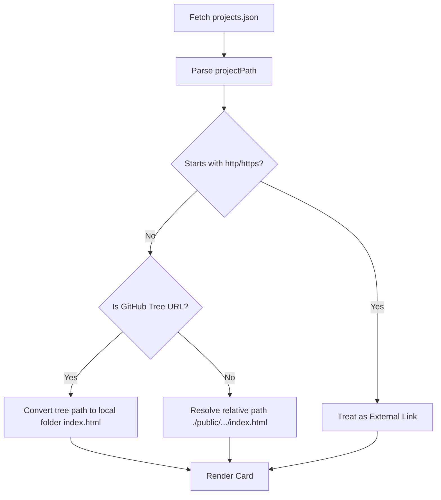

# 🏛️ System Architecture Guide

This document describes the design decisions, data flow, state persistence systems, and CI/CD validation pipelines behind the **100 Days · 100 Web Projects** repository.

---

## 1. Technical Stack Overview

The main landing page and individual projects are engineered with a focus on high performance, raw speed, and zero build compilation overhead:

- **Core Rendering**: Vanilla HTML5, Semantic CSS3, and ES6+ JavaScript.
- **Styling Conventions**: Vanilla CSS custom properties (variables) for dynamic theme switches (Light/Dark) and animations.
- **Markdown Parsing**: CDN-delivered `marked.js` engine (used by AI ChatBot).
- **Icons & Fonts**: Google Fonts (Inter, Orbitron, JetBrains Mono) & FontAwesome v6.
- **Client persistence**: Browser `localStorage` and URL `URLSearchParams` synchronization.

---

## 2. Directory Hierarchy

```
100_days_100_web_project/
├── .github/
│   ├── scripts/                # Helper pipelines (JSON validation, duplicate checking)
│   └── workflows/              # GitHub Actions workflows for CI/CD checks
├── docs/
│   └── ARCHITECTURE.md         # This technical architecture document
├── public/
│   ├── TO_DO_LIST/             # Day 1
│   ├── digital_clock/          # Day 2
│   ├── ...                     # Nested static and dynamic client-side apps
│   └── AI ChatBot/             # Gemini-based AI assistant
├── index.html                  # Landing page structure
├── index.js                    # Landing page grid logic and state syncing
├── projects.json               # Main metadata registry of all projects
├── style.css                   # Global landing page styling and typography
└── theme.js                    # Critical non-blocking dark/light mode bootloader
```

---

## 3. Projects Routing and Resolution Pipeline

The landing page dynamically renders cards by fetching the central database registry `projects.json`. When rendering a project card, the routing engine processes its path through a series of filters in `index.js`:



### 3.1 Link Sanitizer & Path Normalization

```javascript
function resolveProjectUrls(day, name, url, tags) {
  const trimmed = (url || "").trim();
  const sourceOnly = isSourceOnlyProject(day, tags);
  let demoUrl = trimmed;
  let sourceUrl = getSourceUrl(trimmed, day);

  if (isGithubTreeUrl(trimmed)) {
    sourceUrl = trimmed;
    demoUrl = sourceOnly ? trimmed : githubTreeToLocalDemo(trimmed) || trimmed;
  }

  // Adjust relative paths for nested layouts (e.g. contributor sub-directories)
  if (!sourceOnly && demoUrl && !demoUrl.startsWith("http")) {
    try {
      const isRoot = !window.location.pathname.includes("/contributors/");
      const basePrefix = isRoot ? "" : "../";
      if (demoUrl.startsWith("./")) {
        demoUrl = basePrefix + demoUrl.substring(2);
      }
    } catch (error) {}
  }
  return { demoUrl, sourceUrl, sourceOnly };
}
```

---

## 4. State Persistence & URL Sync Engine

To enhance user experience and shareability, the landing page features two distinct state managers:

### 4.1 Bookmarking & URL Syncing
- Bookmarked projects are saved to `localStorage` under `"bookmarkedProjects"`.
- To allow users to share their bookmarked collection directly, the state is serialized into a comma-separated list of day numbers and appended as a URL query parameter (`?bookmarks=Day1,Day2`).
- On page initialization, `loadBookmarksFromURL()` parses the query parameter, updates local state, and saves it to local storage.

### 4.2 Expiring Recent Projects Cache
- Tracks recently viewed projects.
- Extends the traditional queue system by appending a `timestamp: Date.now()` to each entry.
- Runs a background validator timer (`setInterval`) every 5 minutes to clean up and expire entries older than 1 hour (`60 * 60 * 1000` ms), ensuring users only see recently relevant work.

---

## 5. Security Architecture

### XSS Mitigation in AI ChatBot
Due to the multi-session peer features and custom Gemini proxies, inputs/outputs parsed via `marked.js` are processed through an inline strict DOM purifier:

```javascript
function sanitizeHtml(html) {
  const temp = document.createElement("div");
  temp.innerHTML = html;
  
  // Strip dangerous tag structures completely
  const dangerousElements = temp.querySelectorAll("script, iframe, object, embed, link, meta, style");
  dangerousElements.forEach(el => el.remove());
  
  // Strip dangerous event handers and javascript schemes
  const allElements = temp.querySelectorAll("*");
  allElements.forEach(el => {
    const attributes = el.attributes;
    for (let i = attributes.length - 1; i >= 0; i--) {
      const attrName = attributes[i].name;
      if (attrName.startsWith("on") || attributes[i].value.trim().toLowerCase().startsWith("javascript:")) {
        el.removeAttribute(attrName);
      }
    }
  });
  return temp.innerHTML;
}
```

---

## 6. Automated Validation Pipelines (CI/CD)

The repository integrates strict GitHub Action workflows to validate structural integrity and prevent developer mistakes:

1. **HTML & Tag Linting**: Runs `htmlhint` checks on `index.html` to prevent rendering conflicts.
2. **PR Checklist Compliance**: Uses regular expressions on incoming Pull Request bodies to assert description completeness and confirm that the checklist items have been fully ticked off.
3. **Database Scheme Validator**: Parses `projects.json` to ensure exact property types, standard tag strings, and validates that the physical folders/files defined under `projectPath` physically exist in the workspace directory.
4. **Duplicate Entry Blocker**: Analyzes `projects.json` registries to assert that no day numbers or file paths are claimed by more than one project.
