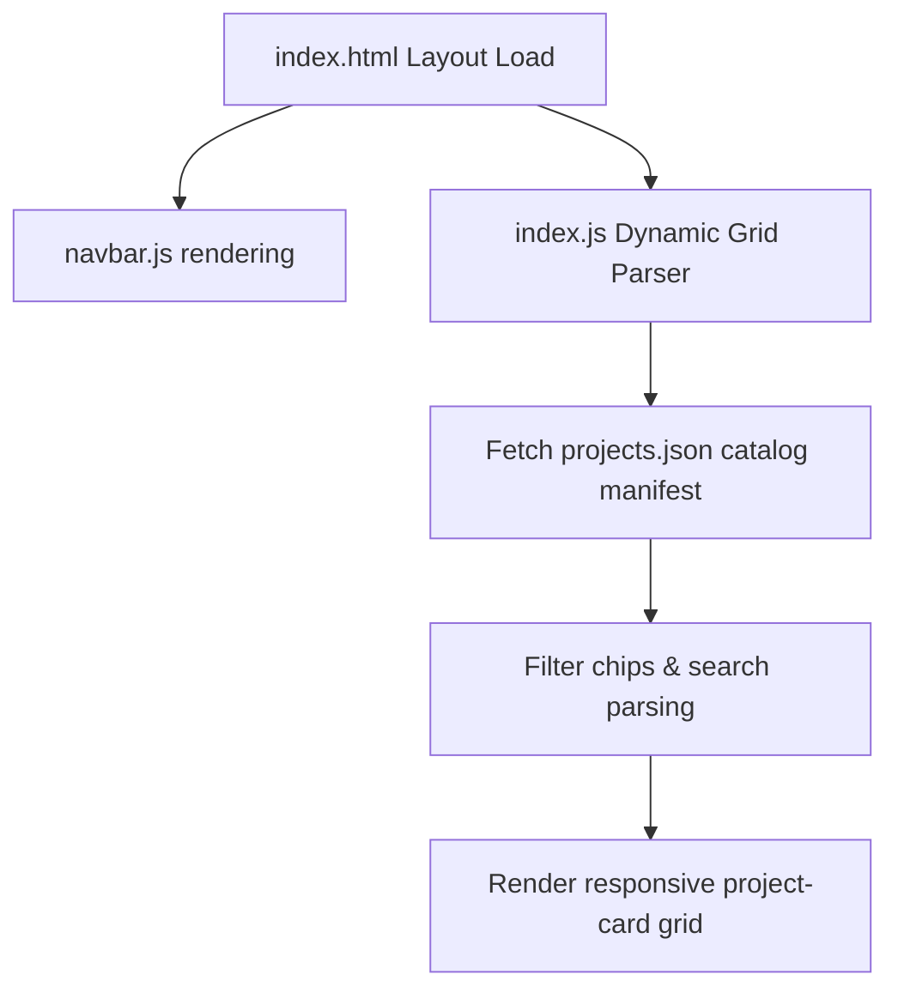

# Repository Architecture Map

This guide documents the technical design, routing layers, and dynamic engines that power the **100 Days 100 Web Projects** catalog page.

## System Workflow Diagram

## Folder Structure Core Architecture

- **`index.html`**: Master catalog frame.
- **`style.css`**: Central HSL theme styles.
- **`index.js`**: Search query engine and filtering selectors.
- **`projects.json`**: Primary JSON database manifest matching tags, title, and assets.
- **`public/`**: Sandbox folder structure for all 100 isolated front-end projects.
