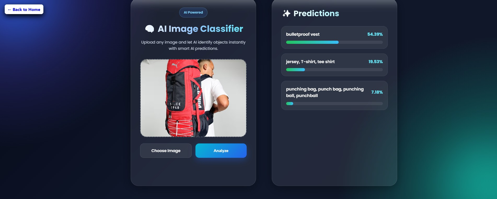

<div align="center">

# 🤖🖼️ AI Image Classifier

**A simple, web-based AI Image Classifier that predicts what an uploaded image contains using machine learning concepts.**

</div>

<br/>

## 🌟 About the Project
This project allows users to upload an image and get an instant prediction or classification result! 🎯 It is built using basic web technologies and is perfectly structured to be extended with real AI/ML models (like TensorFlow.js) or external APIs. 🌐✨

---

## 📁 Project Structure
Here is the layout of the project files and directories:

```text
AI Image Classifier/
├── screenshots/
│   ├── bag_analysis.jpg
├── Readme.md
├── index.html
├── script.js
└── style.css
```
## ✨ Features
* **📤 Upload Image:** Easily select and upload any image directly from your device.
* **👀 Live Preview:** Instantly view the selected image on the screen before classification.
* **🧠 Smart Classification:** Analyzes the image using AI prediction logic (includes placeholder logic ready for full ML integration).
* **📱 Responsive UI:** A clean, simple, and highly responsive user interface.
* **🌱 Beginner-Friendly:** A straightforward code structure that is perfect for learning and scaling.

---

## 🛠️ Technologies Used
* **🟠 HTML5:** For the core structural foundation.
* **🔵 CSS3:** For styling and a responsive design layout.
* **🟡 JavaScript (Vanilla JS):** For handling user uploads, live previews, and prediction logic.
* **🤖 (Optional) AI/ML:** Designed to be easily integrated with TensorFlow.js or other external AI APIs.

---

## 🚀 How to Run
1. Clone or download the repository to your local machine. 💻
2. Navigate to the `AI Image Classifier` folder. 📂
3. Open the `index.html` file in any modern web browser. 🌍
4. Upload an image and enjoy the project! 🎉

---

## 📸 Screenshots
Here is a visual example of the AI Image Classifier in action:

<div align="center">
  
</div>
---

## 👩‍💻 Credits & Authors
* **Author:** Megha Guleria 💻
* **UI Designer:** Nidhi Satle 🎨
* **Documentation & GSSoC '26 Contributor:** Ananya Joshi 📝✨
