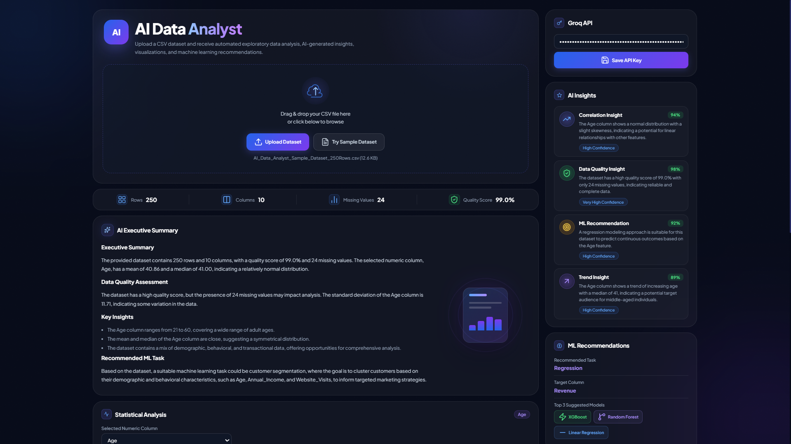
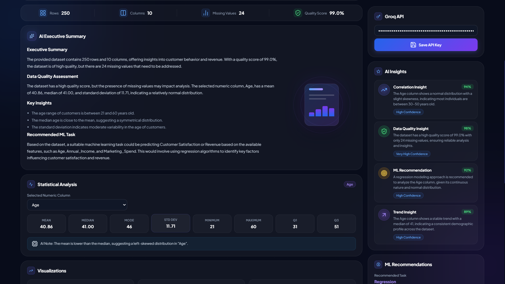
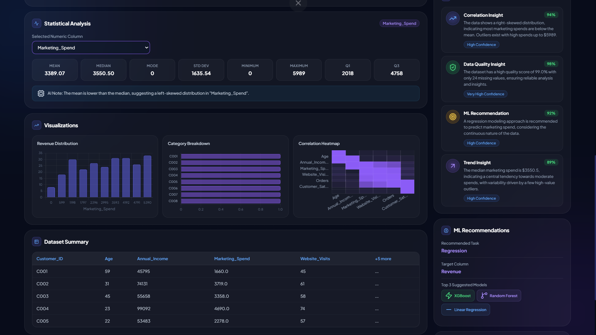

# 🤖 AI Data Analyst

An AI-powered data analysis dashboard that transforms raw CSV datasets into actionable insights using automated statistics, visualizations, machine learning recommendations, and LLM-generated analysis.

## 📌 Overview

AI Data Analyst allows users to upload a CSV dataset and instantly receive:

* Automated Exploratory Data Analysis (EDA)
* AI-generated executive summaries
* Statistical insights
* Interactive visualizations
* Correlation analysis
* Machine Learning recommendations
* Dataset Q&A powered by Groq LLM
* Exportable analysis reports

The project is designed to help students, analysts, and data enthusiasts quickly understand datasets without writing code.

---

## ✨ Features

### 📂 Dataset Upload

* Drag & Drop CSV upload
* Sample dataset support
* Automatic dataset parsing

### 📊 Dataset Overview

* Total Rows
* Total Columns
* Missing Values Detection
* Data Quality Score

### 🧠 AI Executive Summary

Generate a concise natural-language summary of the uploaded dataset using Groq's LLM.

### 💡 AI Insights

Automatically generates:

* Correlation Insights
* Data Quality Insights
* Trend Insights
* ML Readiness Insights

### 📈 Statistical Analysis

For any selected numeric column:

* Mean
* Median
* Mode
* Standard Deviation
* Minimum Value
* Maximum Value
* Q1 (25th Percentile)
* Q3 (75th Percentile)

### 📉 Visualizations

* Revenue Distribution Histogram
* Category Breakdown Chart
* Correlation Heatmap

### 🤖 ML Recommendations

Automatically suggests:

* Recommended ML Task
* Target Column
* Suitable ML Models

### 💬 Ask Your Dataset

Ask natural language questions such as:

* What patterns exist in this dataset?
* Is this dataset suitable for regression?
* What preprocessing steps are recommended?
* Which features are most important?

### 📄 Export Results

* Export Analysis Report
* Download AI Insights

---

## 🛠️ Tech Stack

* HTML5
* CSS3
* JavaScript (ES6+)
* Chart.js
* Chart.js Matrix Plugin
* PapaParse
* Groq API
* Lucide Icons

---

## 🔑 AI Model

This project uses:

* Groq API
* Model: `llama-3.3-70b-versatile`

Users can securely provide their own Groq API key directly within the application.

---

## 📸 Screenshots

<h3>Dashboard Overview</h3>


<h3>AI Insights</h3>


<h3>Visualizations</h3>



---

## 🚀 Getting Started

### Clone the Repository

```bash
git clone <repository-url>
```

### Open the Project

Simply open:

```text
index.html
```

in your browser.

### Configure Groq API

1. Create a Groq API key.
2. Enter the key inside the API Configuration panel.
3. Save the key.
4. Upload a dataset and start analyzing.

---

## 📂 Sample Dataset

A sample dataset is included to demonstrate:

* Statistical Analysis
* Category Breakdown
* Correlation Heatmap
* AI Insights
* ML Recommendations

---

## 🎯 Learning Objectives

This project demonstrates:

* Exploratory Data Analysis (EDA)
* Data Visualization
* Correlation Analysis
* LLM Integration
* Prompt Engineering
* Frontend Dashboard Design
* AI-Assisted Decision Making

---

## 🌟 Future Improvements

* Multiple Dataset Support
* Feature Importance Analysis
* Automated Data Cleaning Suggestions
* Predictive Modeling Sandbox
* Dark/Light Theme Toggle

---

---

## 👨‍💻 Author

<div align="center">

### Ansh Panchal

AI/ML Enthusiast • Open Source Contributor • Data Science Learner

[](https://github.com/4nshhh)
[](https://www.linkedin.com/in/4nshh/)

</div>

---

### 🌟 Contribution

Built with ❤️ as part of **GirlScript Summer of Code (GSSoC)**.

The goal of this project is to make data analysis more accessible by combining:

- 📊 Exploratory Data Analysis
- 🤖 AI-Powered Insights
- 📈 Interactive Visualizations
- 🧠 Machine Learning Recommendations
- 💬 Natural Language Dataset Q&A

into a single modern web application.

---

⭐ If you found this project useful, consider giving it a star!
