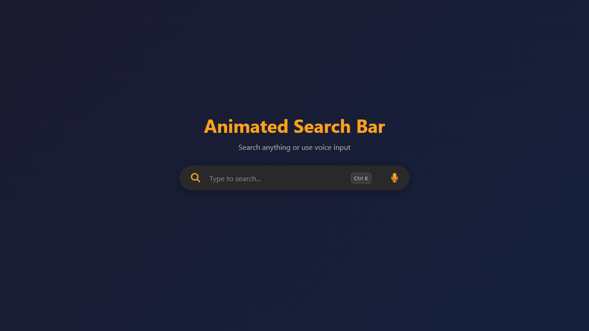

<div align="center">

# 🔍 Animated Search Bar

**A sleek, interactive, and highly responsive search bar featuring voice input, auto-suggestions, and elegant CSS animations.**

[](#)
[](#)
[](#)
[](#)

</div>

<br/>

## 🌌 About The Project

This project implements a modern, dark-themed search interface that goes beyond basic text input. Built with vanilla web technologies, it provides a premium user experience through smooth transitions, glowing focus states, and advanced accessibility features like keyboard shortcuts and voice recognition using the Web Speech API. All valid queries are automatically routed to Google Search.

---

## 📸 Preview

<div align="center">
  
</div>

---

## ✨ Key Features

* 🎙️ **Voice Search Integration:** Click the microphone icon to use speech-to-text (powered by the Web Speech API). Includes visual pulse animations while listening.
* ⌨️ **Keyboard Accessibility:** * Press `Ctrl + K` (or `Cmd + K`) from anywhere on the page to instantly focus the input field.
  * Fully navigable dropdown suggestions using `ArrowUp`, `ArrowDown`, and `Enter`.
  * Press `Escape` to close suggestions.
* 💡 **Smart Auto-Suggestions:** Real-time dropdown suggestions with exact keyword highlighting as you type.
* 🔍 **Live Search Redirection:** Simulates a loading state before dynamically redirecting your search query to Google in a new tab.
* 🎨 **Modern UI/UX:** Features a responsive glass-like container, custom scrollbars, glowing active states, and fluid keyframe animations (`fadeInDown`, `scaleIn`, `pulse`).

---

## 📁 Project Structure

```text
Animated Searchbar/
├── app.js          # Core logic (Voice API, shortcuts, debouncing, search)
├── favicon.svg     # Website favicon
├── index.html      # Semantic structure and FontAwesome integration
├── preview.png     # Visual preview of the project
├── README.md       # Project documentation
└── style.css       # Animations, responsive design, and theming
```
## 🛠️ Technologies Used

* **HTML5:** Semantic markup and ARIA labels for accessibility.
* **CSS3:** Custom properties, flexbox, linear gradients, and advanced keyframe animations. FontAwesome used for scalable vector icons.
* **JavaScript (ES6+):** * Event delegation and DOM manipulation
  * Debounce functions for performance optimization
  * `webkitSpeechRecognition` for voice input processing

---

## 🚀 How to Run Locally

1. Clone or download the repository to your local machine.
2. Navigate to the `Animated Searchbar` directory.
3. Open the `index.html` file in any modern web browser.
   * *Note: Voice search capabilities require a supported browser (like Google Chrome or Microsoft Edge) and explicit microphone permissions.*

---

## 🤝 Contribution

This documentation was created and enhanced as part of **GSSoC 2026 (GirlScript Summer of Code)** under open source contribution guidelines.

### Contributor
**[Ananya Joshi](https://github.com/ananyajoshi-cseai)** *GSSoC 2026 Contributor*
