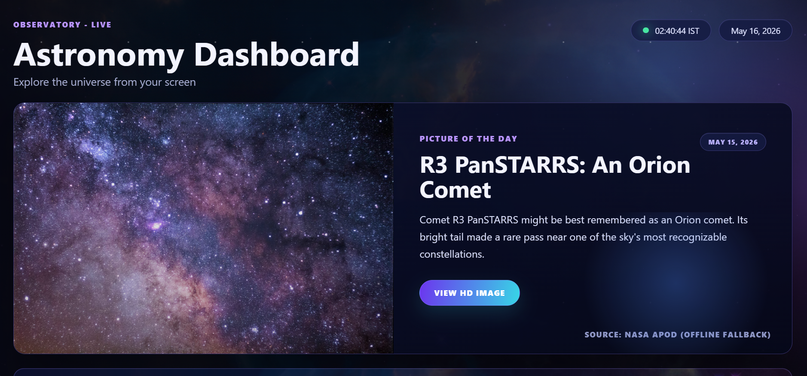
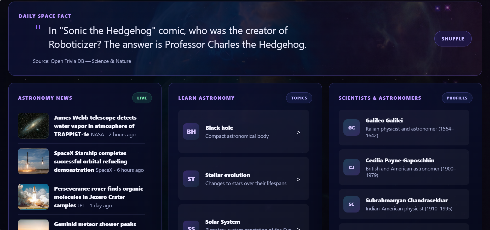
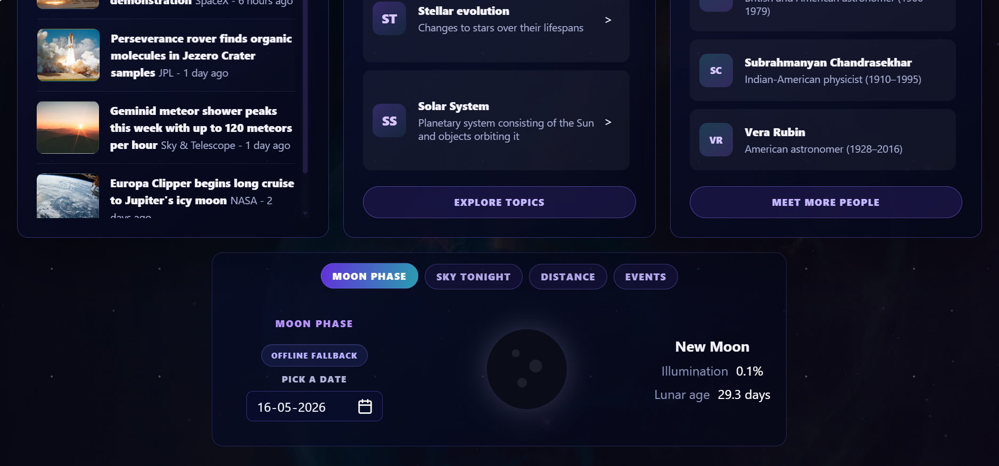

# Astronomy Dashboard

An interactive astronomy dashboard built with HTML, CSS, and JavaScript.

## Project Summary

`Astronomy Dashboard` is a modern space-themed web project added under `public/AstronomyDashboard/`. It provides astronomy enthusiasts with an engaging dashboard experience featuring live and fallback data for space news, moon phases, sky conditions, planetary distances, and educational content about astronomy topics and notable scientists.

## Features

- **NASA Picture of the Day** with image, title, description, and source link
- **Daily Space Fact** card with shuffle support
- **Astronomy News** feed with list and detail view
- **Learn Astronomy** static topic list with descriptions and sources
- **Scientists & Astronomers** profile cards with biographies and links
- **Moon Phase Tracker** with date selection and phase details
- **Sky Tonight** visibility information and full sky map link
- **Planet Distance Calculator** showing km, AU, and light travel time
- **Upcoming Astronomy Events** panel with external calendar reference

## Project Structure

- `index.html` — Dashboard layout and page structure
- `style.css` — Project styling, layout, and visual theme
- `script.js` — Dashboard logic, data fetching, interactivity, and astronomy calculations
- `README.md` — Project documentation (this file)

## Stack

- HTML
- CSS
- JavaScript
- No frontend framework; built using vanilla web technologies

## Integration

This project is registered in the main repository index at `index.js` as:

```js
['Day 119', 'Astronomy Dashboard', './public/AstronomyDashboard/']
```

## External Resources and APIs

| Resource | Purpose |
|---|---|
| `https://api.spaceflightnewsapi.net/v4/articles/` | Live astronomy news feed |
| `https://api.open-meteo.com/v1/forecast` | Sky and weather forecast data |
| `https://aa.usno.navy.mil/api/moon/phases/year` | Moon phase calendar data |
| `https://aa.usno.navy.mil/api/moon/phases/date` | Moon phase for a selected date |
| `https://aa.usno.navy.mil/api/rsttsp` | Sun/moon rise, set, and transit times |
| `https://api.farmsense.net/v1/moonphases/` | Moon phase lookup |
| `https://en.wikipedia.org/api/rest_v1/page/summary` | Topic summary text for astronomy learning cards |
| `https://api.le-systeme-solaire.net/rest/bodies` | Solar system body data and properties |
| `https://visibleplanets.dev/api` | Visible planet sky object data |
| `https://images-api.nasa.gov/search` | NASA image search fallback support |

## External Visual Resources

- `https://images.unsplash.com/...` used for page background and fallback imagery

## Local Fallback Content

The project uses local fallback arrays defined in `script.js` for:

- Space facts
- News items
- Astronomy topics
- Scientist and astronaut profiles

## Notes

- The project is fully contained in `public/AstronomyDashboard/` and uses static web assets.
- It is designed to work as part of the larger `100_days_100_web_project-1` collection.
- The page uses browser-native `fetch()` calls and dynamic DOM updates for interactivity.

## Screenshots








## Contribution Context

This project is part of the GSSoC initiative and the `100 Days 100 Web Projects` collection. It was developed to contribute an interactive and educational astronomy experience that aligns with the repository's goal of showcasing creative web experiments.

## Author

- **Name:** Rukmini
- **Role:** Open Source Contributor (GSSoC)
- **About:** Passionate about building interactive and educational applications that make science and technology more accessible.
