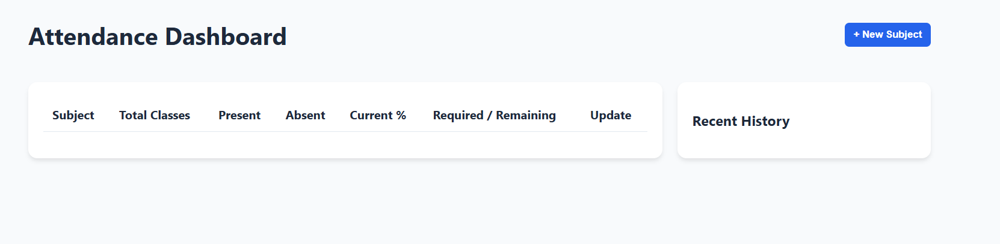
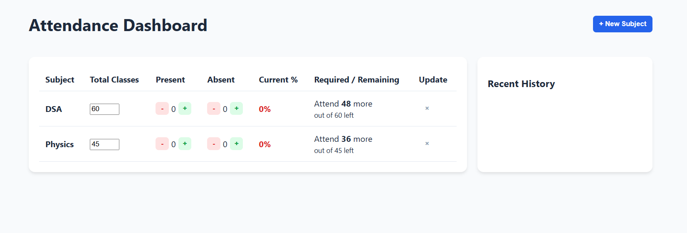

# 📅 Attendance Pro

A simple, clean attendance tracker for students to monitor subject-wise attendance and stay above their target percentage — directly in the browser, no login required.

> Ever sat before an exam thinking, *"Can I skip tomorrow's class?"*  
> This tool answers that instantly.

---

## ✨ Features

- 📚 Add multiple subjects with custom target %
- ➕➖ One-click present / absent counters
- 📈 Live attendance % with color indicators
- 🎯 Smart goal calculator
  - Shows how many classes you **must attend**
  - Warns if your target becomes **impossible**
- 🕒 Recent update history log
- 💾 Data persistence via `localStorage`
  - No login
  - No backend
  - Works offline

---

## 🛠 Tech Stack

- HTML5
- CSS3
- Vanilla JavaScript
- Browser LocalStorage API

---

## 🚀 How to Run

1. Open `index.html` in any browser
2. Click **+ New Subject** and enter the subject name, total classes, and your target %
3. After each class, hit **+** under Present or Absent to log it
4. The dashboard updates instantly — check the Required / Remaining column to stay on track

---

## 📸 Screenshots

---

---

## 👤 Author

**Ayush**  
GitHub: [@ayush2496](https://github.com/ayush2496)

