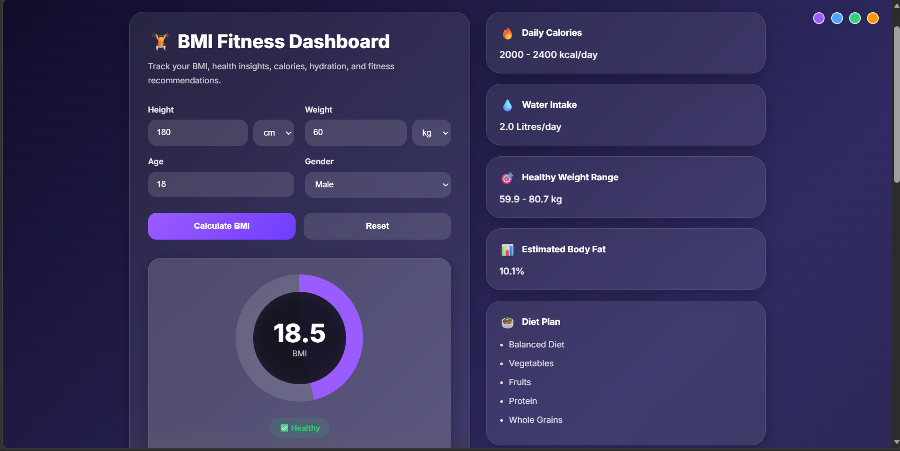
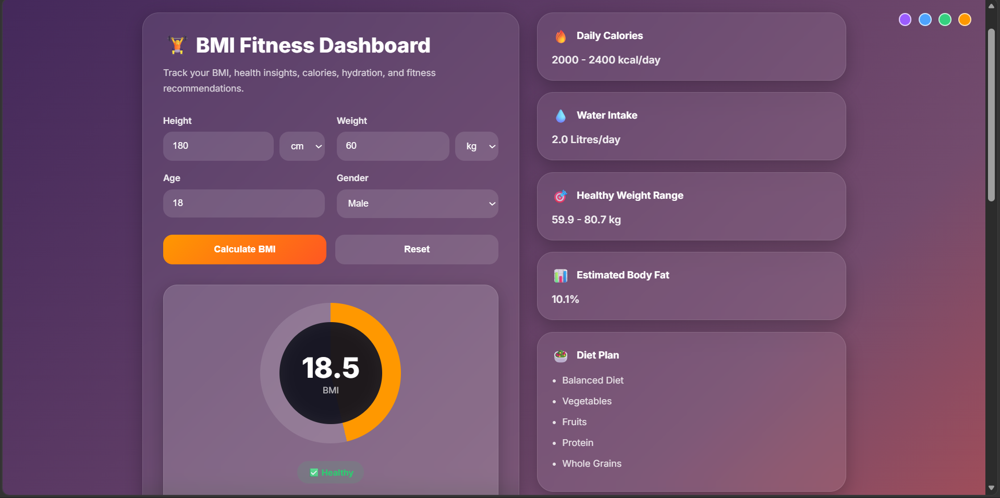

# 🏋️ FitTrack Pro — BMI Fitness Dashboard

A modern, fully functional, and responsive **health analytics dashboard** built using **vanilla HTML, CSS, and JavaScript**.  
It calculates **BMI (Body Mass Index)**, estimates **body fat percentage**, provides **personalized health insights**, and maintains a **persistent progress tracker** using localStorage.

---

## 🚀 Key Features

- **📊 BMI Calculator (Fully Functional)**
  - Real-time BMI calculation based on user input
  - Accurate classification into health categories (Underweight, Normal, Overweight, Obese)
  - Dynamic circular gauge with smooth animation

- **⚖️ Dual Unit Support**
  - Metric system (kg / cm)
  - Imperial system (lbs / ft)
  - Seamless conversion between units

- **🧠 Body Fat Estimation Engine**
  - Uses Deurenberg formula
  - Gender + age-based health estimation

- **🎯 Goal-Oriented Dashboard**
  - Three goal modes: **Lose Weight**, **Maintain Weight**, **Gain Muscle**
  - Dynamically adjusts Daily Calories with a 300–500 kcal deficit or surplus
  - Goal-specific Diet Plan and Workout Recommendations
  - Contextual tip shown in results for the selected goal
  - Goal persists across recalculations in the same session

- **🥗 Personalized Health Insights**
  - Diet recommendations tailored to BMI category and selected goal
  - Workout suggestions for each health category
  - Daily calorie guidance with goal-adjusted ranges

- **💧 Hydration Tracker**
  - Calculates recommended daily water intake based on body weight

- **📈 Persistent BMI Progress Tracker**
  - Stores full history objects `{ date, bmi, weight }` in localStorage
  - Chart repopulates automatically on every page reload
  - Keeps last 20 entries; oldest auto-removed
  - Chart line color matches the active theme
  - "No data yet" empty state shown before first calculation

- **🌗 Multi-Theme Support**
  - Purple, Blue, Green, Orange themes
  - Persistent theme selection via localStorage
  - Chart colors update live when theme is switched

- **📱 Fully Responsive UI**
  - Mobile, tablet, and desktop optimized layout
  - Clean glass-morphism card-based dashboard design

---

## 📸 Screenshots

### Different Theme Dashboards




---

## 🧮 Core Formulas Used

### 1. Body Mass Index (BMI)

- **Metric System:**
```math
BMI = Weight (kg) / Height (m)²
```

- **Imperial System:** lbs and ft are converted to kg and cm before calculation.

### 2. Body Fat Percentage (Deurenberg Formula)

```math
Body Fat % = (1.20 × BMI) + (0.23 × Age) − (10.8 × Sex) − 5.4
```
- Sex factor: Male = 1, Female = 0

### 3. Daily Water Intake

```math
Water (L/day) = Weight (kg) × 0.033
```

### 4. Healthy Weight Range

```math
Min Weight = 18.5 × Height (m)²
Max Weight = 24.9 × Height (m)²
```

### 5. Goal-Adjusted Daily Calories

| Goal | Adjustment |
|------|------------|
| Lose Weight | Base calories − 400 kcal |
| Maintain Weight | Base calories (no change) |
| Gain Muscle | Base calories + 400 kcal |

Base calories are determined by BMI category:

| BMI Category | Base Calories |
|--------------|---------------|
| Underweight | ~2,650 kcal/day |
| Normal | ~2,200 kcal/day |
| Overweight | ~1,850 kcal/day |
| Obese | ~1,650 kcal/day |

---

## 📁 File Structure

```
├── index.html       # Main HTML structure
├── style.css        # All styling, themes, and responsive layout
├── script.js        # BMI logic, goal system, chart, localStorage
└── README.md        # Project documentation
```

---

## 🛠️ Technologies Used

| Technology | Purpose |
|------------|---------|
| HTML5 | Structure and layout |
| CSS3 | Styling, glass-morphism, themes, animations |
| JavaScript (ES6+) | Logic, DOM manipulation, localStorage |
| Chart.js (CDN) | BMI progress line chart |
| Google Fonts (Inter) | Typography |

---

## ▶️ How to Use

1. Download or clone the repository
2. Open `index.html` in any modern browser
3. Enter your **Height**, **Weight**, **Age**, and **Gender**
4. Optionally select a **Goal** (Lose Weight / Maintain / Gain Muscle)
5. Click **Calculate BMI**
6. View your BMI, body fat, calorie target, diet plan, and workout recommendations
7. Your result is saved — revisit the page to see your progress chart

---

## 📦 localStorage Keys

| Key | Contents |
|-----|----------|
| `bmi_history_v2` | Array of `{ date, bmi, weight }` objects (max 20) |
| `selectedTheme` | Active theme class name (`theme-purple`, etc.) |