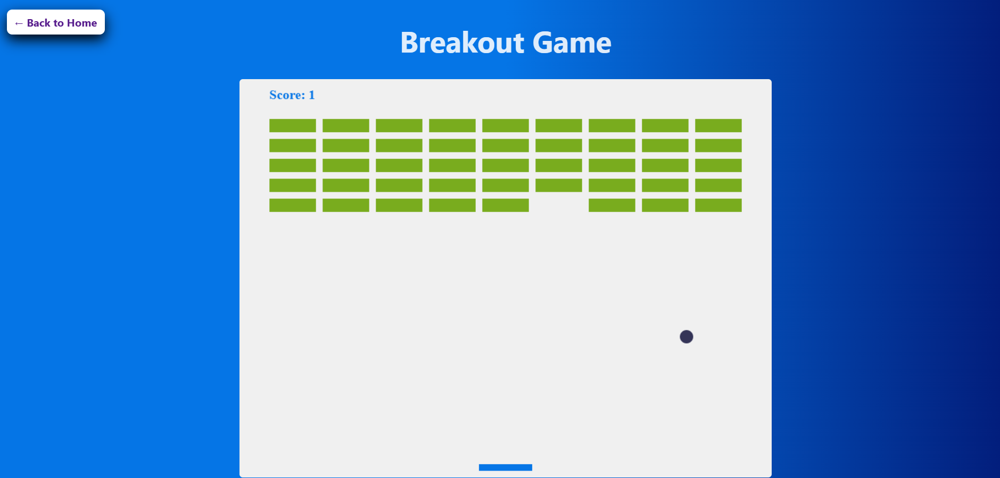

# Breakout Game

A classic arcade-style Breakout game built using HTML, CSS, and JavaScript where players control a paddle to bounce the ball and destroy bricks while aiming for the highest score.

## Features
- Smooth paddle and ball movement
- Brick collision detection
- Score tracking system
- Responsive gameplay mechanics
- Game over and win conditions
- Keyboard controls for paddle movement

## Instructions to play

1. Use the arrow keys to move the paddle.
2. Bounce the ball to break the bricks.
3. Score points by breaking bricks.
4. The game resets when the ball falls below the paddle.

## Technologies Used
- HTML
- CSS
- JavaScript

## How to Run
1. Clone or download the project files
2. Open the project folder
3. Launch index.html in any modern web browser
4. Use the keyboard controls to start playing

## Screenshots

## Author
@Ayontikapal