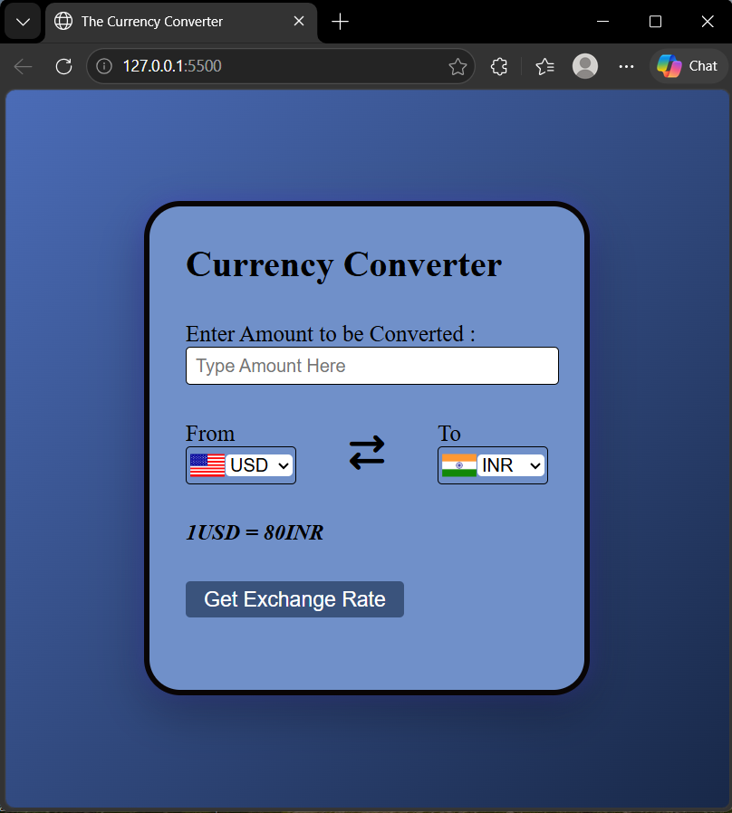

# Currency Converter Web App

A simple and interactive **Currency Converter Web App** built using **HTML, CSS, and JavaScript** with real-time exchange rates.

---

## Features
- Convert currencies in real-time  
- Dynamic dropdown selection  
- Country flag updates based on selected currency  
- Accurate rounding of values  
- Clean and responsive UI  

---

## Technologies Used
- HTML  
- CSS  
- JavaScript (Fetch API)  

---

## How to Run
1. Clone the repository  
```bash
git clone https://github.com/TanviVerma-05/CurrencyConverter-webapp.git
```
2. Navigate to the project folder
3. Open index.html in your browser
4. Start converting currencies 🎉

---

## Screenshots



--- 

## Author
Tanvi Verma


