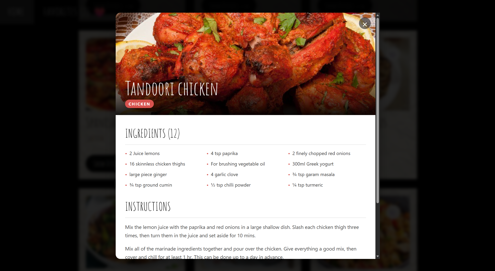

# 🍽️ Flavorly — Recipe Discovery App

## Description

Flavorly is a modern recipe discovery web application built with React and Vite. It allows users to search for recipes by meal name or ingredient, explore recipe details, save favorites, and filter vegetarian meals—all without requiring a backend server. The application uses TheMealDB API to fetch recipe data and provides a fast, responsive user experience.

## Features

* Search recipes by meal name or ingredient
* Autocomplete ingredient suggestions while typing
* Save favorite recipes using localStorage
* Filter recipes by Vegetarian/Vegan category
* View detailed recipe information in a modal
* Access cooking instructions and YouTube tutorials
* Responsive and user-friendly interface
* Fun empty-state animation when no recipes are found
* Fully client-side application with no backend required

## Technologies Used

* HTML5
* CSS3
* JavaScript (ES6+)
* React
* Vite
* TheMealDB API
* Local Storage

## Installation/Setup

1. Clone the repository:

   ```bash
   git clone <repository-url>
   ```

2. Navigate to the project folder:

   ```bash
   cd flavourly
   ```

3. Install dependencies:

   ```bash
   npm install
   ```

4. Start the development server:

   ```bash
   npm run dev
   ```

5. Open your browser and visit:

   ```
   http://localhost:5173
   ```

## Usage

1. Enter a recipe name or ingredient in the search bar.
2. Select a suggestion from the autocomplete dropdown or press search.
3. Browse matching recipes.
4. Click a recipe card to view ingredients, instructions, and video tutorials.
5. Save recipes to favorites for quick access later.
6. Enable the vegetarian filter to display only Vegetarian/Vegan recipes.

## Screenshots




```

## Contributing

Contributions are welcome.

To contribute:

1. Fork the repository.
2. Create a new feature branch:

   ```bash
   git checkout -b feature/new-feature
   ```
3. Commit your changes:

   ```bash
   git commit -m "Add new feature"
   ```
4. Push to your branch:

   ```bash
   git push origin feature/new-feature
   ```
5. Open a Pull Request.

## License

MIT License

Copyright (c) 2026

Permission is hereby granted, free of charge, to any person obtaining a copy of this software and associated documentation files to use, modify, merge, publish, distribute, sublicense, and/or sell copies of the Software.

## Author

**Yash Kumar**

* GitHub: https://github.com/YASHK-arch

