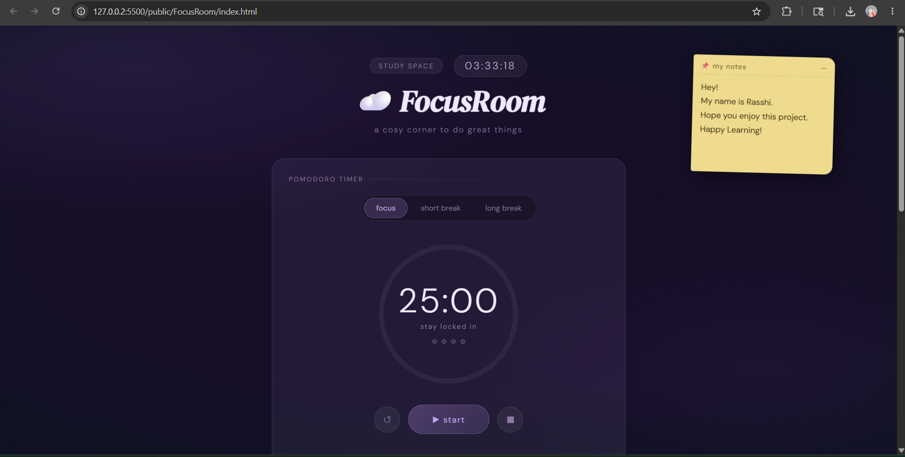
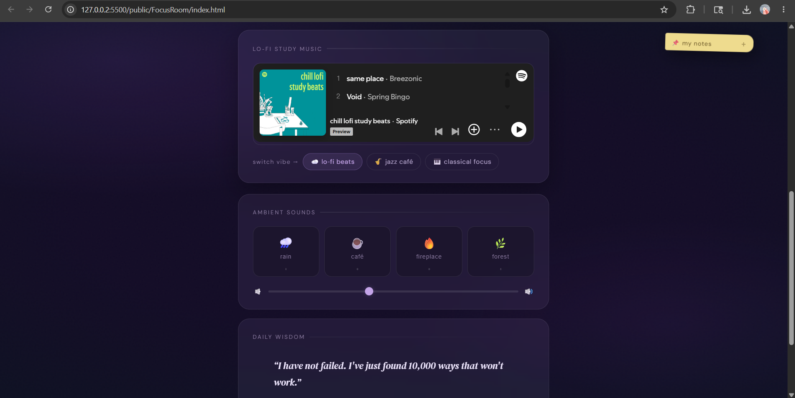
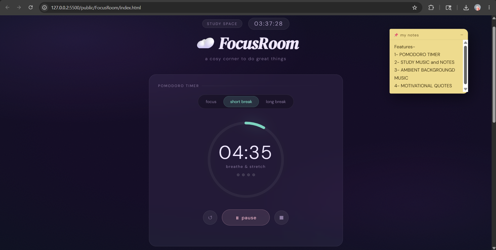
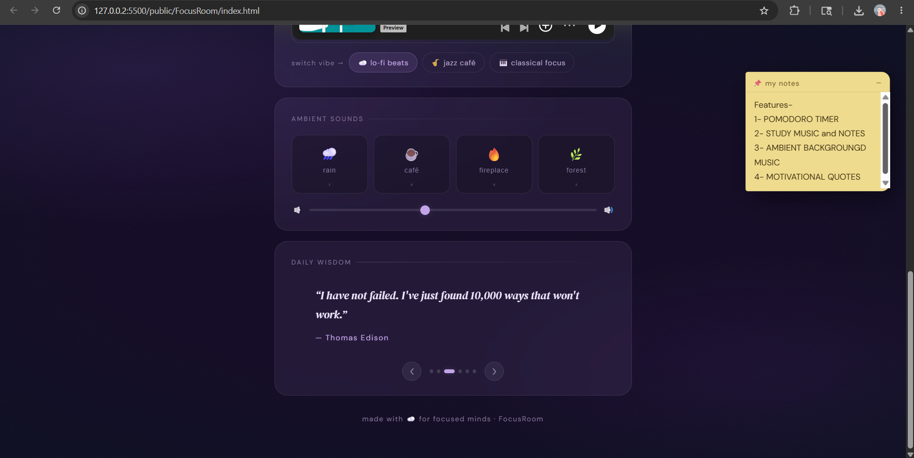
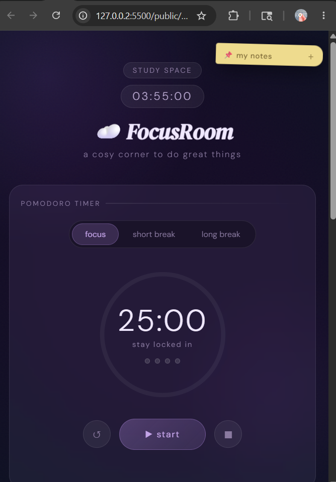

# ☁️ FocusRoom

A cosy and aesthetic productivity web app designed to help students and developers stay focused while studying or working. FocusRoom combines a modern Pomodoro timer, ambient UI, sticky notes, and session tracking into a calm digital workspace that improves concentration and productivity.

Built using pure HTML, CSS, and JavaScript, this project provides a distraction-free environment with smooth animations, elegant visuals, and interactive features.

---

## ✨ Features

### ⏳ Pomodoro Timer

* Focus, Short Break, and Long Break modes
* Circular animated progress ring
* Start, Pause, Resume, and Reset controls
* Session tracking with visual indicators
* Dynamic browser tab timer updates

### 🕒 Live Digital Clock

* Real-time clock display
* Updates every second automatically

### 📝 Sticky Notes

* Draggable sticky note widget
* Write reminders, ideas, or tasks
* Minimize and expand functionality

### 🎨 Aesthetic User Interface

* Minimal and cosy design
* Ambient background layers and glow effects
* Smooth transitions and animations
* Fully responsive layout

### 🔔 Productivity Experience

* Visual feedback and notifications
* Clean workspace focused on reducing distractions
* Designed for studying, coding, and deep work sessions

---

## 🛠️ Technologies Used

* **HTML5** – Structure of the application
* **CSS3** – Styling, animations, and responsive design
* **JavaScript (Vanilla JS)** – Functionality and interactivity
* **Google Fonts** – Typography and aesthetic UI design

---

## 📂 Project Structure

```bash
FocusRoom/
│
├── index.html      # Main webpage structure
├── style.css       # Styling and animations
├── script.js       # Application logic and interactivity
└── README.md       # Project documentation
```

---

## 🚀 How to Run the Project

1. Download or clone this repository

```bash
git clone https://github.com/Ras0105/100_days_100_web_project.git
```

2. Open the project folder
```bash
cd 100_days_100_web_project
```
3. Navigate to the `public/FocusRoom` directory
```bash
cd public/FocusRoom
```
4. Open index.html in your browser

Enjoy the project!

Note: If your project folder name is different from `FocusRoom`, replace it with the actual folder name.

---
## 🙌 Credits

This project is part of the original repository created by Dhairya Gothi.

Original Repository:
https://github.com/dhairyagothi/100_days_100_web_project
## 📸 Screenshots

Add screenshots of your project here.

Example:

## 📸 Screenshots






---

## 🌟 Future Improvements

* Background music and ambient sounds
* Task management system
* Dark/Light theme toggle
* Local storage for notes and sessions
* Custom timer durations
* Productivity analytics dashboard

---
## 🐛 Known Issues

```bash
- External ambient audio sources may occasionally fail due to CORS restrictions.
- Spotify embed may require login in some regions.
```

## 👨‍💻 Author

**Rasshi Ashish Srivastav**

* GitHub: urlRas0105 GitHub[https://github.com/Ras0105](https://github.com/Ras0105)
* LinkedIn: urlRasshi Ashish Srivastav LinkedIn[https://www.linkedin.com/in/rasshi-ashish-srivastav](https://www.linkedin.com/in/rasshi-ashish-srivastav)

---

## 📄 License

This project is open-source and available for learning and personal use.

---

> "A cosy corner to do great things." ☁️
