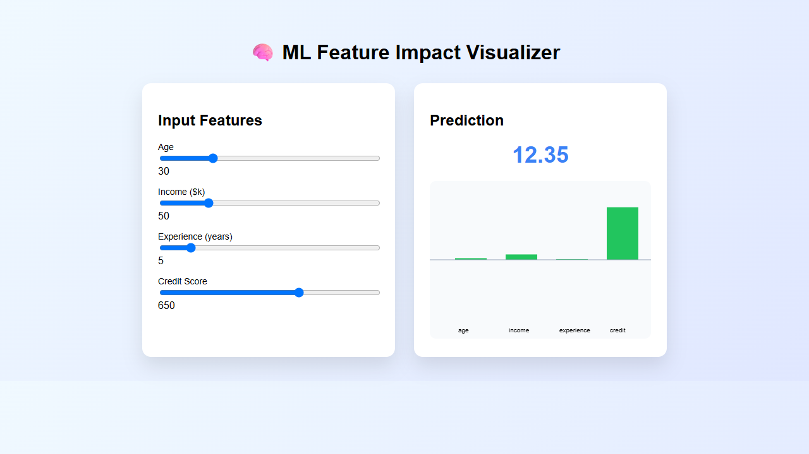

# 🧠 ML Feature Impact Visualizer

An interactive web application that demonstrates how different input features contribute to a Machine Learning model's prediction. Users can adjust feature values using sliders and instantly visualize each feature's impact through a dynamic bar chart.

## 🚀 Features

- Interactive sliders for input features
- Real-time prediction calculation
- Feature contribution visualization using HTML5 Canvas
- Clean and responsive user interface
- Lightweight project with no external libraries

## 📌 Input Features

- 👤 Age
- 💰 Income
- 💼 Experience
- 📈 Credit Score

Each feature contributes to the final prediction based on predefined weights.

## 🛠️ Technologies Used

- HTML5
- CSS3
- JavaScript (Vanilla)
- HTML5 Canvas API

## 📂 Project Structure

```
ML-Feature-Impact-Visualizer/
│── index.html
│── style.css
│── script.js
│── image.png
│── preview.png
└── README.md
```

## ⚙️ How It Works

1. Move any of the feature sliders.
2. The application calculates a prediction using a simple weighted linear equation:

```
Prediction = Bias + Σ(Feature × Weight)
```

3. The prediction updates instantly.
4. A bar chart displays the contribution of each feature to the prediction.

## 📊 Default Model Weights

| Feature | Weight |
|---------|--------|
| Age | 0.02 |
| Income | 0.04 |
| Experience | 0.05 |
| Credit Score | 0.03 |

**Bias:** `-10`

> These values are for demonstration purposes and do not represent a real machine learning model.

## ▶️ Getting Started

1. Clone the repository

```bash
git clone https://github.com/100_days_100_project.git
```

2. Open the project folder.
```
cd MLImppactVisualizer
```

3. Open `index.html` in your browser.

No installation or dependencies are required.

## 🎯 Future Improvements

- Support for real ML models
- SHAP feature importance visualization
- Dark mode
- Responsive mobile layout
- Download prediction report
- Chart.js integration
- Additional input features

## 📸 Preview

Add a screenshot of your application here.

```

```

## 🤝 Contributing

Contributions are welcome!

1. Fork the repository.
2. Create a new branch.
3. Commit your changes.
4. Submit a Pull Request.

## 📄 License

This project is licensed under the MIT License.

---

If you found this project useful, consider giving it a ⭐ on GitHub!