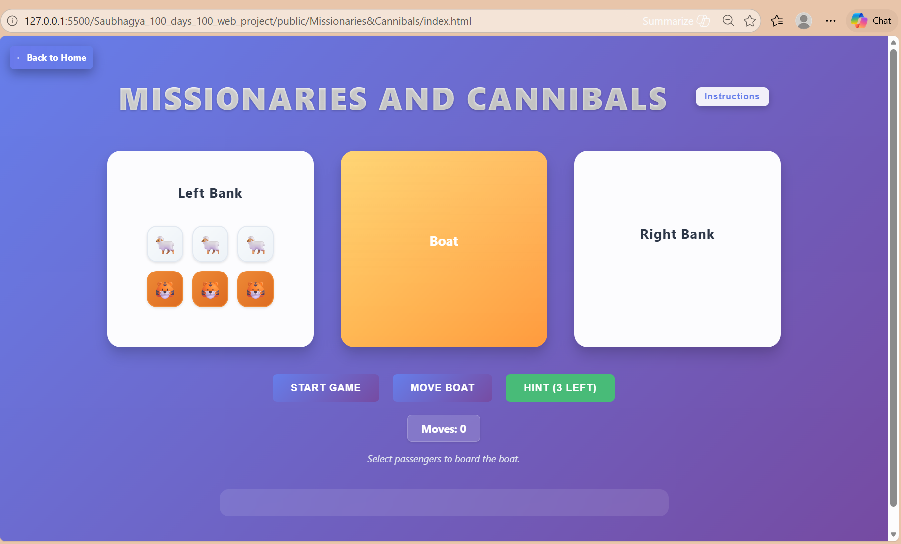
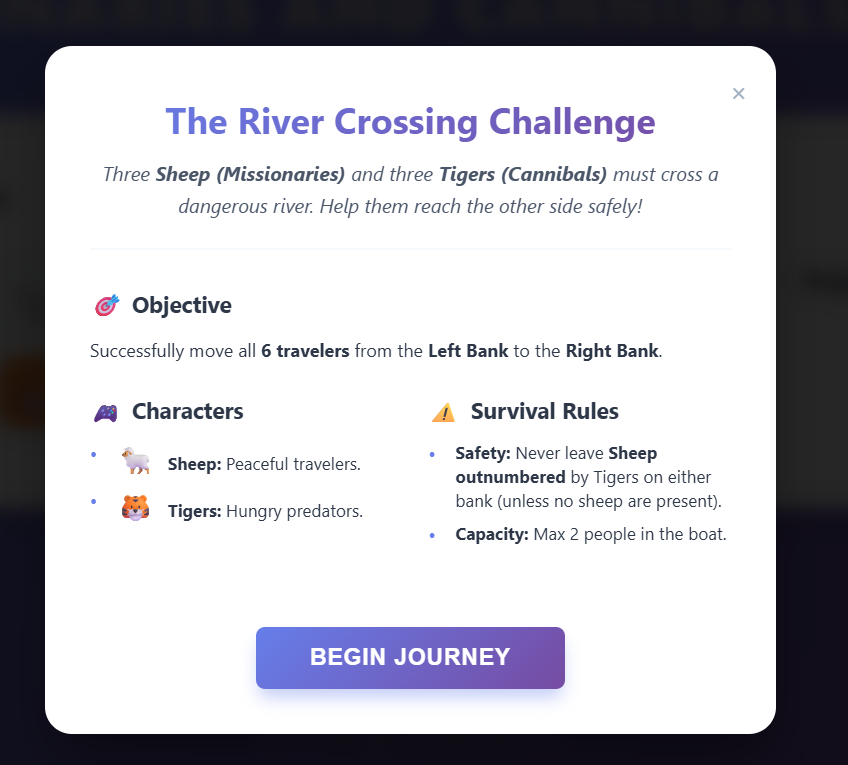
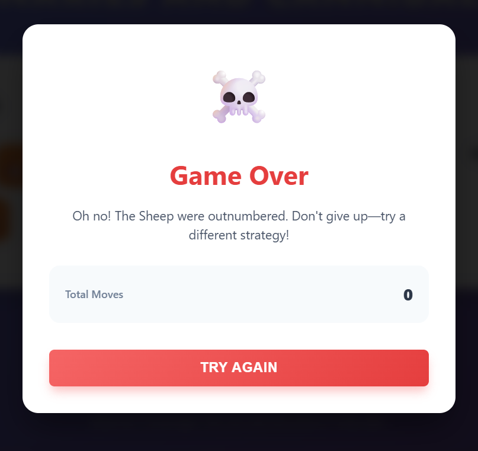

# 🐑🐯 Missionaries and Cannibals — River Crossing Puzzle
 
A browser-based implementation of the classic **Missionaries and Cannibals** logic puzzle, reimagined as a **Sheep vs Tigers** river crossing challenge. Move all travelers safely from the Left Bank to the Right Bank without letting the Tigers outnumber the Sheep!
 
---
 
## 📖 Description
 
This is an interactive puzzle game built with vanilla HTML, CSS, and JavaScript. Three Sheep (Missionaries) and three Tigers (Cannibals) must cross a river using a boat that holds at most 2 passengers. The player must ensure that Tigers never outnumber Sheep on either bank — or it's game over. The game includes a hint system, move counter, drag-and-drop support, win/loss modals, and a guided instructions panel.
 
---
 
## ✨ Features
 
- 🎮 **Interactive Gameplay** — Click or drag-and-drop characters onto the boat to move them
- ⛵ **Boat Movement** — Move the boat between banks with the "Move Boat" button (requires at least 1 passenger)
- 🏆 **Win/Loss Modals** — Animated result screens showing victory or defeat with total move count
- 💡 **Hint System** — Up to 3 progressive hints to guide stuck players
- 📊 **Move Counter** — Tracks the number of boat crossings made
- 📜 **Instructions Modal** — A story-styled welcome screen with rules and character descriptions
- 🔄 **Start / Reset** — Restart the game at any time
- 📱 **Fully Responsive** — Adapts to mobile, tablet, and desktop screens
- ♿ **Guidance Text** — Dynamic in-game messages tell players what to do next
---
 
## 🛠️ Technologies Used
 
- **HTML5** — Semantic structure and modal overlays
- **CSS3** — CSS custom properties, Grid layout, Flexbox, animations, and responsive media queries
- **JavaScript (ES6+)** — DOM manipulation, event handling, game state management, drag-and-drop API
---
 
## 📁 Project Structure
 
```
missionaries-and-cannibals/
│
├── index.html       # Main game layout and modals
├── styles.css       # Styling, animations, and responsive design
└── script.js        # Game logic, state management, and event listeners
```
 
---
 
## 💻 How to Run Locally

1. Clone the main repository.
2. Navigate to `public/Missionaries&Cannibals/`.
3. Open `index.html` in any modern web browser.
4. Enjoy the Project.

---
 
## 🎮 Usage / How to Play
 
1. **Launch the game** — The Instructions modal appears automatically on load.
2. **Read the rules** and click **"Begin Journey"** to start.
3. **Click on a character** (🐑 Sheep or 🐯 Tiger) on the same bank as the boat to board them.
4. **Move the Boat** — Click "Move Boat" once you've loaded 1–2 passengers.
5. **Unload passengers** — Click characters on the boat to move them to the current bank.
6. **Repeat** until all 6 characters reach the Right Bank.
7. **Use Hints** — Up to 3 hints available if you get stuck.
8. **Win** by safely moving everyone across; **Lose** if Tigers ever outnumber Sheep on any bank.

### ⚠️ Rules Summary
 
| Rule | Detail |
|------|--------|
| Boat capacity | Maximum **2 passengers** per trip |
| Safety constraint | **Sheep must never be outnumbered** by Tigers on either bank (unless no Sheep are present) |
| Minimum to sail | At least **1 person** must be in the boat to cross |
 
---
 
## 📸 Screenshots
 



 

 
---
 
## 🤝 Contributing
 
Contributions are welcome! If you'd like to improve this project:
 
1. **Fork** the repository
2. **Create** a new branch: `git checkout -b feature/your-feature-name`
3. **Commit** your changes: `git commit -m "Add: your feature description"`
4. **Push** to the branch: `git push origin feature/your-feature-name`
5. **Open a Pull Request** describing what you've changed and why
Please make sure your code follows the existing style and does not break any existing functionality.
 
---
 
## 📄 License
 
MIT License 

 
---
 
## 👨‍💻 README Author

- **Saubhagya Srivastava**
- GitHub: [Saubhagya1621](https://github.com/Saubhagya1621)
- LinkedIn: [Saubhagya Srivastava](https://www.linkedin.com/in/saubhagyasri/)🚀
---
 