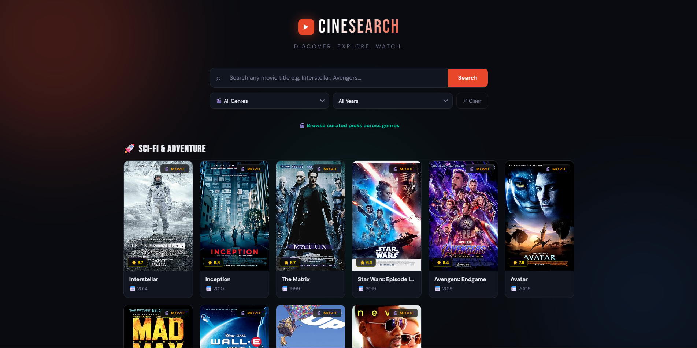
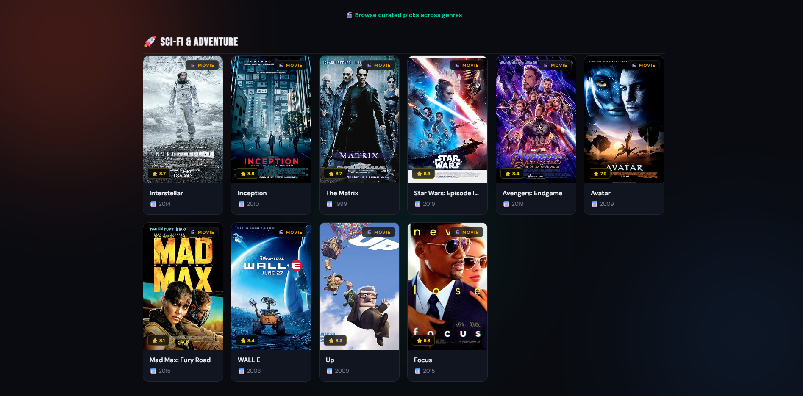
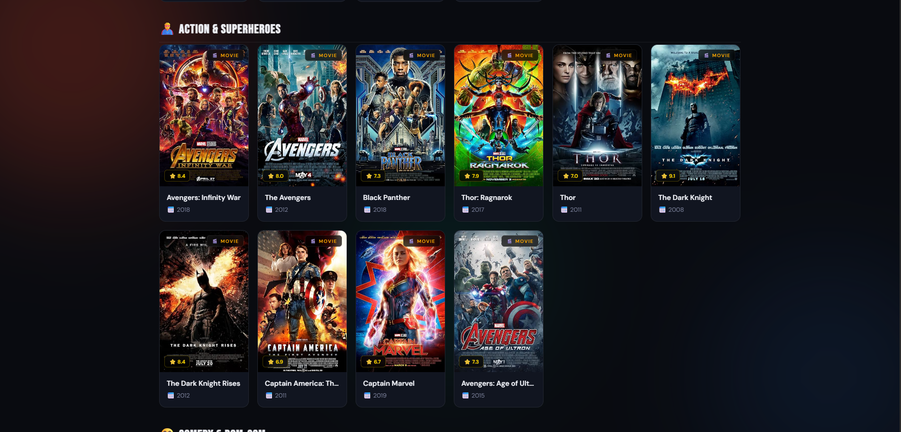
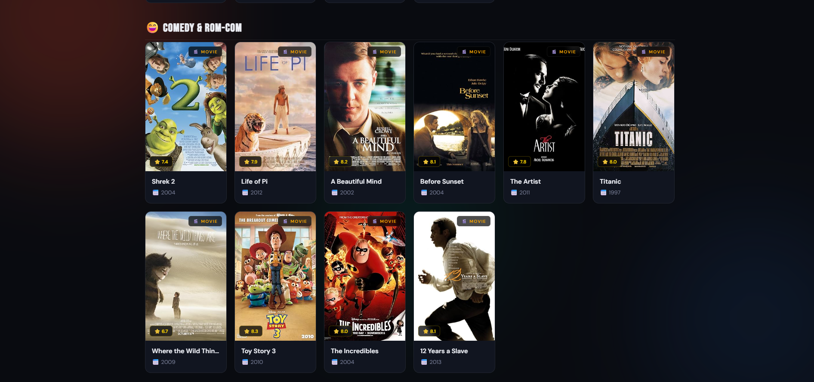
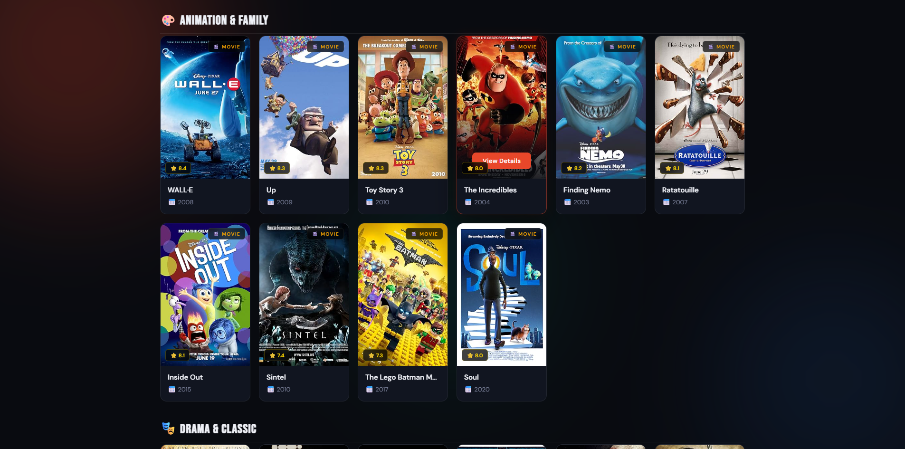
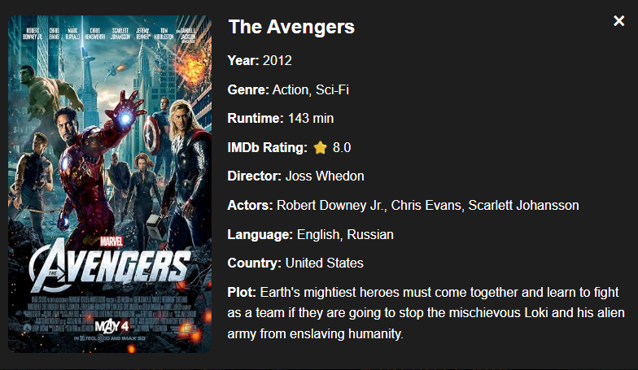

# 🎬 Movie Search App

A modern and responsive Movie Search Application built using **HTML, CSS, and JavaScript** that allows users to discover movies, explore curated categories, and search movies instantly with an improved and visually appealing user interface.

## 🚀 Live Features

### 🔍 Smart Movie Search
- Search movies instantly by title.
- Fast and responsive search results.
- Displays movie posters, titles, release years, ratings, and categories.

### 🎭 Curated Movie Sections
Explore movies through multiple categorized collections:

- Comedy & Rom-Com 😄
- Animation & Family 🎨
- Drama & Classic 🎭
- Action & Adventure ⚔️
- Sci-Fi & Fantasy 🚀
- And more...

### ⭐ Movie Information Cards
Each movie card displays:

- Movie Poster
- Movie Title
- Release Year
- Rating
- Category Tag
- View Details Button

### 🎨 Enhanced UI/UX
- Modern dark-themed design
- Smooth hover animations
- Responsive card layouts
- Better spacing and alignment
- Improved visual hierarchy
- Attractive gradients and section styling

### 📱 Responsive Design
Works seamlessly across:

- Desktop
- Laptop
- Tablet
- Mobile Devices

### ⚡ Improved Performance
- Optimized rendering
- Better search functionality
- Cleaner code structure
- Improved user interaction

---

## 🛠️ Technologies Used

| Technology | Purpose |
|------------|----------|
| HTML5 | Structure |
| CSS3 | Styling & Layout |
| JavaScript (ES6) | Functionality & Interactivity |

---

## 📂 Project Structure

```text
Movie-Search-App/
│
├── index.html
├── style.css
├── script.js
└── README.md
```

---

## ✨ Improvements Made

### Previous Version
- Basic movie search interface
- Limited UI elements
- Simple result cards
- Minimal visual appeal

### Updated Version
✅ Multiple movie sections added

✅ Enhanced dark theme UI

✅ Better movie card design

✅ Category-wise movie organization

✅ Improved search functionality

✅ Responsive layout improvements

✅ Smooth hover effects

✅ Better typography and spacing

✅ Cleaner and more modern user experience

---

## 🎯 Future Enhancements

- Movie trailer integration
- Favorites/Watchlist feature
- Genre-based filtering
- Pagination
- Infinite scrolling
- Theme switcher
- Sorting options (Rating, Year, Popularity)
- API-based recommendations

---

## 📸 Preview

### Search Movies
Search any movie and instantly view matching results with detailed movie cards.



### Browse Categories
Explore hand-picked movie collections across different genres and categories.









### and much more . . .


### View Details
Access additional information about selected movies through interactive cards.



---

## 🤝 Contributing

Contributions, issues, and feature requests are welcome.

1. Fork the repository
2. Create a new branch
3. Make your changes
4. Commit your changes
5. Open a Pull Request

---

## 👩‍💻 Author

**Sanyogita Singh**

- Developed the Movie Search App
- Wrote and maintained the project documentation

---

## 🤝 Contributors

- Sanyogita Singh – Project Development & Documentation

## 📜 License

This project is open-source and available under the MIT License.

---
