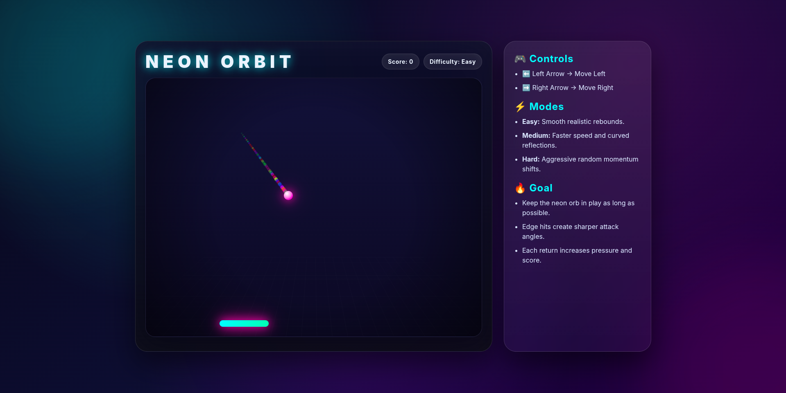

<div align="center">

# 🎮 NEON ORBIT

**A high-performance neon-themed Pong game with multiple difficulty modes and glassmorphism UI.**

[](https://github.com/koushik2109)
[](https://100daysweb.vercel.app/public/NEON_ORBIT/index.html)

### 🚀 [Play the Live Game Here](https://100daysweb.vercel.app/public/NEON_ORBIT/index.html)



</div>

<br/>

## 🌌 About The Project

**NEON ORBIT** is a modern, high-performance take on the classic Pong game. Built with vanilla HTML, CSS, and JavaScript, it features a stunning neon aesthetic with glassmorphism UI elements, smooth animations, and three difficulty modes. The game delivers a polished, responsive, and engaging experience with real-time score tracking and fluid ball physics.

---

## ✨ Features & Breakdown

### 🎨 UI & Visual Design

- **Neon Glassmorphism:** Frosted glass UI with semi-transparent backgrounds and subtle borders
- **Animated Gradient Background:** Radial gradients with cyan, magenta, and violet glowing effects
- **Dynamic Glowing Elements:** The paddle features cyan-to-lime gradients with neon glow effects
- **Responsive Layout:** Clean two-column layout with game arena and control panel
- **Premium Typography:** Large, bold "NEON ORBIT" branding with cyan text shadows
- **Dark Theme:** Deep blue/purple color scheme with high contrast for visibility

### 💨 Animations

- **Trail Effect:** Ball leaves a magenta particle trail as it moves
- **Paddle Feedback:** Smooth scale animation when the ball hits the paddle
- **Floating Glow:** Background globs animate with a floating effect
- **Smooth Transitions:** All UI elements have fluid hover and transition effects
- **Perspective Grid:** 3D perspective grid in the background for depth

### 🕹️ Gameplay Features

- **Three Difficulty Modes:**
  - 🟢 **Easy:** Smooth, realistic rebounds at steady speed
  - 🟡 **Medium:** Faster speed with curved, sine-wave reflections
  - 🔴 **Hard:** Aggressive gameplay with random momentum shifts
- **Real-time Score Tracking:** Live score display with increment on each paddle hit
- **Difficulty Display:** Shows current active difficulty mode
- **Smooth Physics:** Ball velocity increases with each paddle hit, creating escalating challenge

### 🎮 Controls

- **Keyboard:** Left/Right Arrow keys to move the paddle
- **Mouse Alternative:** Responsive button clicks for game mode selection
- **Mobile Support:** Touch-friendly interface (expandable)

### 📊 Game Mechanics

- **Ball Physics:** Bounces off top and side walls with velocity reversal
- **Paddle Hit Detection:** Checks collision and calculates reflection angle based on hit point
- **Score Increment:** +1 point for each successful paddle hit
- **Game Over Condition:** When ball falls below the paddle
- **Reset & Restart:** Full game state reset with difficulty selection menu

---

## 🛠️ Technologies Used

- **HTML5:** Semantic markup structure
- **CSS3:** Custom properties (variables), gradients, animations, glassmorphism, responsive design
- **JavaScript (ES6+):** Game logic, physics engine, DOM manipulation, `requestAnimationFrame`
- **Web APIs:** Canvas-ready architecture, event listeners, object-oriented state management

---

## 🚀 How to Run Locally

1. Clone or download this repository.
2. Ensure all three core files are in the same directory:
   - `index.html`
   - `style.css`
   - `script.js`
3. Open `index.html` in any modern web browser.
4. _No build tools, no dependencies, and no internet connection required._

### 📁 Project Structure

```text
NEON-ORBIT/
├── index.html      # Game structure and markup
├── style.css       # All styles, themes, and animations
├── script.js       # Game logic and physics engine
└── README.md       # Project documentation
```

---

## 🎯 Game Rules

1. **Keep the Ball in Play:** Don't let the ball fall below your paddle
2. **Hit & Score:** Each successful paddle hit increases your score by 1 point
3. **Increasing Difficulty:** Ball speed and velocity increases with each hit
4. **Choose Your Challenge:** Select Easy, Medium, or Hard mode before starting
5. **Game Over:** When the ball falls beyond the bottom boundary

---

## 🔧 Code Architecture

### Game Loop

- Uses `requestAnimationFrame` for smooth 60 FPS gameplay
- Updates paddle position based on keyboard input
- Updates ball position and checks for collisions
- Handles paddle-ball collision physics

### Physics Engine

- **Wall Collision:** Reverses velocity when ball hits left/right/top walls
- **Paddle Collision:** Calculates angle based on hit point and difficulty level
- **Velocity Scaling:** Increases ball speed with difficulty mode (Easy: 3-4, Medium: 5-6, Hard: 7-8)

### State Management

- Tracks ball position, velocity, paddle position, score, and game running state
- Keyboard input handling via event listeners
- Clean state reset on game restart

---

## 🤝 Contribution

Contributions are welcome! Feel free to:

- Report bugs or issues
- Suggest new features (e.g., mobile touch controls, power-ups, multiplayer)
- Improve code quality or performance
- Enhance the visual design

---

## 📝 License

This project is open source and available under the MIT License.

---

## 🎓 Learning Resources

- **Game Development:** Physics-based collision detection
- **Web APIs:** `requestAnimationFrame`, DOM manipulation
- **CSS:** Glassmorphism, gradients, animations, responsive design
- **JavaScript:** Event handling, state management, game loops

---

## 📞 Support

Have questions or need help? Feel free to:

- Open an issue on GitHub
- Check the code comments for detailed explanations
- Review the game mechanics in `script.js`

---

## 🌟 Enjoy the Game!

Master the three difficulty modes and compete with yourself to achieve the highest score in NEON ORBIT! 🚀✨
