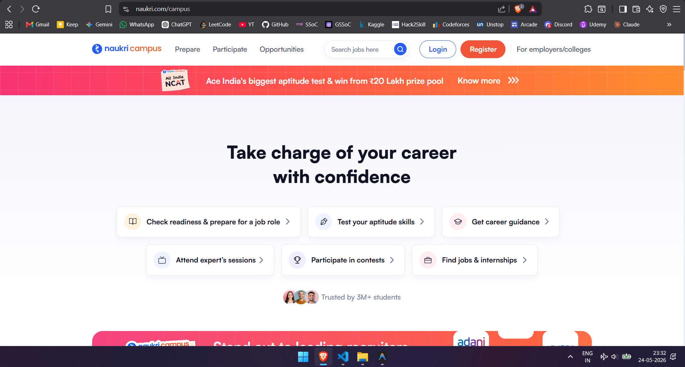

# Naukri.com Landing Page Archive / Clone

This repository contains a fully-packaged, offline-capable clone of the **Naukri.com** desktop PWA/landing page. The project was archived using the `saveweb2zip` utility, ensuring all critical styles, scripts, fonts, and assets are bundled locally for offline viewing, analysis, or UI prototyping.

---

## 📁 Project Directory Structure

Below is a breakdown of the repository's contents:

```text
saveweb2zip-com-www-naukri-com/
├── css/
│   └── main.c9cd75d1.css        # Bundled application styles containing layout rules, responsive sheets, and UI design tokens.
├── fonts/
│   ├── *.woff, *.woff2, *.ttf   # Local copies of system fonts (Inter, Outfit, Roboto) for consistent cross-browser rendering.
│   └── fnicon.*                 # Custom Naukri font icon sets (EOT, TTF, WOFF, WOFF2).
├── images/
│   └── favicon.ico              # Site icon.
├── js/
│   ├── 7564fe11.js              # Vendor/Runtime verification helper script.
│   ├── gtm.js                   # Google Tag Manager integration layer.
│   ├── loggerSPA_v6.0.min.js    # Single Page Application (SPA) client logger.
│   ├── main.d5dacaef.js         # Core application bundles and page rendering logic.
│   ├── ub_v1.16.min.js          # User Behavior Analytics (UBA) client.
│   └── vendors~main.69fed284.js # Third-party vendor bundles (React, ReactDOM, utility libraries).
├── index.html                   # Main entry point containing structural HTML, fallback styles, and analytics bootstrap script.
└── README.md                    # Project documentation.
```

---

## 🚀 How to Run Locally

You can run this project locally in a few easy ways:

### Method 1: Double-Click (Direct Launch)
Simply open the `index.html` file in any modern web browser (Google Chrome, Firefox, Microsoft Edge, Safari) by double-clicking it.

### Method 2: Serve via Python (Recommended)
To prevent CORS issues with local fonts or asynchronous scripts, it is highly recommended to run a lightweight local HTTP server.
1. Open your terminal/shell in the project directory.
2. Run the following command:
   ```bash
   python -m http.server 8000
   ```
3. Open your browser and navigate to `http://localhost:8000`.

### Method 3: VS Code Live Server
If you are using **VS Code**, install the **Live Server** extension, open the project folder, and click **"Go Live"** in the bottom-right corner.

---

## 🛠 Features & Architecture Details

1. **Self-Contained Styling**: The site utilizes standard vanilla compiled CSS from the production landing page of Naukri.com, which incorporates modern typography, layouts, and interactive elements.
2. **Performance Optimization**: Dynamic splash screen loader (`circleG`) is implemented with CSS keyframe micro-animations (`bounce_circleG`) inside `index.html` to deliver high visual engagement during script loading.
3. **PWA Infrastructure**: Relies on bundled JavaScript files (`main.d5dacaef.js` and `vendors~main.69fed284.js`) that power the React single-page application framework.
4. **Offline Resilience**: The fonts are fully hosted inside the `fonts/` directory, avoiding external dependencies on Google Fonts API endpoints and preventing broken font styles.
5. **Built-in Analytics & Telemetry**: Contains boilerplate configuration scripts for Google Tag Manager (GTM), Microsoft Clarity, and Naukri's proprietary User Behavior Analytics (UBA) backend collectors.

## Screenshots

