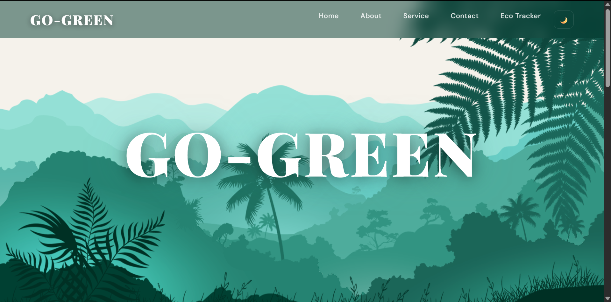

# Go Green — Eco Habit Tracker (Parallel-x)

## Description
A lightweight static eco habit tracker bundled with the Parallel-x landing site. It helps users log daily sustainable actions, measure simple environmental impact (eco points, CO₂, water), and track streaks and milestones — all without a backend.

## Features
- Landing CTA linking to the Eco Tracker
- Homepage snapshot of today's eco metrics
- Create, edit and delete custom habits
- Daily logging and history of completed actions
- Persistent storage via `localStorage` (`eco_habits`, `eco_totals`, `eco_history_log`, `eco_completed_today`, `eco_last_date`)
- Weekly summary and consecutive-day streak calculation
- Unlockable milestone badges based on cumulative impact
- Dark / Light theme toggle (persisted across pages)
- Mobile-friendly header/back-button behavior

## Technologies Used
- HTML5
- CSS3 (CSS variables for theming)
- JavaScript (ES6)

## Installation / Setup
1. Clone the repository or copy the `public/Parallel-x website/` folder to your web server or local machine.
2. From the repository root, run a simple static server (example with Python 3):

```bash
python -m http.server 8000
```

3. Open in your browser:


## Usage
- Open the tracker and add custom habits using the add form.
- Click a habit's action button to log completion for the day; totals and history update immediately.
- Edit or delete habits via the respective buttons.
- Toggle site theme using the moon/sun button in the header — the selection is saved to `localStorage.site_theme`.
- Clearing browser storage will reset habits and progress.

## Screenshots



## Contributing
Improvements welcome. Suggested workflow:
1. Fork the repo and create a branch: `git checkout -b feat/your-change`
2. Make changes and test locally.
3. Open a pull request with a clear description.

Please avoid adding heavy build tooling — this project is intentionally dependency-free.

## License
MIT License — see the top-level `LICENSE` file for details.

## Author
Indrayani Verulkar
