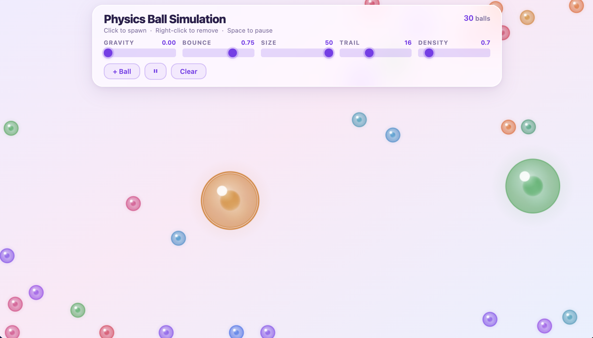

# Physics Ball Simulation

An interactive 2D physics simulation featuring bouncing balls with realistic gravity, elastic collisions, and ball-to-ball collision detection — all rendered on an HTML5 Canvas.

## Features

- Realistic gravity and wall bouncing with configurable elasticity
- Impulse-based elastic ball-to-ball collision detection and response
- Click or click-drag on the canvas to spawn balls at any position
- Gradient-shaded balls with specular highlights for a 3D look
- Configurable trail effect per ball
- Live controls: gravity strength, bounce elasticity, ball size, trail length, density
- Per-ball density — denser balls have more mass and hit harder (r³ mass model)
- Right-click any ball to remove it
- Pause / resume simulation (button or Space key)
- Clear all balls (button or C key)
- Responsive — fills the viewport on any screen size
- No external dependencies — pure HTML5 Canvas, CSS, and JavaScript ES6+

## Technologies Used

- HTML5 (Canvas API)
- CSS3 (glassmorphism, CSS animations)
- JavaScript ES6+ (requestAnimationFrame, class syntax)

## How to Run

1. Open `index.html` in a web browser
2. Enjoy the simulation!

## Usage

| Action | How |
|--------|-----|
| Spawn a ball | Click anywhere on the canvas |
| Spawn multiple balls | Click and drag across the canvas |
| Add a random ball | Click **+ Ball** |
| Pause / Resume | Click **⏸** or press **Space** |
| Clear all balls | Click **Clear** or press **C** |
| Adjust gravity | Drag the **Gravity** slider |
| Adjust bounciness | Drag the **Bounce** slider |
| Change spawn size | Drag the **Size** slider |
| Change trail length | Drag the **Trail** slider |
| Change density | Drag the **Density** slider |
| Remove a ball | Right-click it |

## Screenshots

## Author

Navneet Parashar — [GitHub](https://github.com/SilverMenace)
