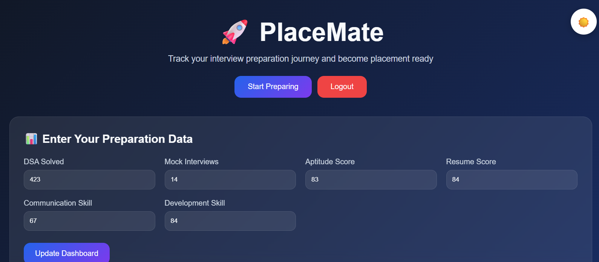
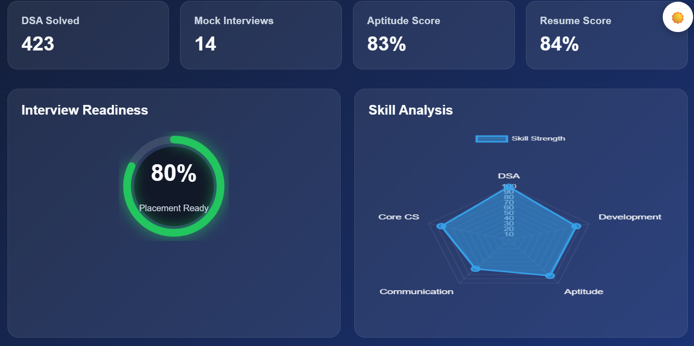
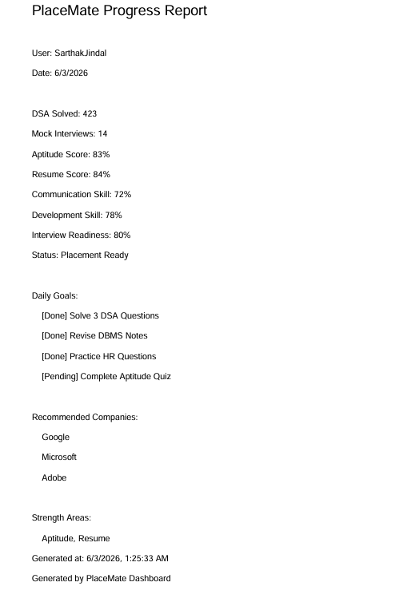

# 🚀 PlaceMate Dashboard

PlaceMate Dashboard is a modern and interactive placement preparation tracker designed to help students monitor their interview readiness, skill development, and overall placement progress. The dashboard provides visual analytics, preparation metrics, daily goals tracking, mock interview practice, company recommendations, and downloadable PDF reports.

---

## 📖 Overview

Preparing for placements requires consistent effort across multiple areas such as Data Structures & Algorithms, Aptitude, Communication Skills, Resume Building, and Development Skills. PlaceMate Dashboard centralizes these metrics into a single platform, allowing users to:

- Track preparation progress
- Analyze skill strengths and weaknesses
- Monitor interview readiness
- Practice common interview questions
- Set and complete daily goals
- Get company preparation recommendations
- Export progress reports as PDF documents

---

## ✨ Features

### 🔐 User Authentication
- User Login and Signup functionality
- LocalStorage-based authentication
- Persistent login sessions
- Logout support

### 📊 Preparation Tracking
Track important placement metrics including:

- DSA Problems Solved
- Mock Interviews Completed
- Aptitude Score
- Resume Score
- Communication Skill Score
- Development Skill Score

### 🎯 Interview Readiness Meter
- Dynamic readiness calculation
- Visual circular progress indicator
- Readiness status classification:
  - Placement Ready
  - Almost Ready
  - Need Improvement

### 📈 Skill Analysis Dashboard
- Interactive Radar Chart powered by Chart.js
- Real-time skill visualization
- Automatic updates when data changes

### ✅ Daily Goals Tracker
Track daily preparation tasks:

- Solve DSA Questions
- Revise DBMS Notes
- Practice HR Questions
- Complete Aptitude Quizzes

Goal completion status is visually updated.

### 💬 Mock Interview Practice
Includes commonly asked interview questions with sample answers:

- Tell me about yourself
- What are your strengths?
- Explain a challenging project
- Why should we hire you?

### 🏢 Company Recommendations
Dynamic company suggestions based on readiness score.

#### High Readiness
- Google
- Microsoft
- Adobe

#### Developing Readiness
- TCS
- Infosys
- Wipro

### 🌗 Dark / Light Mode
- One-click theme switching
- Theme persistence using LocalStorage

### 💾 Data Persistence
User data is automatically saved using LocalStorage.

Stored information includes:
- Scores
- Preparation metrics
- Theme preference
- Login status

### 🏅 Achievement Badge System

Earn badges automatically based on preparation milestones and performance.

Available badges include:

* 🏅 DSA Master
* 🏅 Aptitude Expert
* 🏅 Placement Ready
* 🏅 Consistency Champion

Badges update dynamically whenever preparation data is refreshed.


### 📄 Resume Improvement Suggestions

Receive personalized resume recommendations based on your Resume Score.

Example suggestions:

* ✓ Add Projects
* ✓ Improve Keywords
* ✓ Add Quantified Achievements
* ✓ Improve Project Descriptions
* ✓ Keep Updating Projects

Suggestions are generated dynamically to help improve placement readiness.


### 🤖 Personalized AI Insights

Get intelligent recommendations based on your preparation metrics.

The dashboard analyzes user scores and identifies:

* Weak skill areas
* Improvement opportunities
* Recommended next actions

Example:

Weak Areas:

* Communication
* Development

Recommended Actions:

* Practice HR Questions
* Build a Full-Stack Project

Insights update automatically whenever dashboard data changes.


### 📄 PDF Report Export
Generate a professional downloadable report containing:

- User Information
- Preparation Statistics
- Readiness Score
- Placement Status
- Daily Goals Summary
- Recommended Companies
- Strength Areas
- Generation Timestamp

---

## 🛠️ Technologies Used

### Frontend
- HTML5
- CSS3
- JavaScript (ES6)

### Libraries
- Chart.js
- jsPDF

### Storage
- Browser LocalStorage

---

## 📂 Project Structure

```text
PlaceMate/
│
├── index.html
├── style.css
├── script.js
├── README.md
│
└── assets/
```

---

## ⚙️ Installation

### 1. Clone the Repository

```bash
git clone https://github.com/your-username/placemate-dashboard.git
```

### 2. Navigate to Project Directory

```bash
cd placemate-dashboard
```

### 3. Open the Project

Simply open:

```text
index.html
```

in your browser.

No build process or package installation is required.

---

## 🚀 Usage

### Create Account

1. Open the application.
2. Click Sign Up.
3. Enter username and password.
4. Create account.

### Login

1. Enter registered credentials.
2. Click Login.

### Update Progress

1. Enter preparation data.
2. Click Update Dashboard.
3. Dashboard metrics update automatically.

### Complete Goals

Check goals as you complete them.

### Practice Interviews

Use the Mock Interview Questions section.

### Download Report

Click:

```text
Download Report
```

to export your progress as a PDF file.

---

## 📊 Readiness Score Calculation

The readiness score is calculated using:

```text
(Aptitude + Resume + Communication + Development) / 4
```

### Readiness Levels

| Score Range | Status |
|------------|---------|
| 80 - 100 | Placement Ready |
| 60 - 79 | Almost Ready |
| Below 60 | Need Improvement |

---

## 💾 Local Storage Keys

The application stores data using:

```javascript
placemateUser
placemateUsers
placemateUserData
placemateTheme
```

---

## 🎨 UI Components

### Dashboard Cards
- DSA Statistics
- Mock Interview Statistics
- Aptitude Score
- Resume Score

### Visualizations
- Circular Progress Meter
- Radar Skill Chart

### Interactive Sections
- Goal Tracker
- Interview Questions
- Company Recommendations

---

## 🔮 Future Enhancements

Potential improvements:

- Backend Authentication
- Cloud Data Storage
- User Profiles
- Multiple Dashboard Views
- Progress History Tracking
- Weekly Analytics
- Monthly Reports
- AI-Based Recommendations
- Interview Performance Scoring
- Resume Analyzer Integration
- Export Charts to PDF
- Email Report Sharing

---


## 📸 Screenshots

### Dashboard


### Skill Analysis


### PDF Report


---

## 📜 License

This project is licensed under the MIT License.

Feel free to use, modify, and distribute this project.

---

## 👨‍💻 Author

Developed for placement preparation and skill tracking.

### PlaceMate Dashboard
Track. Improve. Get Placement Ready. 🚀