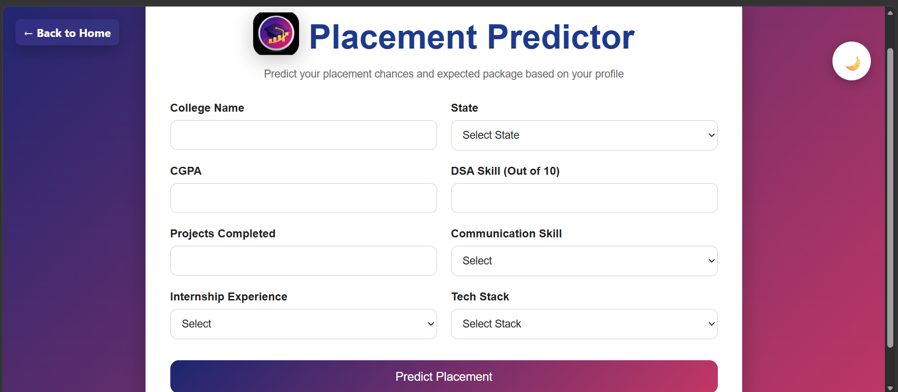
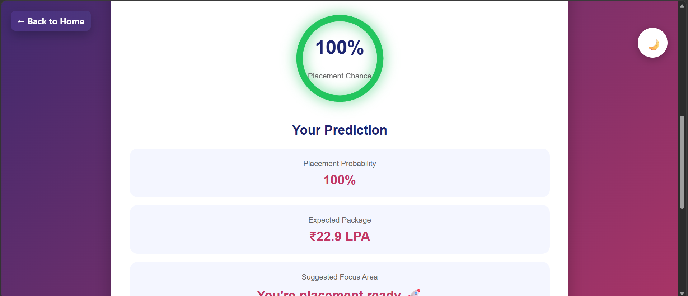
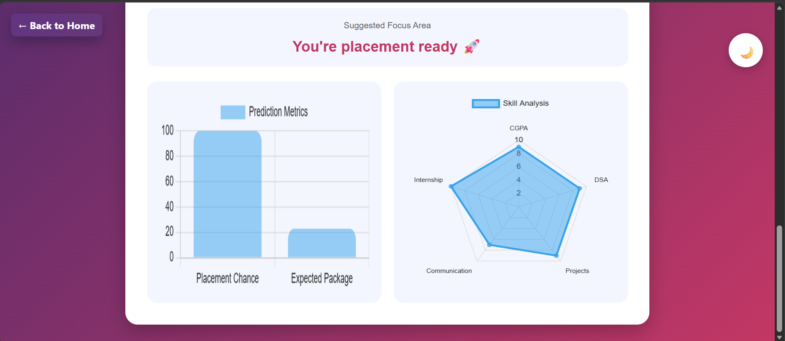

# 🎓 Placement Predictor

A modern, responsive, and interactive Placement Predictor web application that helps students estimate their placement chances and expected salary package based on academic performance, technical skills, internships, projects, and communication abilities.

The platform provides a visually rich analytics dashboard with charts, animated progress indicators, theme switching, and responsive layouts for all devices.

---

# 🌟 Live Features

✅ Placement probability prediction  
✅ Expected salary package estimation  
✅ Circular animated placement meter  
✅ Interactive charts using Chart.js  
✅ Dark / Light mode support  
✅ Fully responsive UI  
✅ Floating animated logo  
✅ Smooth transitions and hover effects  
✅ Radar-based skill analysis  
✅ Gradient modern dashboard design  
✅ Mobile-friendly layout  
✅ LocalStorage theme persistence  
✅ Real-time prediction updates  

---

# 📂 Project Structure

```
Placement_Predictor/
│
├── index.html        # Main HTML structure
├── style.css         # Styling and animations
├── script.js         # Prediction logic and charts
├── logo.png          # Website logo
├── Preview.png
├── Analysis-1.png
├── Analysis-2.png
├── favicon.png       # Browser favicon
└── README.md         # Project documentation
```

---

# 🛠 Tech Stack
| Technology | Usage                |
| ---------- | -------------------- |
| HTML5      | Structure            |
| CSS3       | Styling & Animations |
| JavaScript | Prediction Logic     |
| Chart.js   | Graphs & Analytics   |

---

# Prediction Factors
The placement prediction algorithm analyzes:

- 📚 CGPA
- 💻 DSA Skill Level
- 🛠 Projects Completed
- 🗣 Communication Skills
- 🏢 Internship Experience
- 🚀 Tech Stack Selection

# 📊 Dashboard Components
## 🔹 Placement Meter
Animated circular progress ring displaying:
Placement Probability
Dynamic Color Indicators
Smooth Animated Transitions

## 🔹 Prediction Cards
Displays:
Placement Chance
Expected Package
Suggested Improvement Area

## 🔹 Analytics Charts
### 📈 Bar Chart
Compares:
- Placement Probability
- Expected Package

### 🕸 Radar Chart
Visualizes:
- Technical Skills
- Communication
- Internship Readiness
- Academic Strength

## 🌙 Dark Mode
The application supports:
- Dark Theme
- Light Theme
- Theme persistence using - LocalStorage

User preferences are automatically saved.

## 🎨 UI/UX Enhancements
✨ Modern Design Features
- Glassmorphism-inspired cards
- Gradient backgrounds
- Responsive grid layout
- Smooth hover animations
- Floating logo effect
- Soft shadows and glowing effects
- Interactive buttons

## 📱 Responsiveness
Optimized for:
- 💻 Desktop
- 📱 Mobile
- 📲 Tablets
- 🖥 Large Screens

---

# Animations Included

| Animation                 | Purpose               |
| ------------------------- | --------------------- |
| Floating Logo             | Adds dynamic branding |
| Hover Lift Effects        | Interactive feel      |
| Progress Ring Animation   | Smooth score loading  |
| Theme Toggle Rotation     | Better UX             |
| Fade & Transition Effects | Smooth UI interaction |

---
# Preview
<p align="center">
  
</p>

---

# Analysis Preview
<p align="center">
  
</p><p align="center">
  
</p>

---

# 🔥 Future Improvements
Planned future features:

- 🤖 AI/ML-based prediction engine
- 🏢 Company-wise placement prediction
- 📄 Resume analyzer integration
- 📈 Historical analytics dashboard
- 🔐 Login & user profiles
- ☁ Cloud database integration
- 📊 Export report as PDF
- 🎯 Personalized placement roadmap

---

# 🚀 How To Run Locally
1️⃣ Clone Repository
```
git clone <repository-link>
```
2️⃣ Open Project Folder
```
cd Placement_Predictor
```
3️⃣ Run Project

Open:
```
index.html
```
in your browser.

---

# Logo & Branding

- The project includes:
- Custom animated logo
- Custom favicon
- Placement-themed branding
- Professional modern UI

# 📸 Preview Sections
## 🏠 Main Interface
- Responsive form layout
- Placement prediction dashboard

## 📊 Analytics Section
- Skill visualization
- Salary analysis charts

## 🌙 Dark Mode
- Fully themed dark interface

---

# 📌 Key Highlights

- Beginner-friendly project
- Fully frontend-based
- Easy to customize
- Modern UI design
- Great for portfolio showcase
- Real-time calculations
- Lightweight and fast

---

# 🤝 Contribution
Contributions are welcome!
You can improve:
- Prediction logic
- UI/UX
- Accessibility
- Animations
Performance
- Mobile responsiveness

---

# 🌟 Support

If you like this project:
- Star the repository
- Fork the project
- Contribute improvements