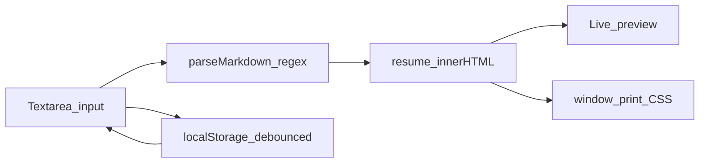

```
    ◆━━━━━━━━━━━━━━━━━━━━━━━━━━━━━━━━━━━━━━━━━━━━━━━━━━━━━━◆
         R E S U M E   P R E V I E W E R
    ◆━━━━━━━━━━━━━━━━━━━━━━━━━━━━━━━━━━━━━━━━━━━━━━━━━━━━━━◆
           Markdown in  ·  Beautiful resume out
```

> **Type Markdown on the left.** Watch a print-ready resume appear on the right — instantly, in your browser, with zero dependencies.

---

## At a glance

```
┌─────────────────────────────────────────────────────────────────────────────┐
│  ◆ Resume Previewer          [ Templates ]  [ Clear ]  [ Export PDF ]     │
├──────────────────────────────┬──┬───────────────────────────────────────────┤
│  MARKDOWN                    │  │  PREVIEW                                  │
│  ─────────────────────────   │  │  ─────────────────────────────────────    │
│                              │  │                                           │
│  # Your Name                 │  │       Your Name                           │
│  **Role** | email | phone    │  │       Role · email · phone                │
│                              │  │  ─────────────────────────────────────    │
│  ## Summary                  │  │  SUMMARY                                  │
│  Your story in plain text.   │  │  Your story, beautifully set.             │
│                              │  │                                           │
│  ## Experience               │  │  EXPERIENCE                               │
│  - **Co** — Role (2024)      │  │  • Co — Role (2024)                       │
│    - Impact bullet           │  │    • Impact bullet                        │
│                              │  │                                           │
│  (you type here)             │  │  (updates as you type)                    │
└──────────────────────────────┴──┴───────────────────────────────────────────┘
```

---

## Features

- **Live side-by-side sync** — Every keystroke in the editor triggers an immediate preview refresh (`input` → `renderPreview()`).
- **Custom Markdown parser** — Lightweight regex pipeline in vanilla JavaScript: `parseMarkdown`, `parseInline`, and `escapeHtml` — no third-party bundles.
- **Export to PDF** — One click runs `window.print()`; `@media print` rules in CSS hide the chrome and format a letter-size, professional layout.
- **Starter templates** — Quick-load **Software Engineer** and **Data Analyst** layouts from the toolbar.
- **Auto-save** — Drafts persist in `localStorage` under `resume-previewer-markdown` (400ms debounced save).

---

## Quick start

1. **Open** `index.html` in any modern browser — no install, no build step.
2. **Write** your resume in Markdown, or click a template button to load a starter draft.
3. **Export** — Click **Export PDF**, then choose **Save as PDF** in the print dialog.

---

## Supported Markdown

| Syntax | Example | Renders as |
|--------|---------|------------|
| `#` | `# Jane Doe` | Name (heading 1) |
| `##` | `## Experience` | Section title |
| `###` | `### Subsection` | Subsection title |
| `**text**` | `**Senior Developer**` | **Bold** |
| `- item` | `- Led team of 5` | Bulleted list |
| `[text](url)` | `[Portfolio](https://example.com)` | Clickable link |

The line immediately after your `#` name is styled as a **contact line** when it looks like a subtitle (bold, email, or pipe-separated details).

### Example resume

Copy this into the editor to see the preview in action:

```markdown
# Jane Doe
**Product Designer** | jane@email.com | (555) 123-4567 | [portfolio.com](https://portfolio.com)

## Summary
Designer focused on accessible, human-centered interfaces with 6+ years in SaaS.

## Experience
- **Acme Corp** — Senior Product Designer (2022 – Present)
  - Redesigned onboarding flow; increased activation by 28%
- **Studio North** — UI Designer (2019 – 2022)
  - Shipped design system used across 4 product teams

## Skills
- Figma, prototyping, user research, design systems
- HTML/CSS literacy for tight dev collaboration
```

---

## How it works



1. You type raw Markdown into the textarea.
2. `parseMarkdown` walks line-by-line, matching headers, lists, and paragraphs.
3. `parseInline` applies bold and link patterns on each segment.
4. The preview pane receives safe HTML; print styles take over when you export.

---

## Tech stack

| Layer | Choice |
|-------|--------|
| Structure | HTML5 |
| Layout & print | CSS3 — CSS Grid, Flexbox, `@media print`, `@page` |
| Logic | Vanilla JavaScript — regex parsing, DOM rendering |
| Persistence | Browser `localStorage` |
| PDF | Native print dialog (no canvas libraries) |

---

## Project structure

```
Resume Previewer/
├── index.html    Split-screen shell, toolbar, editor & preview panes
├── style.css     Dark UI chrome, resume typography, responsive & print rules
├── script.js     Parser, live render, templates, auto-save, print trigger
└── README.md     You are here
```

---

## Design notes

**Custom regex instead of a Markdown library** — Keeps the project dependency-free and makes parsing behavior transparent. You see exactly how `#`, `**`, `-`, and `[text](url)` map to resume HTML.

**Native print instead of PDF libraries** — Browsers already render print layouts well. With tuned `@page` margins, page-break rules, and print-only visibility, Export PDF produces clean results without shipping a heavy PDF generator.

---

<p align="center">
  <strong>No install. No framework. Just open and write.</strong>
</p>
