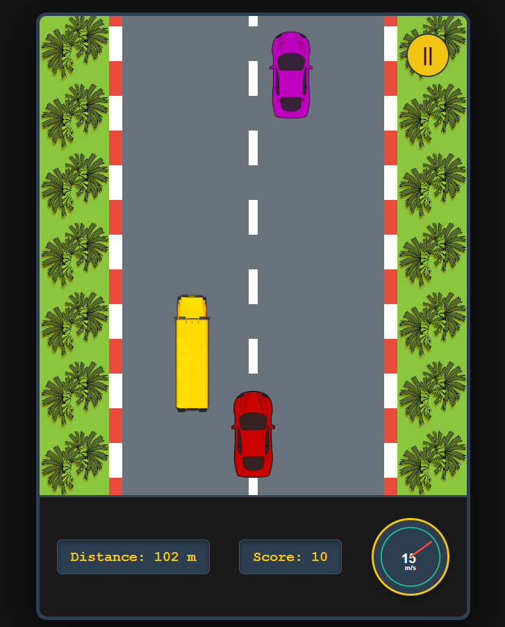
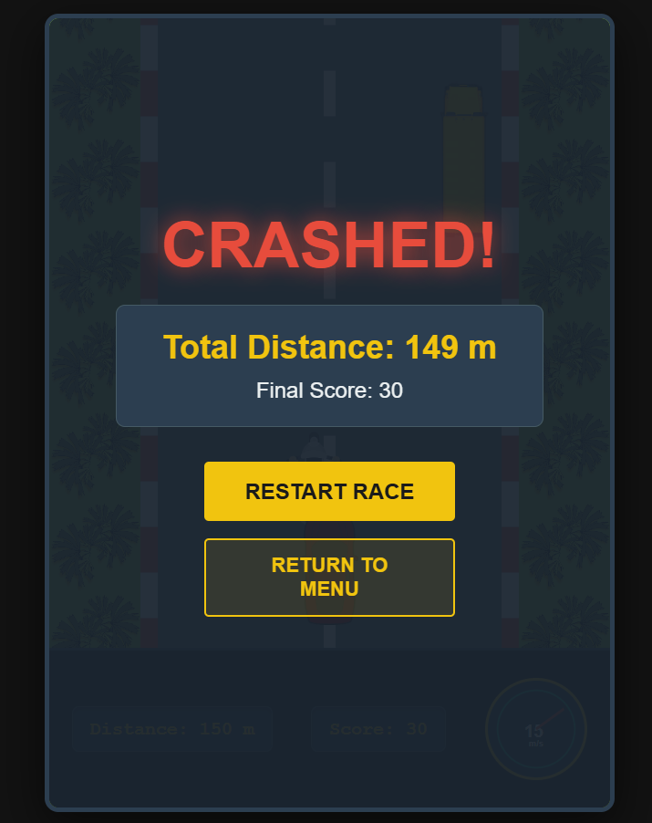

# Retro Highway Racer

## Description
An endless 2D highway racing game featuring an interactive dashboard console, smooth parallax environments, and responsive mechanics built entirely with vanilla frontend technologies.

## Features
- **Dynamic Speedometer:** An interactive SVG gauge that smoothly interpolates needle acceleration and deceleration using CSS transitions.
- **Parallax Environments:** Independent layered background scrolling logic where the grass textures move relative to the highway speed to simulate spatial depth.
- **Defensive Boundary Collision:** Accurate bounding-box detection handling collision limits against curbs and obstacle types.
- **Unified Arcade UI/UX:** A structured racing slate and gold console theme optimized across mobile, tablet, and desktop breakpoints.

## Technologies Used
- HTML5
- CSS3
- JavaScript ES6

## Installation/Setup
1. Fork this repository.
2. Clone the repository locally: `git clone https://github.com/poorvi-2026/100_days_100_web_project.git`
3. Navigate to the project directory: `cd 100_days_100_web_project/public/RetroHighwayRacer/`

## Usage
1. Open the `index.html` file directly in any modern web browser (or run via VS Code Live Server).
2. Use the **Left/Right Arrow Keys** or **A/D Keys** on desktop to steer your car and dodge incoming obstacles.
3. On mobile devices, use the on-screen left and right steering buttons.

## Screenshots

| Main Menu | Gameplay |
| :---: | :---: |
|  |  |

| Paused Screen | Game Over |
| :---: | :---: |
|  |  |

## Contributing
Contributions are welcome! Please follow the root repository's `CONTRIBUTING.md` guidelines for submitting pull requests.

## License
MIT License

## Author
Poorvi Parashar