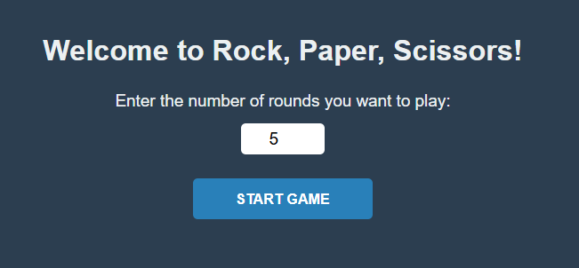
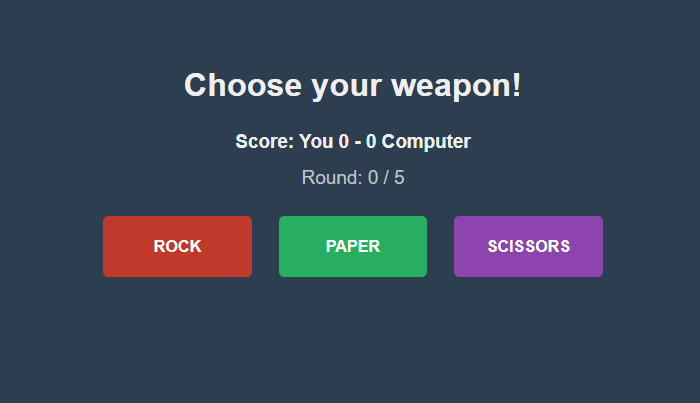
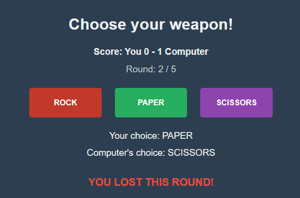
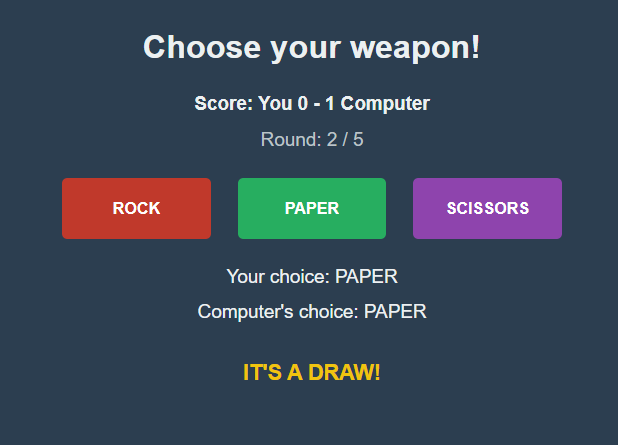
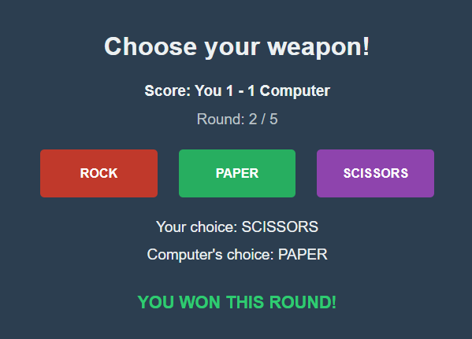

# Rock, Paper, Scissors Web Game

A clean, responsive, and modern web implementation of the classic Rock, Paper, Scissors game. This project is a direct web migration of a Python Tkinter desktop application, retaining its precise core mechanics, rules, and color themes while delivering an optimized user experience for web browsers.

## 🚀 Features

- **Customizable Game Length**: Choose exactly how many rounds you want to play before the match begins.
- **Dynamic State Tracking**: Watch your score and the current round counter update instantly as you play.
- **Color-Coded Feedback**: Visual cues flash green for a win, red for a loss, and yellow for a tie.
- **Clean Responsive Layout**: Fits smoothly on both mobile screens and desktop monitors.
- **Safe State Controls**: Interaction buttons automatically lock when a match concludes to prevent accidental inputs.

## 📁 File Structure

The project consists of three lightweight files:

```text
├── index.html   # Defines the structural frames (Setup and Game views)
├── styles.css   # Handles the color palette, fonts, and responsive grid layouts
└── script.js    # Manages the computer choices, win/loss logic, and state engine
```

## 🛠️ How to Run the Project

Since this application relies strictly on standard frontend web technologies, it does not require a server, installation process, or external compiler.

1. **Download** or save `index.html`, `styles.css`, and `script.js` into the exact same folder on your computer.
2. **Double-click** the `index.html` file to open it instantly inside any web browser (Chrome, Safari, Edge, Firefox, etc.).

## 🕹️ How to Play

1. **Set Rounds**: On the greeting screen, enter your preferred number of rounds (Defaults to `5`) and click **Start Game**.
2. **Make a Choice**: Pick your weapon by clicking either **ROCK**, **PAPER**, or **SCISSORS**.
3. **See Results**: The engine automatically rolls a random counter-move for the computer, processes the winner, and shows the status updates.
4. **Finish and Reset**: Once all rounds are exhausted, a browser alert declares the final winner. Click the **Play Again** button to wipe the cache and return to the main setup screen.

## 🎨 Tech Stack & Styling Match Notes

- **Language**: Vanilla JavaScript (ES6+), HTML5, and CSS3.
- **Color Palette**: The theme explicitly maps to the original Python UI toolkit colors:
  - Deep Navy Slate background (`#2c3e50`)
  - Rock Crimson (`#c0392b`)
  - Paper Emerald (`#27ae60`)
  - Scissors Amethyst (`#8e44ad`)

## Images





