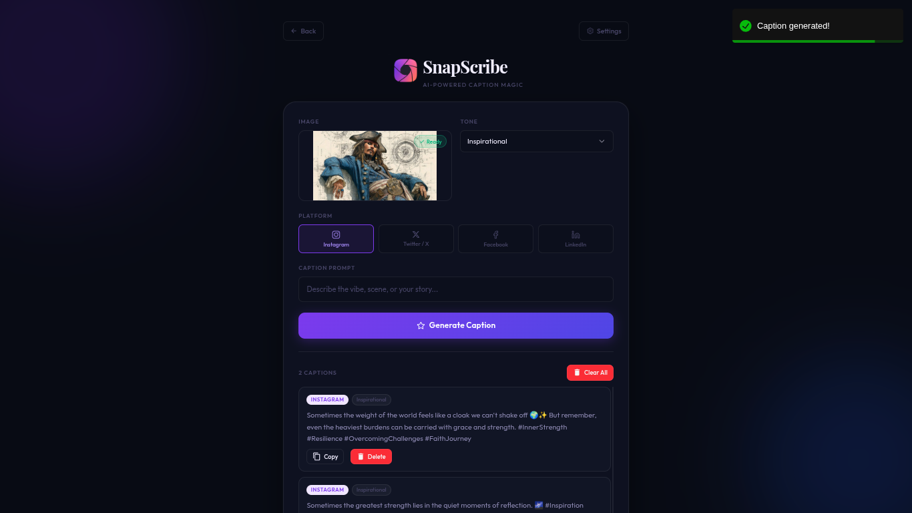

# 
SnapScribe

An AI-powered social media caption generator. Upload an image, snap a photo, or type a prompt and get scroll-stopping captions tailored for Instagram, Twitter / X, Facebook, and LinkedIn.

## Features
- 📷 Drag & drop image upload or in-app camera capture
- 🎭 11 caption tones (Fun, Romantic, Aesthetic, Witty, Luxury, and more)
- 🌐 Platform-aware captions (Instagram, Twitter / X, Facebook, LinkedIn)
- 📋 One-click copy for every generated caption
- 🔑 User-provided Mistral API key which is stored locally, no backend needed
- 📱 Fully responsive UI

## Technologies Used
- React + Vite
- JavaScript
- Mistral AI API (`mistral-small-latest`)
- TanStack Query
- react-dropzone 
- react-toastify

## How to Run
1. Open the live demo: [SnapScribe](https://ai-caption-generator-eeux.onrender.com/)
2. Click **⚙️ Settings** and enter your [Mistral API key](https://console.mistral.ai/api-keys)
3. Upload an image or type a prompt and hit **Generate Caption** 🚀

## Run Locally
1. Clone the repo and `cd` into the `SnapScribe` folder
2. Run `npm install`
3. Run `npm run dev` and open `http://localhost:5173`

## Screenshots

## Author
gc_MayankPun — [GitHub](https://github.com/gc-MayankPun)