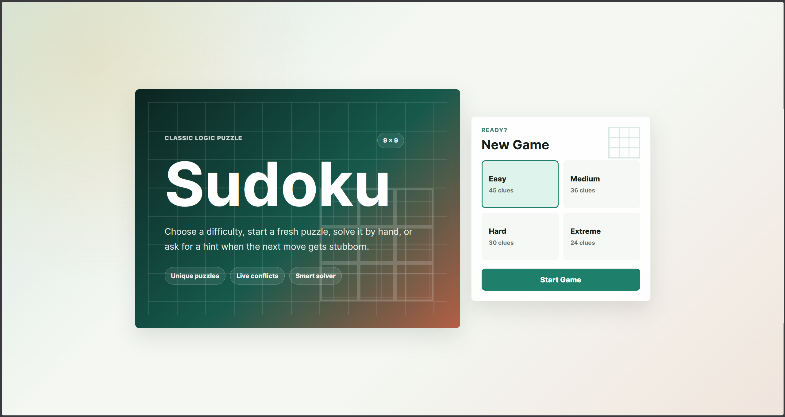
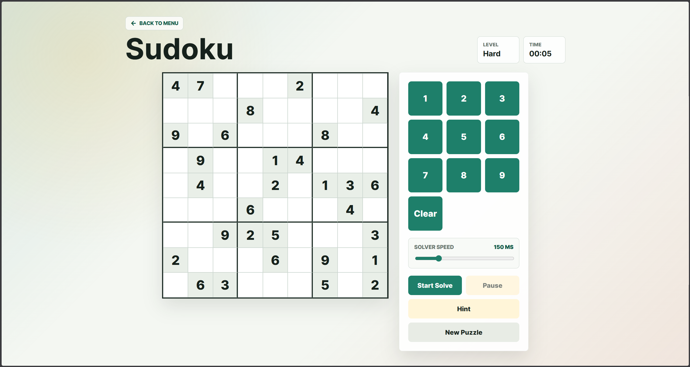

# SudoSolve

A clean and interactive Sudoku game where players can choose a difficulty, solve puzzles manually, get hints, and watch a smart backtracking solver complete the board.

## Features
- Four difficulty levels: Easy, Medium, Hard, and Extreme
- Fresh Sudoku puzzle generation for every new game
- Interactive 9 x 9 Sudoku board with keyboard and number-pad input
- Live conflict highlighting for invalid entries
- Hint support when players need help with the next move
- Visual backtracking solver with adjustable speed
- Pause and resume controls for the solver
- Game timer to track solve time
- Responsive layout for desktop and mobile screens

## Technologies Used
- HTML
- CSS
- JavaScript

## How to Run
1. Open `index.html` in a web browser
2. Select a difficulty level
3. Click **Start Game**
4. Enjoy the project!

## Screenshots

## Author
Created by **Akshith**

- GitHub: [Akshith-cdr](https://github.com/Akshith-cdr)
