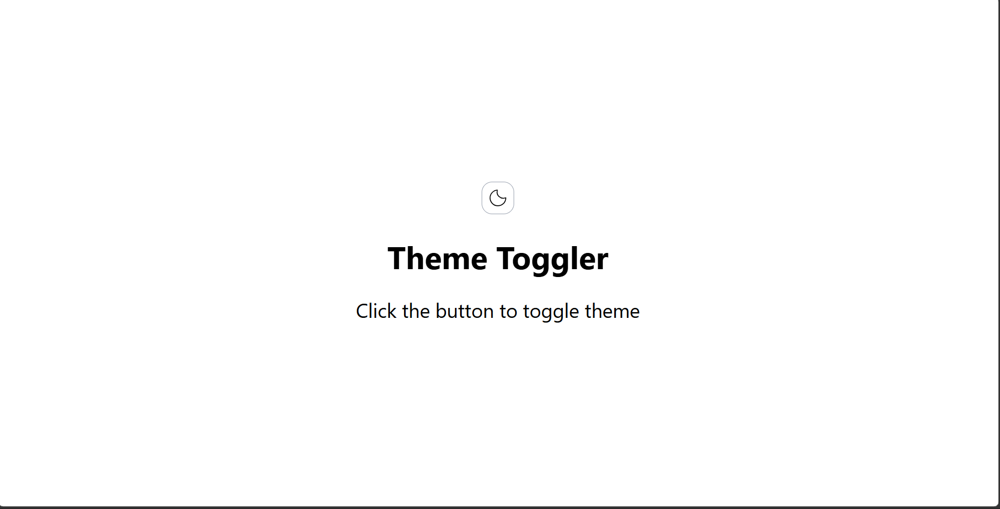
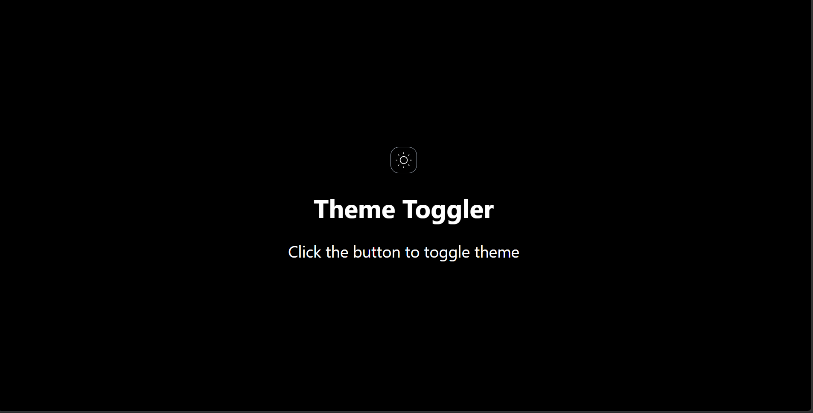

# Theme Toggler

A simple and interactive Theme Toggler built using React and Tailwind CSS. Users can switch between Light Mode and Dark Mode with a single click, and the selected theme is saved using localStorage for a consistent experience across sessions.

## Features

* Toggle between Light and Dark themes
* Theme preference saved in localStorage
* Responsive and user-friendly interface
* Smooth theme transition effects

## Technologies Used

* React.js
* Tailwind CSS
* JavaScript
* Vite

## How to Run

1. Clone the repository
2. Open the project folder in your code editor
3. Install dependencies using:

```bash
npm install
```

4. Start the development server:

```bash
npm run dev
```

5. Open the local URL shown in the terminal (usually http://localhost:5173)
6. Enjoy the project!

## Screenshots


### Light Mode



### Dark Mode



## Author

Anuj Sharma
