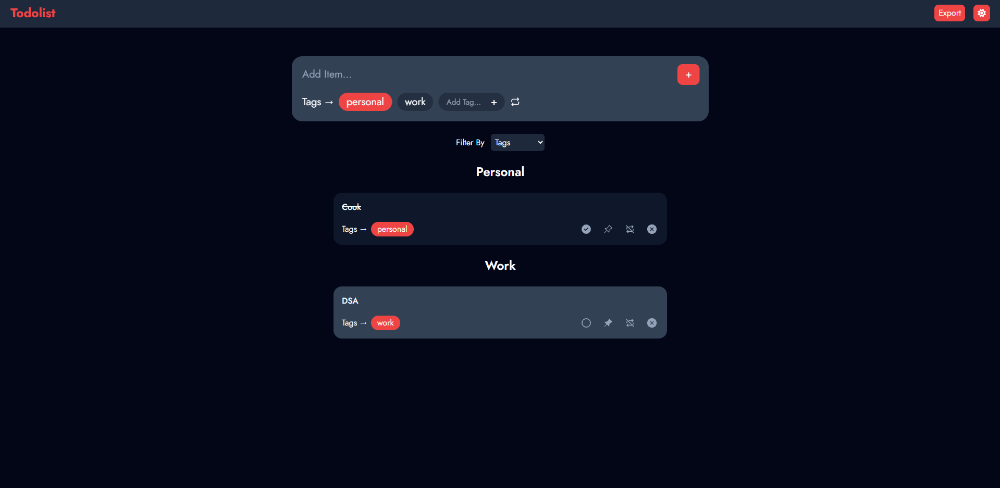
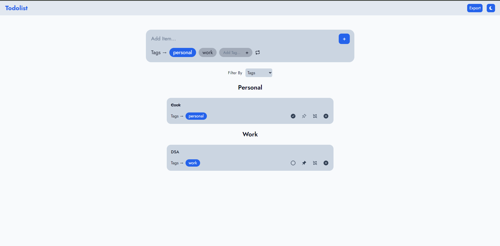

# ✅ TodoList App

### A clean, feature-rich Todo application built with React, TypeScript, and Tailwind CSS.  
Supports dark/light mode, tag-based filtering, recurring tasks, and persistent storage — all with a smooth, responsive UI.


---

## 📸 Screenshots

| Dark Mode | Light Mode |
|:---------:|:----------:|
|  |  |

---

## 📋 Table of Contents

- [Introduction](#-introduction)
- [Features](#-features)
- [Technologies Used](#-technologies-used)
- [Project Structure](#-project-structure)
- [Installation](#-installation)
- [Usage](#-usage)
- [Future Enhancements](#-future-enhancements)
- [Contributing](#-contributing)
- [Authors](#-authors)
- [License](#-license)

---

## 🧾 Introduction

**TodoList App** is a fully functional task management application built as part of the **100 Days 100 Web Projects** challenge. It allows users to create, organize, and track their daily tasks efficiently with features like tag-based categorization, pin/complete/delete actions, and a dark/light theme toggle — all persisted across sessions using `localStorage`.

The project was recently fixed and refactored after a critical bug caused a completely blank UI due to a misconfigured `tailwind.config.js`. It now follows React best practices with immutable state updates, proper TypeScript typings, and clean component architecture.

---

## ✨ Features

- ✅ **Create Tasks** — Add todos with title, tags, and recurring options
- 📌 **Pin Tasks** — Pin important tasks to the top of the list
- ☑️ **Complete Tasks** — Mark tasks as done with a single click
- 🗑️ **Delete Tasks** — Remove tasks you no longer need
- 🏷️ **Tag-Based Filtering** — Filter tasks by custom tags
- 🔁 **Recurring Tasks** — Tasks that auto-reset daily at midnight
- 🌗 **Dark / Light Mode** — Toggle between themes, persists on refresh
- 💾 **LocalStorage Persistence** — Tasks and preferences survive page reloads
- 📱 **Responsive Design** — Works seamlessly on mobile and desktop
- 🛡️ **Safe Storage Reads** — Corrupt `localStorage` data won't crash the app

---

## 🛠️ Technologies Used

| Technology | Purpose |
|---|---|
| [React 18](https://reactjs.org/) | UI library |
| [TypeScript](https://www.typescriptlang.org/) | Type safety and better DX |
| [Tailwind CSS](https://tailwindcss.com/) | Utility-first styling |
| [Vite](https://vitejs.dev/) | Fast dev server and build tool |
| `localStorage` | Client-side data persistence |

---

## 📁 Project Structure

```
todolist-app/
│
├── public/
│   └── vite.svg
│
├── src/
│   ├── components/
│   │   ├── TodoItem.tsx         # Individual task card component
│   │   ├── TagFilter.tsx        # Tag-based filter sidebar/bar
│   │   └── AddTodoModal.tsx     # Modal for creating new tasks
│   │
│   ├── types/
│   │   └── index.ts             # TodoItem type definitions
│   │
│   ├── utils/
│   │   └── storage.ts           # loadFromStorage<T>() utility with try/catch
│   │
│   ├── constants/
│   │   └── storageKeys.ts       # STORAGE_KEYS constant object
│   │
│   ├── App.tsx                  # Root component with state management
│   ├── main.tsx                 # Entry point
│   ├── App.css                  # Global styles + Jost font import
│   └── index.css                # Tailwind base directives
│
├── index.html
├── tailwind.config.js
├── vite.config.ts
├── tsconfig.json
└── package.json
```

---

## ⚙️ Installation

Follow these steps to run the project locally:

### Prerequisites

Make sure you have the following installed:

- [Node.js](https://nodejs.org/) (v18 or higher)
- [npm](https://www.npmjs.com/) or [yarn](https://yarnpkg.com/)

### Steps

**1. Clone the repository**

```bash
git clone https://github.com/your-username/todolist-app.git
cd todolist-app
```

**2. Install dependencies**

```bash
npm install
```

**3. Start the development server**

```bash
npm run dev
```

**4. Open in browser**

```
http://localhost:5173
```

### Build for Production

```bash
npm run build
```

Preview the production build:

```bash
npm run preview
```

---

## 🚀 Usage

| Action | How To |
|---|---|
| Add a task | Click the **"+ Add Task"** button, fill in the form, and hit Save |
| Pin a task | Click the 📌 pin icon on any task card |
| Complete a task | Click the checkbox on the task card |
| Delete a task | Click the 🗑️ delete icon on the task card |
| Filter by tag | Click a tag from the tag filter bar |
| Toggle theme | Click the 🌙 / ☀️ icon in the top-right corner |
| Recurring tasks | Enable the "Recurring" option while creating a task — it resets daily |

---

## 🧑‍💻 Key Implementation Details

### LocalStorage Persistence

Tasks, tags, and dark mode preference are all saved to `localStorage` using a type-safe utility:

```ts
function loadFromStorage<T>(key: string, fallback: T): T {
  try {
    const stored = localStorage.getItem(key);
    return stored ? JSON.parse(stored) : fallback;
  } catch {
    return fallback;
  }
}
```

### Immutable State Updates

All state mutations use immutable patterns to ensure React re-renders correctly:

```ts
// Toggle complete status — immutable map()
const toggleTodoStatus = (id: string) => {
  setTodos(prev =>
    prev.map(todo =>
      todo.id === id ? { ...todo, completed: !todo.completed } : todo
    )
  );
};
```

### Recurring Task Reset

Tasks marked as recurring automatically reset at midnight using a `useEffect` with the current state via functional updater:

```ts
useEffect(() => {
  const checkReset = () => {
    const today = new Date().toDateString();
    setTodos(prev =>
      prev.map(todo =>
        todo.recurring && todo.lastReset !== today
          ? { ...todo, completed: false, lastReset: today }
          : todo
      )
    );
  };
  const interval = setInterval(checkReset, 60000);
  return () => clearInterval(interval);
}, []);
```

---

## 🔮 Future Enhancements

- [ ] **Drag-and-drop** task reordering
- [ ] **Due dates & reminders** with browser notifications
- [ ] **Priority levels** (Low / Medium / High)
- [ ] **Subtasks** support
- [ ] **Search** tasks by title or tag
- [ ] **Export tasks** as CSV or JSON
- [ ] **Backend integration** — sync tasks across devices
- [ ] **User authentication** — personal task boards
- [ ] **Animations** — smooth task enter/exit transitions

---

## 🤝 Contributing

Contributions are welcome and appreciated! Here's how to get started:

**1. Fork the repository**

Click the **Fork** button at the top right of this page.

**2. Create a new branch**

```bash
git checkout -b feat/your-feature-name
```

> Use prefixes: `feat/`, `fix/`, `docs/`, `refactor/`

**3. Make your changes**

Follow the existing code style. Use TypeScript types properly and avoid direct state mutations.

**4. Commit your changes**

```bash
git commit -m "feat: add due date support for tasks"
```

**5. Push and open a Pull Request**

```bash
git push origin feat/your-feature-name
```

Then open a PR against the `main` branch with a clear description of your changes.

### Contribution Guidelines

- Write clean, readable TypeScript — no `any` types
- Use immutable state update patterns (`map`, `filter`, spread)
- Test your changes locally with `npm run dev` before submitting
- Keep PRs focused — one feature or fix per PR
- Add screenshots in PRs for UI changes

---

## 📄 License

This project is licensed under the **MIT License**.

```
MIT License

Copyright (c) 2025

Permission is hereby granted, free of charge, to any person obtaining a copy
of this software and associated documentation files (the "Software"), to deal
in the Software without restriction, including without limitation the rights
to use, copy, modify, merge, publish, distribute, sublicense, and/or sell
copies of the Software, and to permit persons to whom the Software is
furnished to do so, subject to the following conditions:

The above copyright notice and this permission notice shall be included in all
copies or substantial portions of the Software.
```

---

## 👩‍💻 Authors

| Role | Name |
|---|---|
| 💻 App Development | **Sanyogita Singh** |
| 📝 Documentation | **Sanyogita Singh** |

---

<div align="center">

Made with ❤️ as part of the **100 Days 100 Web Projects** Challenge

⭐ If you found this useful, please star the repository!

</div>