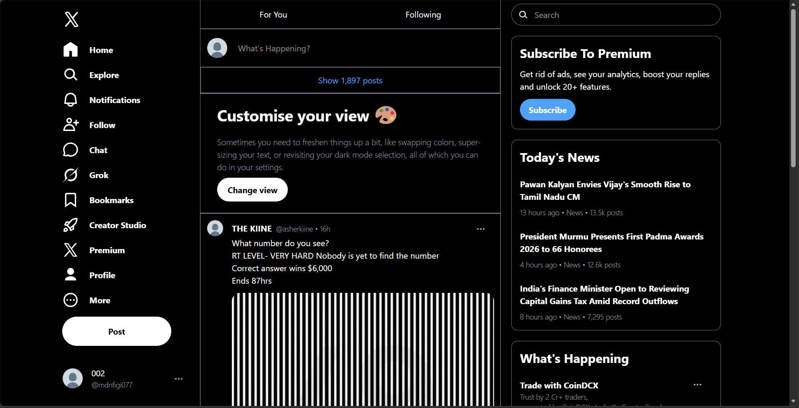

# Twitter Clone

A responsive clone of the Twitter (X) Home Page built using HTML and Tailwind CSS. This project recreates the core Twitter feed interface, including the sidebar, navigation tabs, tweet composer, and post interaction section.

## Features

- Responsive Twitter-inspired UI
- Fixed left sidebar navigation
- Sticky top navigation
- "For You" and "Following" tabs
- Tweet composer section
- Feed layout with post interactions
- Like, Comment, Repost, Analytics, and Share icons
- Built with Tailwind CSS
- Clean and modern design

## Technologies Used

- HTML5
- Tailwind CSS
- SVG Icons

## Project Structure

```bash
Twitter-clone/
├── assets/
├── src/
├── index.html
├── package.json
├── package-lock.json
└── README.md
```

## 📸 Preview




## ⚙️ Installation

Clone the repository:


Navigate to the project folder:

```bash
cd public/Twitter-clone
```

Install dependencies:

```bash
npm install
```

Start Tailwind CSS:

```bash
npm run dev
```

Open `index.html` in your browser.


## 👨‍💻 Author

Anuj Sharma