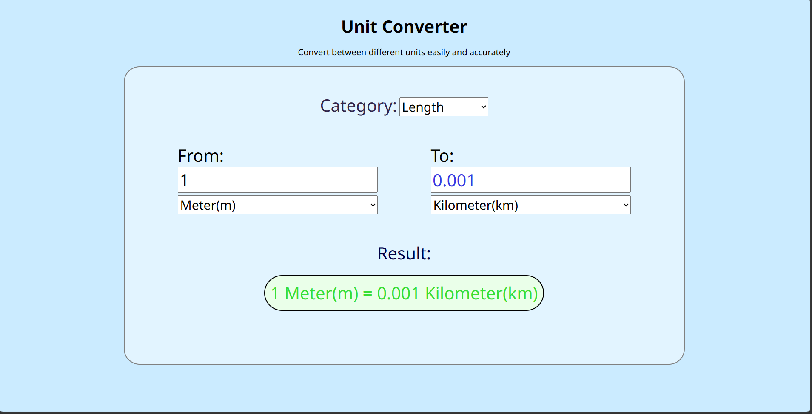

````markdown id="e7vmqk"
# Unit Converter

A simple and responsive Unit Converter web application built using HTML, CSS, and JavaScript.  
It allows users to convert values between different units easily and accurately.

## Features

- Convert between different unit categories
- Supports:
  - Length
  - Weight
  - Temperature
  - Time
  - Speed
- Simple dropdown-based category selection
- From and To unit selection
- Real-time result display
- Clean and beginner-friendly UI
- Responsive layout

## Technologies Used

- HTML
- CSS
- JavaScript

## Project Structure

```txt
UnitConverter/
│
├── index.html
├── style.css
├── script.js
└── README.md
````

## How to Run

1. Download or clone the project.
2. Open the project folder.
3. Open `index.html` in your browser.
4. Select a category.
5. Enter a value.
6. Choose From and To units.
7. View the converted result.

## Screenshot



## HTML Overview

The project contains:

* A main heading section
* Category dropdown
* Input field for the original value
* Unit dropdown for From value
* Readonly output field for converted value
* Unit dropdown for To value
* Result display section

## Future Improvements

* Add more unit categories
* Add dark mode
* Add swap button
* Add copy result button
* Improve UI animations
* Add quick conversion cards

## Author

Anuj Sharma

