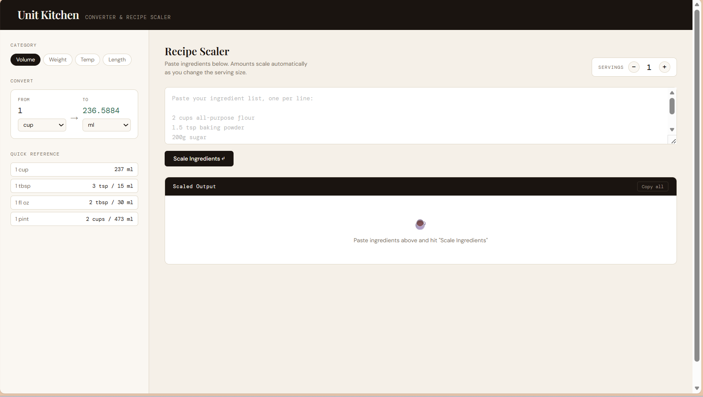
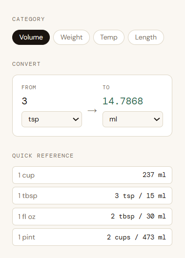
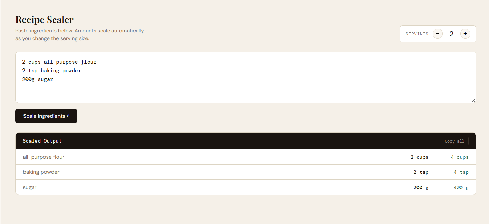
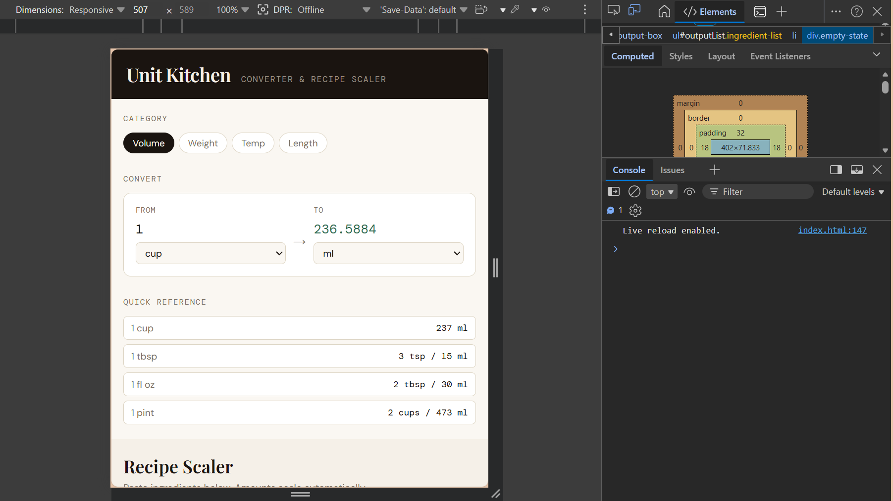

# 🍳 Unit Kitchen — Converter & Recipe Scaler

An elegant, minimalistic, and distraction-free web ecosystem designed for chefs, home bakers, and developers to easily handle culinary unit transformations and interactive scaling mechanics. Unit Kitchen features a split-pane structural workspace: a real-time smart conversion engine on the left, and an intelligent ingredient list deserializer on the right.

Built with semantic **HTML5**, modern layout **CSS3 custom properties**, and native **Vanilla ES6 JavaScript**, the platform offers a lightweight, high-performance solution that replaces bulky culinary apps with typography-focused design.

---

## ✨ Key Architectural Features

### ⚖️ Multi-Category Dynamic Converter Engine
- **Volume Metric Matrix**: Computes shifts across fluid volume definitions including `tsp`, `tbsp`, `fl oz`, `cup`, `pint`, `quart`, `gallon`, `ml`, and `l` using relative internal base-unit calculations.
- **Weight Calibration**: Immediate evaluations across mass indicators: Grams (`g`), Kilograms (`kg`), Ounces (`oz`), and Pounds (`lb`).
- **Temperature & Length Modules**: Native formula handling for temperature conversions across Celsius (`°C`), Fahrenheit (`°F`), and Kelvin (`K`), alongside baking pan sizing computations (`mm`, `cm`, `m`, `in`, `ft`).
- **Quick Reference Cards**: Real-time context cards updating instantly with global culinary milestones (e.g., pan adjustments, water boiling values).

### 🧪 Advanced Recipe Scaler & Intrinsic Parser
- **String Tokenizer**: Uses RegEx algorithms to decouple raw text lines into distinct data objects: numerical amounts, unit keys, and ingredient name labels.
- **Fraction/Mixed Number Parsing**: Intuitively handles user inputs containing fractions (`1/2`) or mixed fractions (`1 1/2`) and calculates decimal equivalents.
- **Unicode Fraction Formatter**: Automatically rounds fractional results to human-readable culinary symbols like `⅛`, `¼`, `⅓`, `½`, `⅔`, and `¾`.
- **Dynamic Servings Controller**: Increments or decrements baseline scales with immediate reactive DOM modifications.
- **Clipboard Management**: Custom logic compiles and aggregates output strings to match clean system formats on clipboard paste sequences.

### 🎨 Modular UI/UX Standards
- **BEM Design Methodology**: CSS naming conventions structured around a strict Block-Element-Modifier syntax.
- **Color Variables**: Uses system color tokens (`--cream`, `--paper`, `--ink`, `--accent`) providing clean theme consistency.
- **Fully Accessible & Responsive Layout**: Responsive breakpoints resizing interface columns on screens down to a compact 375px viewport layout.

---

## 🛠️ Tech Stack & Dependencies

- **Structure**: Semantic HTML5 Layout (`<aside>`, `<main>`, `<header>`)
- **Styling**: CSS3 Variable Tokens, Flexbox Grid Controls, CSS Transitions
- **Engine**: Vanilla JavaScript (ES6+ Closures, Regular Expressions, DOM Listeners)
- **Typography**: Google Fonts Integration (`Playfair Display`, `DM Mono`, `DM Sans`)

---

## 💻 How to Run Locally
1. Clone the main repository.
2. Navigate to `public/Unit-Kitchen/`.
3. Open `index.html` in any modern web browser.
4. Enjoy the Project.

---

## 📂 Project Structure

```text
Unit-Kitchen/
│
├── index.html      # Main webpage structure
├── style.css       # Styling and animations
├── script.js       # Application logic and interactivity
└── readme.md       # Project documentation
```

---

## 📸 Screenshots






---

## Contributing

Steps:

1) Fork this repository
2) Clone your fork locally
3) Open index.html directly in your browser — that's it. No npm install, no server needed.
4) Make your changes, test them in the browser, then open a Pull Request.

Future Improvements:

1) Swap units button : Add a ↔ button between the From and To dropdowns that swaps the selected units.
2) Clear button for recipe scaler.
3) Dark mode toggle.


---

## 🙌 Credits

This project is part of the original repository created by Dhairya Gothi.

Original Repository:
https://github.com/dhairyagothi/100_days_100_web_project

---

## 📄 License

MIT License

---


## 👨‍💻 Author

- **Saubhagya Srivastava**
- GitHub: [Saubhagya1621](https://github.com/Saubhagya1621)
- LinkedIn: [Saubhagya Srivastava](https://www.linkedin.com/in/saubhagyasri/)


