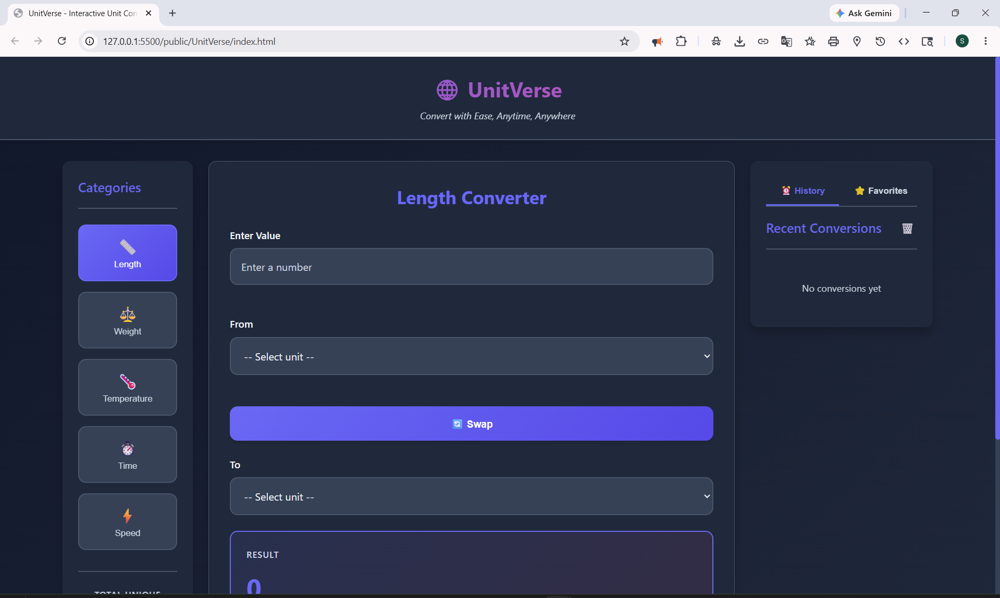

# 🌐 UnitVerse - Interactive Unit Converter

## Description

**UnitVerse** is a modern, interactive web-based unit converter that enables users to perform fast and accurate conversions across multiple measurement categories. Built using HTML5, CSS3, and Vanilla JavaScript, it offers real-time conversion, smart rounding, and persistent history tracking in a sleek dark-themed interface.

---

## Features

* 🔢 **5 Unit Categories along with their sub-categories**
  * Length, Weight, Temperature, Time, Speed
* ⚡ **Real-time Conversion** with instant results
* 🎯 **Smart Rounding Algorithm** for clean outputs
* 🔄 **Unit Swap Functionality**
* 📜 **Conversion History** (last 10 entries with timestamps)
* ⭐ **Favorites System** for quick access
* 📋 **Copy to Clipboard** support
* ✅ **Input Validation & Error Handling**
* 🔔 **Toast Notifications** for user feedback
* 📊 **Unique Conversion Counter**
* 📱 **Fully Responsive Design**
* 🌙 **Modern Dark UI with smooth animations**
* 💾 **LocalStorage Persistence**

---

## Technologies Used

* HTML5
* CSS3 (Flexbox, Grid, Animations)
* JavaScript
* LocalStorage API
* Clipboard API

---

## Installation/Setup

### Option 1: Run Directly

1. Clone or download the repository
2. Navigate to the project folder:

   ```
   public/UnitVerse/
   ```
3. Open `index.html` in your browser

### Option 2: Run with Local Server

```
cd public/UnitVerse

# Python 3
python -m http.server 8000

# Node.js
npx http-server
```

Then open:

```
http://localhost:8000
```

---

## Usage

### Basic Steps

1. Select a category (Length, Weight, etc.)
2. Enter the value
3. Choose "From" and "To" units
4. View instant conversion results

### Additional Functionalities

* 🔄 Swap units with one click
* ⭐ Save frequently used conversions
* 📋 Copy results instantly
* ⏰ Access history and reuse conversions
* 🗑️ Clear inputs or history easily

---

## Screenshots

### 🖥️ Main Interface



.png)

---

## 🤝 Contributing

Contributions are welcome!
Feel free to fork this repo and submit a PR.

### Steps to Contribute

1. Fork the repository
2. Create a new branch:

   ```
   git checkout -b feature/your-feature
   ```
3. Make your changes
4. Commit your changes:

   ```
   git commit -m "feat: add your feature"
   ```
5. Push to your fork:

   ```
   git push origin feature/your-feature
   ```
6. Create a Pull Request

### Suggested Contributions

* Add new unit categories (volume, area, etc.)
* Implement dark/light mode toggle
* Add keyboard shortcuts
* Improve UI/UX
* Add multi-language support
* Enable offline support

---

## 📄 License

MIT License

---

## 👨‍💻 Author

**Soumya Sync**
GitHub: https://github.com/soumyasync

Built as part of **100 Days 100 Web Projects**
Contributing to **GirlScript Summer of Code 2026**