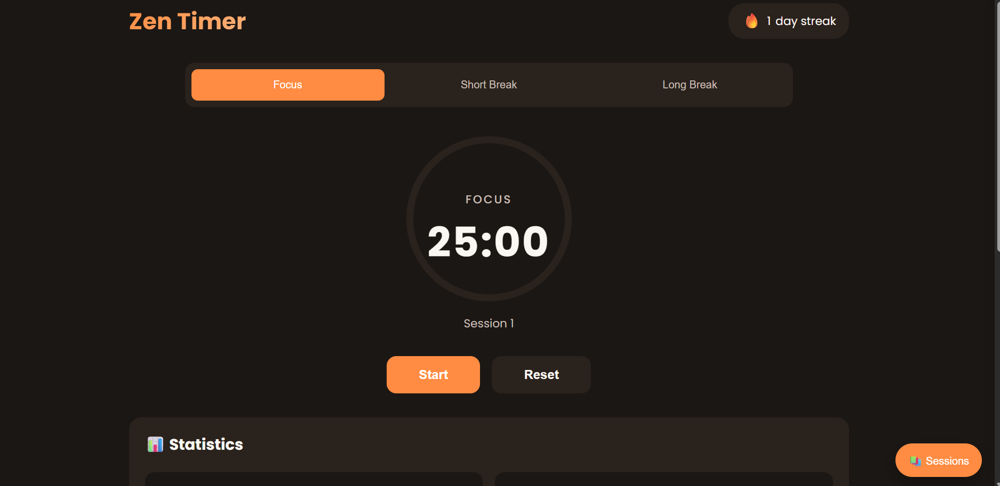
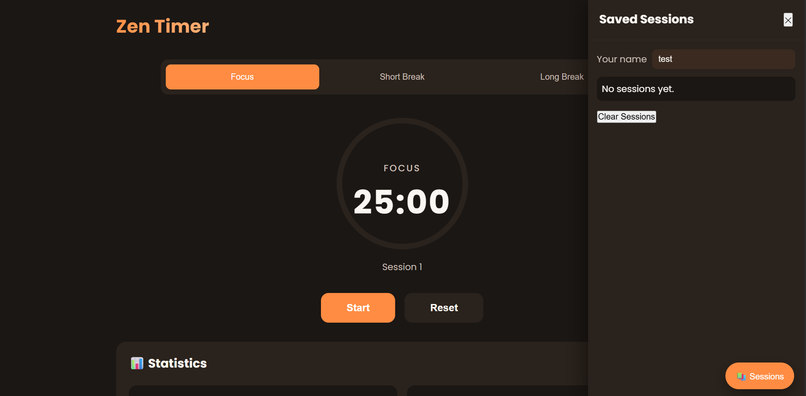
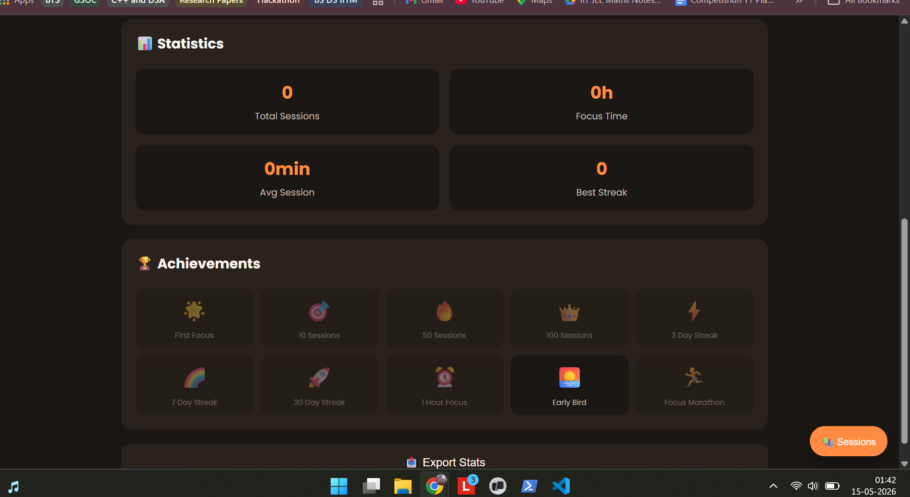

# Zen Timer — Focus Better

A lightweight, warm-themed timer to help you focus. It includes focus/short/long modes, an animated SVG progress ring, session tracking (saved to localStorage), achievement badges, and a sharable PNG export that includes your name and unlocked badges.

## Features
- Focus / Short Break / Long Break modes
- Animated circular progress indicator (SVG)
- Start / Pause / Reset controls
- Session persistence in `localStorage` with a sidebar listing past sessions
- Achievement badges unlocked automatically
- Export a sharable PNG containing your name, best session, and unlocked badges
- Responsive layout and gentle warm color palette

## Technologies Used
- HTML
- CSS 
- JavaScript 

## How to Run
1. Open `public/ZEN_TIMER/index.html` 
2. Choose a mode (Focus / Short Break / Long Break).
3. Click `Start` to begin; `Pause` to pause and `Reset` to reset the timer.
4. Open the Sessions sidebar (bottom-right `📚 Sessions` button) to view saved sessions and set your display name.
5. Click `📤 Export Stats` to generate and download a PNG snapshot with your name, best session, and unlocked badges.

## Screenshots

## Author
Sameer Gera

