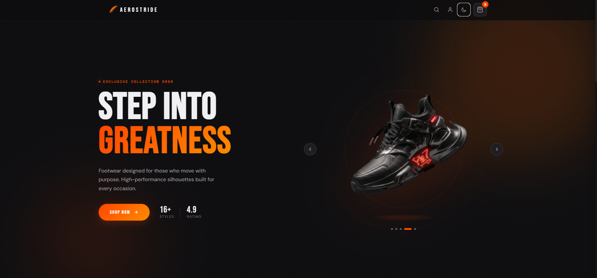
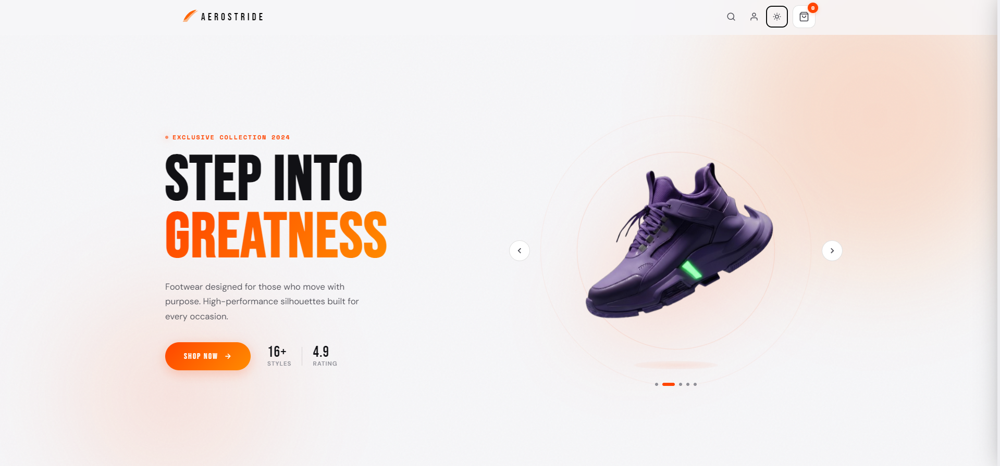
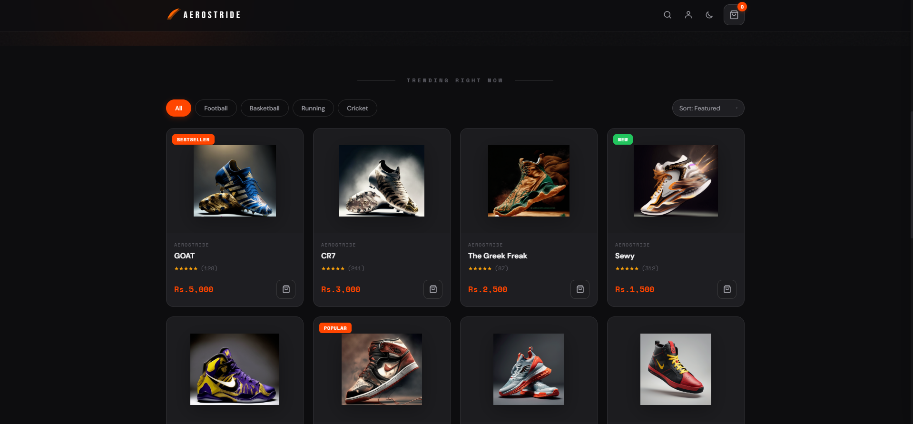
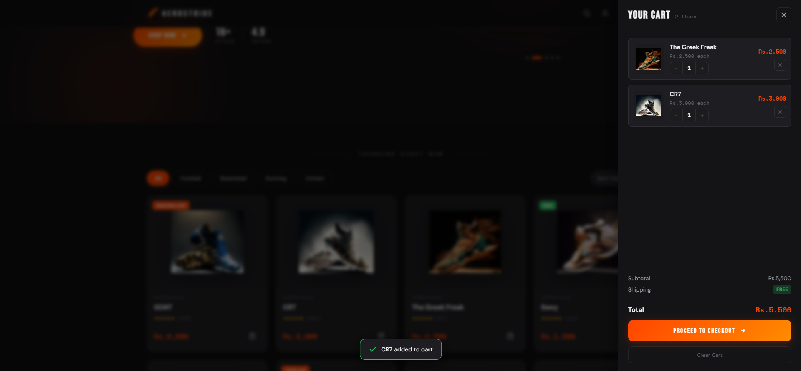

# 👟 AeroStride

> **Step Into Greatness** — A modern, responsive footwear e-commerce web application built with a premium UI, smooth interactions, dark/light mode support, and an immersive shopping experience.



---

## ✨ Overview

AeroStride is a stylish and fully responsive footwear shopping platform designed to provide users with a seamless online shopping experience. The application features an elegant dark-themed interface, dynamic product showcases, category filtering, shopping cart functionality, authentication modals, and theme switching.

Whether users are searching for football boots, basketball sneakers, running shoes, or cricket footwear, AeroStride delivers a modern and engaging browsing experience.

---

## 🚀 Features

### 🎨 Modern UI/UX
- Premium dark and light theme support
- Smooth animations and transitions
- Fully responsive design
- Glassmorphism-inspired components
- Interactive product showcase

### 👟 Product Management
- Product listing section
- Category-based filtering
- Featured and trending products
- Product ratings and pricing display
- Product badges (New, Bestseller, Popular)

### 🛒 Shopping Cart
- Add products to cart
- Remove items from cart
- Update product quantity
- Dynamic subtotal calculation
- Slide-in cart drawer
- Checkout interface

### 🔐 Authentication
- Login functionality
- Sign-up functionality
- Modal-based authentication UI
- User-friendly form validation

### 🌗 Theme Switching
- Light mode
- Dark mode
- Instant theme transitions

### 📱 Responsive Design
- Desktop optimized
- Tablet friendly
- Mobile responsive

---

## 📸 Screenshots

### Hero Section (Dark Mode)

- Premium landing page with interactive shoe carousel
- Call-to-action shopping button
- Featured product showcase


### Hero Section (Light Mode)

- Clean and elegant light-themed design
- Enhanced readability and aesthetics



### Product Collection

- Category filters
- Product cards
- Ratings and pricing
- Trending product display



### Shopping Cart

- Real-time cart updates
- Quantity management
- Checkout summary



### Authentication Modal

- Login & Sign-up forms
- Clean and modern user interface


---

## 🛠️ Tech Stack

### Frontend
- HTML5
- CSS3
- JavaScript (ES6+)

### UI & Styling
- CSS Flexbox
- CSS Grid
- Custom Animations
- Responsive Design Principles

### Features
- Theme Toggle System
- Product Filtering
- Shopping Cart Logic
- Authentication Modal
- Interactive Carousel

---

## 📂 Project Structure

```bash
e-commerce_cart/
│
├── images_used/
│   ├── images/
│  
├── index.css
│  
├── index.js
│   
├── index.html
│
└── README.md
```

---

## ⚡ Getting Started

### Clone the Repository

```bash
git clone https://github.com/your-username/AeroStride.git
```

### Navigate to Project Directory

```bash
cd AeroStride
```

### Run the Project

Simply open:

```bash
index.html
```

or use VS Code Live Server:

```bash
Right Click → Open with Live Server
```

---

## 🎯 Future Enhancements

- Product details page
- Wishlist functionality
- User profile dashboard
- Order history
- Payment gateway integration
- Backend support
- Product search functionality
- Firebase authentication
- Admin panel

---

## 🤝 Contributing

Contributions, issues, and feature requests are welcome!

1. Fork the repository
2. Create a new branch

```bash
git checkout -b feature-name
```

3. Commit your changes

```bash
git commit -m "Add new feature"
```

4. Push to GitHub

```bash
git push origin feature-name
```

5. Open a Pull Request

---

## 🌟 Acknowledgements

Inspired by modern sneaker brands and premium e-commerce experiences with a focus on performance, aesthetics, and usability.

---

## 📜 License

This project is licensed under the MIT License.

---

<div align="center">

### 👟 AeroStride

**Step Into Greatness**

Built with ❤️ and lots of coffee ☕

</div>
