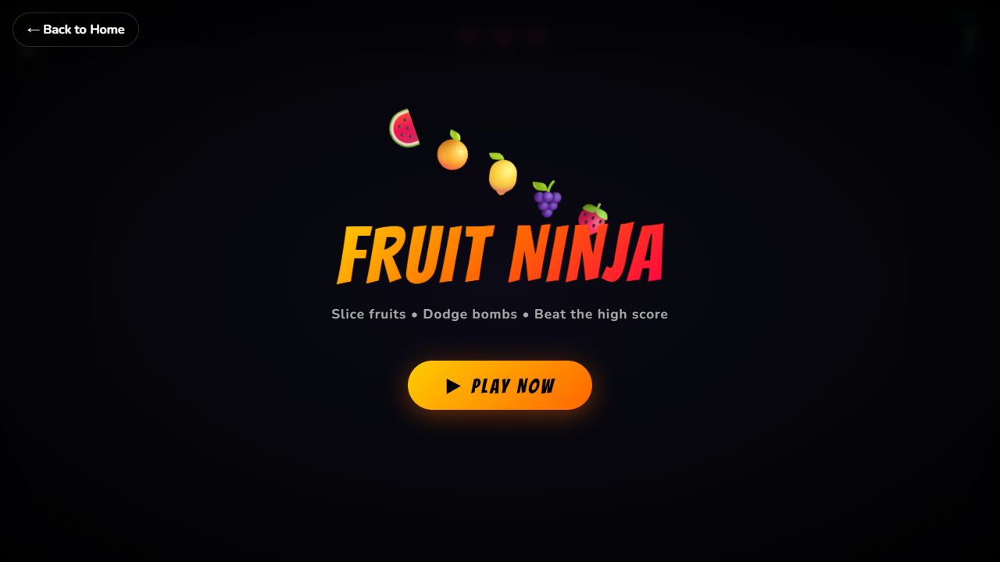

# ⚡ Fruit Slice Game

A fast-paced, arcade-style fruit slicing game built with pure HTML, CSS, and JavaScript. Test your reflexes by slicing flying fruits, avoiding bombs, and achieving the highest score possible in a colorful and responsive browser experience.

---

## Description

Fruit Slice Game is inspired by classic fruit-slicing arcade games where players must quickly slice fruits before they fall off the screen. The game features smooth animations, score tracking, combo mechanics, and engaging gameplay that works across desktop and mobile devices.

No frameworks, build tools, or external dependencies are required—just open and play.

---

## Features

Feature	Details
🍎 Fruit Slicing Gameplay	Slice flying fruits using mouse or touch controls
💣 Bomb Avoidance	Avoid slicing bombs to prevent losing the game
🎯 Score System	Earn points for every fruit successfully sliced
🔥 Combo Bonuses	Build combos by slicing multiple fruits quickly
❤️ Lives System	Limited lives add challenge and excitement
⏸ Game Controls	Start, Pause, Resume, and Restart functionality
📈 High Score Tracking	Stores best score using LocalStorage
✨ Smooth Animations	Dynamic fruit movement and slicing effects
🔊 Sound Effects	Interactive sounds for slicing, scoring, and game events
🌙 Modern UI	Clean design with responsive layout
💾 LocalStorage Support	Persists high scores between sessions
📱 Responsive Design	Optimized for desktop, tablet, and mobile devices
⌨ Keyboard Support	Quick game controls using keyboard shortcuts
♿ Accessible Interface	Semantic structure and user-friendly controls


## How to Play
Click Start Game.
Slice fruits by dragging your mouse or swiping across the screen.
Earn points for every fruit sliced.
Avoid slicing bombs.
Don't let too many fruits fall unsliced.
Try to beat your highest score.

---

## Tech Stack

-> HTML
-> CSS
-> Javascript

---

## How to Run

No build tools, servers, or npm installs required.

1. **Clone** or download the repository
2. **Navigate** to `public/fruit slice`
3. **Open** `index.html` in any modern browser

---

## Screenshots


```

## Contribution Note

Contributions, issues, and feature requests are welcome!  
Feel free to open a pull request or file an issue on the main repository.

Please follow the existing code style: vanilla JS only, no frameworks, no backend.

---

Built with focus. Ship with momentum. ⚡