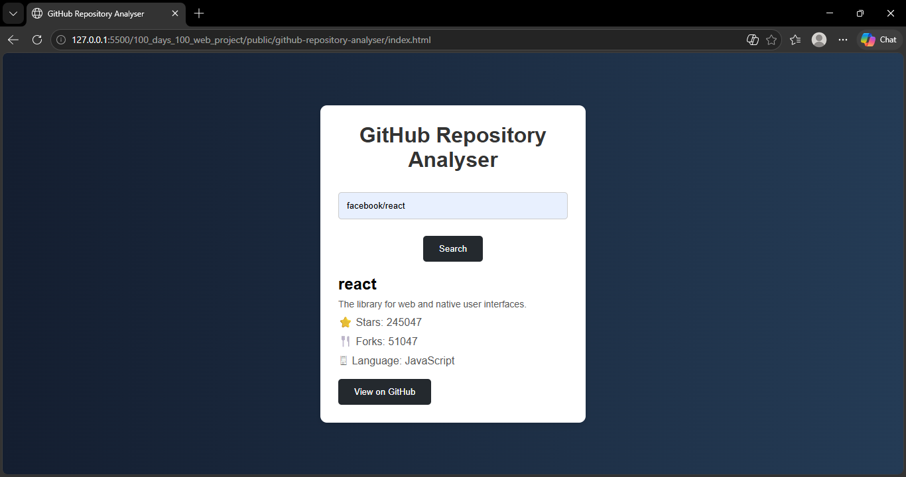

# GitHub Repository Analyser

A simple web application that allows users to search and analyze GitHub repositories using the GitHub API.

## Features
- Search any public GitHub repository
- View repository details
- Display stars, forks, and language
- Direct link to open repository on GitHub
- Error handling for invalid repositories

## Technologies Used
- HTML
- CSS
- JavaScript
- GitHub API

## How to Run
1. Download or clone the repository
2. Open `index.html` in a web browser
3. Enter repository name in `owner/repository` format
4. Click the search button

## Screenshots

## Author
Akshara Jaiswal