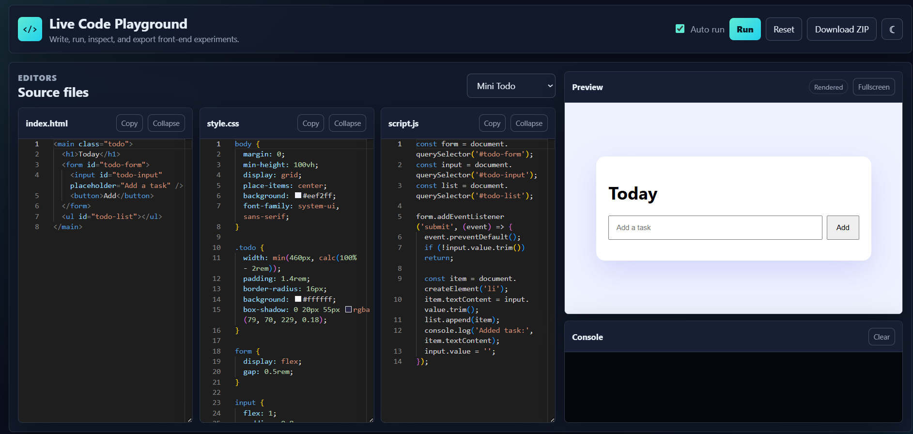

# Live Code Playground

A polished front-end playground for the **100 Days 100 Web Projects** collection. It lets learners write HTML, CSS, and JavaScript in Monaco Editor, preview the result in a sandboxed iframe, inspect console output, and export the project as a ZIP.

## Features

- HTML, CSS, and JavaScript editors powered by Monaco Editor
- Live iframe preview with manual Run and debounced Auto run modes
- Sandboxed JavaScript execution with console log, warning, and error capture
- Dark and light themes saved in localStorage
- Local persistence for editor content, theme, template, and Auto run preference
- Starter templates for a landing card, counter widget, and mini todo app
- Copy buttons for each editor
- Reset, fullscreen preview, collapsible editor panels, and toast notifications
- ZIP download containing `index.html`, `style.css`, and `script.js`
- Responsive layout for mobile, tablet, and desktop screens
- Keyboard shortcuts: `Ctrl+S` / `Cmd+S` to run and `Ctrl+R` / `Cmd+R` to reset

## Screenshots



## Technologies Used

- HTML5
- CSS3 with custom properties
- Vanilla JavaScript ES6+
- Monaco Editor via CDN
- JSZip via CDN

## Installation

No build step is required.

1. Clone the repository.
2. Open `public/live-code-playground/index.html` in a browser.

For a local static server from the repository root:

```bash
npm run dev
```

Then visit:

```text
http://localhost:3000/public/live-code-playground/
```

## Local Usage

1. Write markup in `index.html`.
2. Add styles in `style.css`.
3. Add behavior in `script.js`.
4. Keep Auto run enabled for instant preview, or press Run manually.
5. Use Download ZIP to export the current project files.

## Folder Structure

```text
public/live-code-playground/
├── index.html
├── style.css
├── script.js
├── README.md
└── assets/
    └── preview.png
```

## Accessibility Notes

- The page uses semantic header, main, section, article, aside, and nav landmarks.
- Interactive controls include labels, titles, focus styles, and ARIA live regions.
- Preview output is isolated in a titled iframe.
- Console output uses a polite live log region.
- Colors are designed for strong contrast in both dark and light themes.

## Browser Compatibility

Tested for modern evergreen browsers:

- Chrome
- Microsoft Edge
- Firefox

Monaco Editor and JSZip are loaded from CDNs, so an internet connection is required for the full editor and ZIP export experience.

## Future Improvements

- Add file tabs for additional custom files.
- Add import from ZIP.
- Add prettier-style formatting controls.
- Add shareable encoded playground URLs.
- Add user-selectable Monaco font size and editor keybindings.

## Contribution Notes

This project follows the repository's static-first architecture: no backend, no framework, no bundler, and no server-side code execution. User JavaScript runs only inside a sandboxed iframe and never in the parent document.
