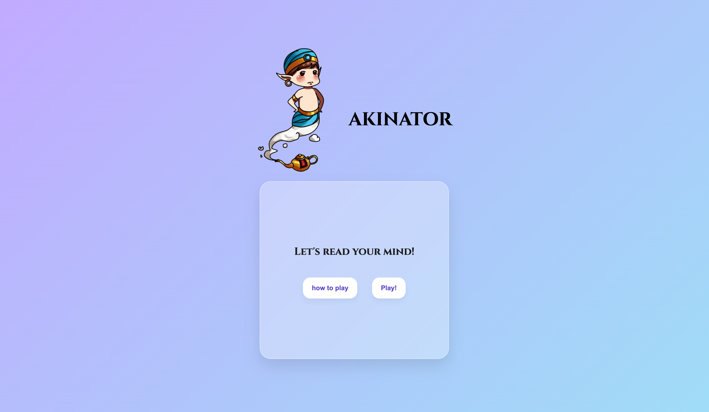
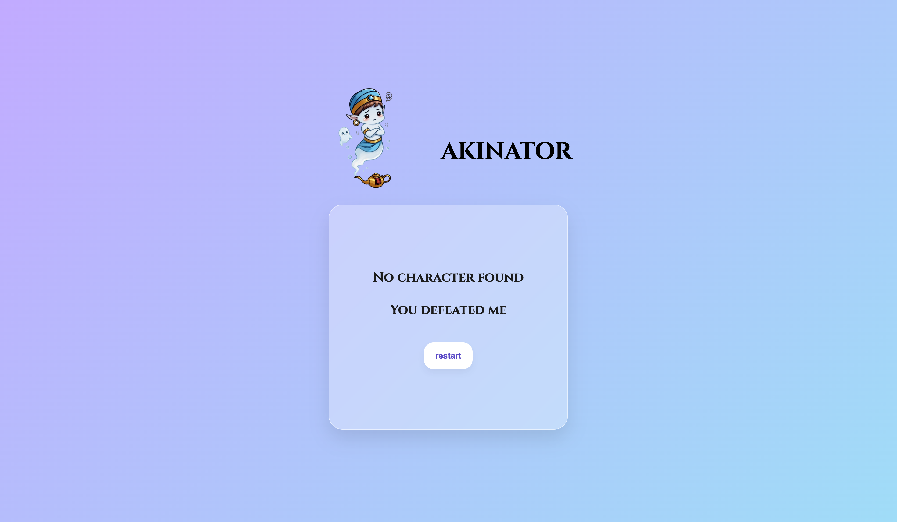

# MIND READER

Welcome to **Akinator: The Mind Reader**! This is a fun, interactive web game built with React where an all-knowing Genie attempts to read your mind. 
Think of a character from the Anime universe, and the Genie will ask you a series of "Yes", "No", or "Don't Know" questions. Using a custom-built decision algorithm, the Genie mathematically narrows down the possibilities and tries to guess exactly who you are thinking of!

## Features
- **Custom Game Engine:** Uses a smart algorithm to mathematically calculate the most optimal question to ask next in order to divide the remaining character list.
- **Interactive UI & Animations:** The Genie reacts to your gameplay! He floats seamlessly, enters a "thinking" state while calculating his next move, and shows a unique reaction when he finds the answer.
- **Dynamic State Management:** Built using complex React state handling to manage the character pool, question counts, and asynchronous UI changes.
- **Win/Loss States:** Fully handles scenarios where the Genie successfully guesses your character, or runs out of questions and admits defeat.

## Technologies Used
- **React.js** (Hooks, State Management, Conditional Rendering)
- **Vite** (Build tool)
- **JavaScript (ES6+)** (Game engine logic and algorithms)
- **CSS3** (Keyframe animations, transitions, layout)
- **HTML5**

## How to Run
1. Clone the repository to your local machine.
2. Open your terminal and navigate to the project folder.
3. Run `npm install` to install all dependencies.
4. Run `npm run dev` to start the development server.
5. Open the provided `localhost` link in your browser and enjoy!

## Screenshots
**Main menu**

**Game in progress**

**Answer found**

**Game over**

## Author
Mahantesh Madalgi
github- https://github.com/Mahantesh-Madalgi