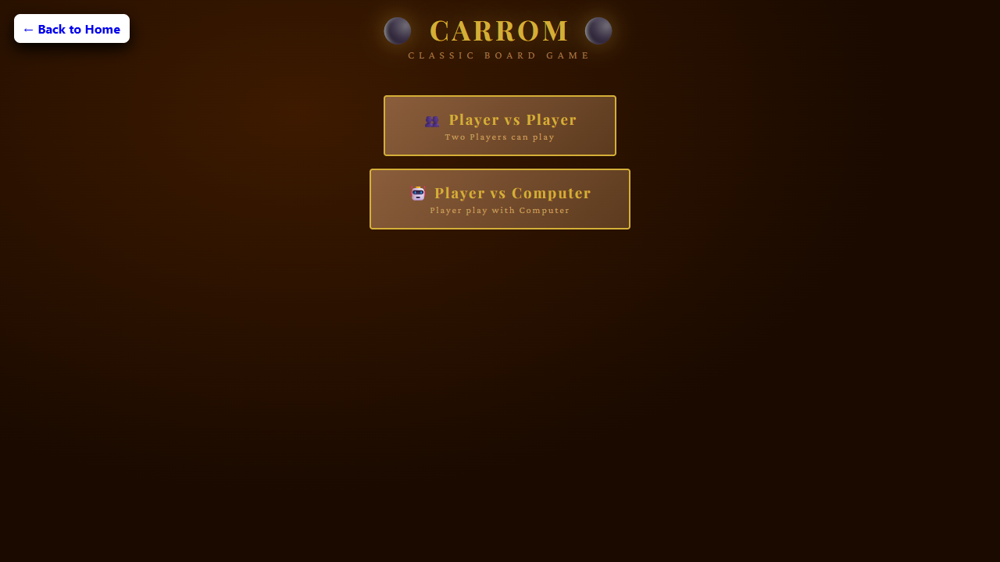

# 🎯 Carrom Game - Classic Board Game Simulation

## 🚀 Overview

**Carrom Game** is a modern, interactive web-based recreation of the classic **Carrom board game**, developed using **HTML, CSS, and JavaScript**.

The game features realistic physics-based gameplay, smooth coin movement, collision detection, pocket animations, and an intelligent computer opponent. Players can enjoy either a **Player vs Player** experience or challenge the **Computer AI**.

Designed as a frontend-only project, this game demonstrates advanced JavaScript concepts including **canvas rendering, game loops, physics simulation, animations, and user interaction handling**.

---

# ✨ Features

### 🎮 Game Modes

* 👥 **Player vs Player (PvP)** mode
* 🤖 **Player vs Computer (AI)** mode with automated aiming and shooting

---

### 🪙 Realistic Carrom Gameplay

* Smooth striker movement and shooting mechanics
* Adjustable striker position
* Direction-based aiming system
* Power control for shots
* Realistic coin collision physics
* Wall rebounds and friction effects
* Coin pocket detection with sinking animations
* Continuous animation using `requestAnimationFrame`

---

### 🏆 Scoring System

| Coin          | Points    |
| ------------- | --------- |
| ⚫ Black Coin  | 10 Points |
| ⚪ White Coin  | 20 Points |
| 🩷 Pink Queen | 40 Points |

* Players earn points for every coin pocketed.
* A successful shot grants an additional turn.
* The first player to reach **120 points** wins the game.

---

# 🎛️ Controls

## Mouse / Touch Controls

| Control           | Action                         |
| ----------------- | ------------------------------ |
| 📍 Striker Slider | Move the striker left or right |
| 🎯 Aim Slider     | Change shooting direction      |
| 💪 Power Slider   | Adjust shot strength           |
| 🎱 Shoot Button   | Release the striker            |
| 🔄 Reset Button   | Restart the current game       |
| 🏠 Home Button    | Return to the main menu        |

---

## ⌨️ Keyboard Controls

| Key            | Function            |
| -------------- | ------------------- |
| ⬅️ Left Arrow  | Move striker left   |
| ➡️ Right Arrow | Move striker right  |
| ⬆️ Up Arrow    | Adjust aim upward   |
| ⬇️ Down Arrow  | Adjust aim downward |
| Space / Enter  | Shoot the striker   |

---

# 🛠️ Technologies Used

| Technology           | Purpose                                                        |
| -------------------- | -------------------------------------------------------------- |
| **HTML5**            | Game structure and interface                                   |
| **CSS3**             | Styling, layout, animations, and responsiveness                |
| **JavaScript (ES6)** | Canvas rendering, physics engine, game logic, AI, and controls |
| **HTML Canvas API**  | Drawing the board, coins, striker, and effects                 |

---

# 📂 Project Structure

```text
carrom-game/
│
├── index.html       # Main game structure
├── style.css        # User interface styling
├── script.js        # Game engine, physics, AI, and controls
├── image.png        # Website icon
├── preview.png      # Project screenshot
└── README.md
```

---

# ⚙️ Game Mechanics

The game includes a custom physics system built from scratch:

* 🔄 Friction-based movement slowing
* 💥 Coin-to-coin collision detection
* 🧱 Board boundary rebounds
* 🕳️ Pocket attraction and sinking effects
* 🎯 Dynamic aiming system
* 🤖 Computer opponent decision making

---

# 📱 Responsive Design

The game automatically adjusts its board size according to the screen dimensions and provides a smooth experience on:

* 💻 Desktop Computers
* 🖥️ Laptops
* 📱 Mobile Phones
* 📲 Tablets

---

# ▶️ How to Run the Project

## 1️⃣ Clone the Repository

```bash
git clone https://github.com/dhairyagothi/100_days_100_web_project.git
```

---

## 2️⃣ Navigate to the Project Folder

```bash
cd mini-carrom
```

---

## 3️⃣ Launch the Game

Simply open the `index.html` file in any modern browser.

Recommended browsers:

* Google Chrome
* Microsoft Edge
* Mozilla Firefox
* Safari

---

# 📸 Screenshot

Add a screenshot of the game interface:

```html

```

---

# 💡 Learning Highlights

This project demonstrates practical knowledge of:

* Object-oriented JavaScript concepts
* Game loop architecture
* Canvas-based graphics programming
* Mathematical calculations using vectors and angles
* Collision handling algorithms
* Animation timing
* DOM manipulation and event handling
* AI-based gameplay decisions

---

# 🔮 Future Improvements

Possible features that can be added:

* 🔊 Sound effects and background music
* 🌐 Online multiplayer mode
* 🏅 Leaderboards and high scores
* 🎨 Multiple board themes
* ⚙️ Difficulty levels for computer AI
* 💾 Save and resume game functionality
* 📊 Match statistics and history

---

# 📄 License

This project is developed for **learning, educational, and portfolio purposes**.

You are free to fork, modify, and improve the project for personal use.

---

## ⭐ Support

If you like this project, consider giving it a **star ⭐ on GitHub** and sharing it with others.

Happy Coding! 🚀
