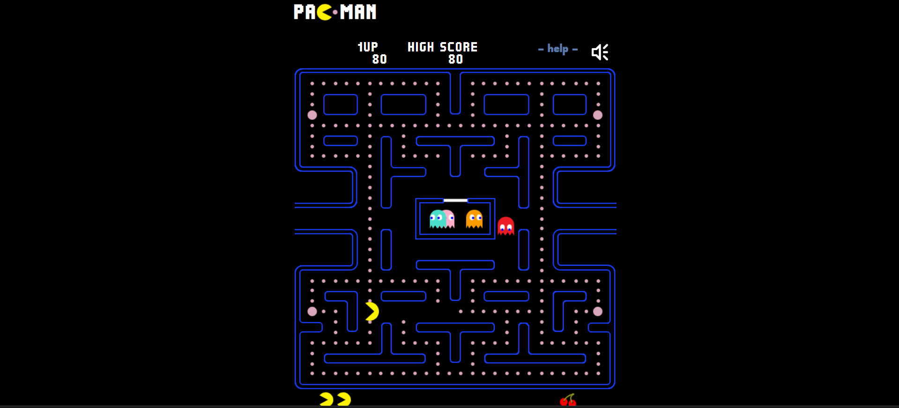
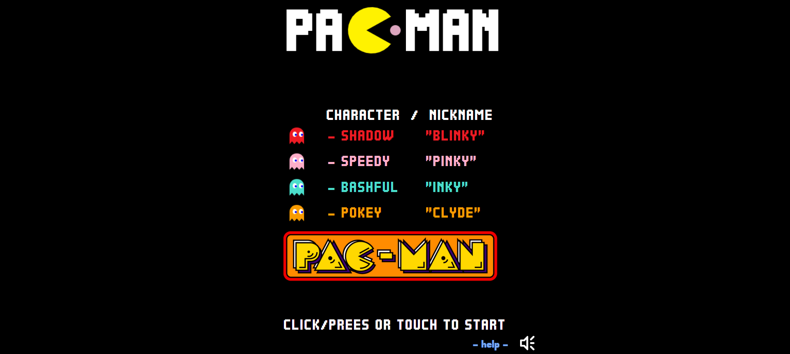

# Pac-Man

## Description
A classic Pac-Man game built with HTML5 Canvas and JavaScript. Play directly in your browser on any device - desktop or mobile - with full touch and keyboard support.

## Features
- Classic Pac-Man gameplay with all 4 ghosts (Blinky, Pinky, Inky, Clyde)
- Smooth ghost and Pac-Man canvas animations
- Home screen with character introduction sequence
- Trailer animation on the home screen
- Score and high score tracking
- Fruit bonuses and combo system
- jQuery - used for DOM manipulation, event handling (keyboard/touch), screen switching, and simulating key events for touch controls
- jQuery Buzz - used for cross-browser audio management
- Sound on/off toggle
- Pause functionality (P key)
- Touch controls for mobile devices
- Help screen with keyboard controls

## Technologies Used
- HTML5
- CSS3
- JavaScript ES6
- HTML5 Canvas API
- jQuery

## Installation/Setup
1. Clone or download the repository
2. No build tools or dependencies required
3. Open `index.html` directly in your browser

## Usage
- **Arrow Keys** - Move Pac-Man (Left, Right, Up, Down)
- **P** - Pause / Resume the game
- **Click / Press or Touch** - Start the game from the home screen
- On mobile, use the on-screen touch controls to move

## Screenshots
    Home Screen
> 

    Gameplay

> 

## Contributing
1. Fork the repository
2. Create a new branch (`git checkout -b feature/your-feature`)
3. Commit your changes (`git commit -m 'Add your feature'`)
4. Push to the branch (`git push origin feature/your-feature`)
5. Open a Pull Request

## License
MIT License

## Author
Your Name
- GitHub: [@Kshitij-Maurya-005](https://github.com/Kshitij-Maurya-005)