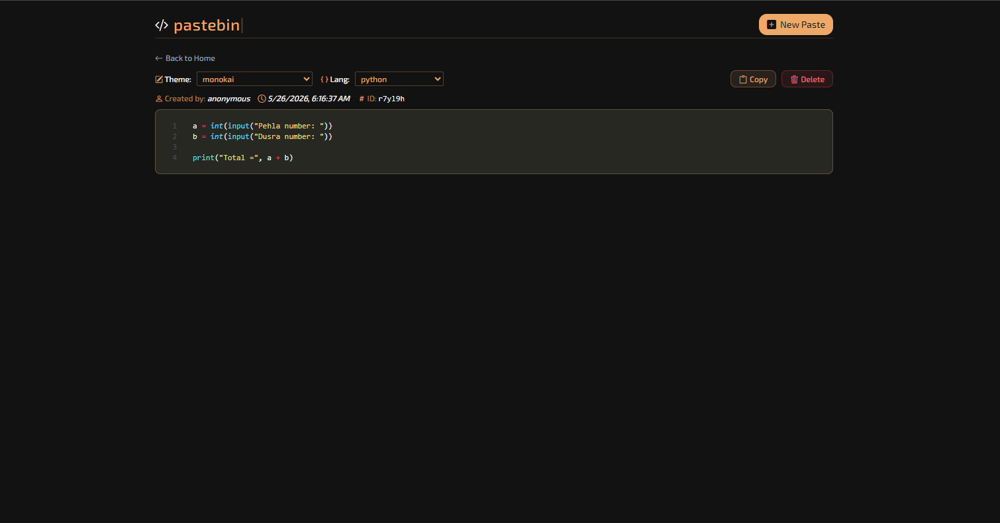
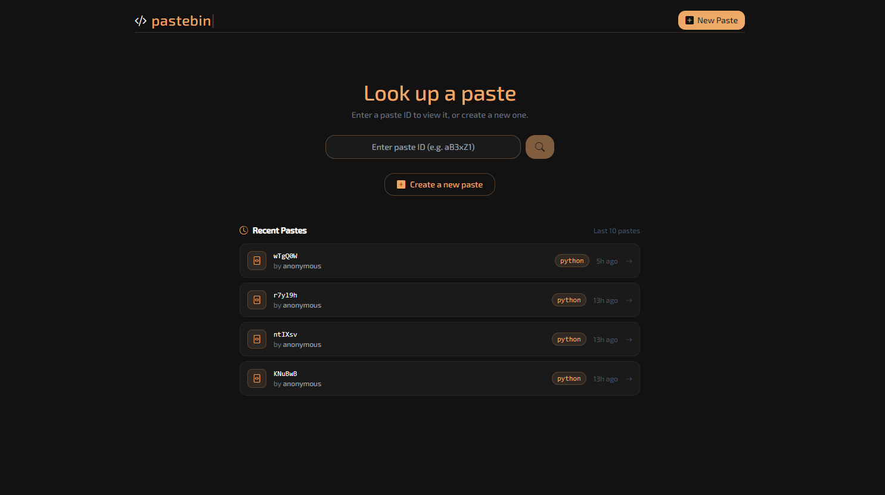

# 📋 Pastebin

> **Share Code. Beautifully.** — A modern, minimal pastebin service built with SvelteKit and PostgreSQL, featuring syntax highlighting, multiple language support, and stunning themes for an elegant code sharing experience.



---

## ✨ Overview

Pastebin is a lightweight and elegant pastebin service that allows developers to share code snippets effortlessly. Built with SvelteKit on the frontend and PostgreSQL as the database, Pastebin supports multiple programming languages with beautiful syntax highlighting themes — making code sharing not just functional, but visually appealing.

Built as part of the **100 Days 100 Web Projects** challenge.

---

## 🚀 Features

### 🎨 Beautiful Themes
- Multiple syntax highlighting themes
- Clean and minimal UI
- Elegant code display

### 💻 Language Support
- Multiple programming languages supported
- Automatic syntax highlighting
- Readable and styled code blocks

### 🗄️ Database Integration
- PostgreSQL database backend
- Persistent paste storage
- Environment-based configuration via `.env`

### ⚡ SvelteKit Powered
- Fast and lightweight frontend
- Server-side rendering support
- Clean routing and page structure

### 📱 Responsive Design
- Desktop optimized
- Tablet friendly
- Mobile responsive

---

## 📸 Screenshots

### Preview





---

## 🛠️ Tech Stack

### Frontend
- SvelteKit
- HTML5
- CSS3

### Backend
- Node.js
- PostgreSQL

### Tools & Config
- Yarn (package manager)
- `.env` for environment configuration

---

## 📂 Project Structure

```bash
pastebin/
│
├── .svelte-kit/
├── node_modules/
├── src/
├── static/
|── assets/
├── .env
├── .gitignore
├── .npmrc
├── .prettierignore
├── .prettierrc
├── index.html
├── package-lock.json
├── package.json
├── postcss.config.js
├── README.md
├── schema.sql
├── svelte.config.js
├── tailwind.config.js
├── tsconfig.json
├── vite.config.ts
└── yarn.lock
```

---

## ⚡ Getting Started

### Prerequisites

Make sure you have the following installed:
- [Node.js](https://nodejs.org/) (v18 or higher)
- [Yarn](https://yarnpkg.com/)
- [PostgreSQL](https://www.postgresql.org/)

### Clone the Repository

```bash
git clone https://github.com/your-username/glyph.git
```

### Navigate to Project Directory

```bash
cd pastebin
```

### Install Dependencies

```bash
yarn
```

### Configure Environment

Create a `.env` file in the root directory and add your PostgreSQL connection URL:

```bash
BACKEND_PGSQL_URI="your connection url here"
```

### Start Development Server

```bash
yarn dev
```

### Build for Production

```bash
yarn build
```

---

## 🎯 Future Enhancements

- User authentication and personal paste history
- Paste expiry / auto-delete after set time
- Private and public paste visibility settings
- Copy to clipboard button
- Embed support for pastes
- Search functionality
- REST API for programmatic paste creation
- Docker support for easy deployment

---

## 🤝 Contributing

Contributions, issues, and feature requests are welcome!

1. Fork the repository
2. Create a new branch

```bash
git checkout -b feature-name
```

3. Commit your changes

```bash
git commit -m "Add new feature"
```

4. Push to GitHub

```bash
git push origin feature-name
```

5. Open a Pull Request

---

## 🌟 Acknowledgements

Inspired by modern code sharing platforms with a focus on simplicity, aesthetics, and developer experience.

---

## 👩‍💻 Authors

| Role | Name |
|---|---|
| 💻 App Development | **Sanyogita Singh** |
| 📝 Documentation | **Sanyogita Singh** |

---

## 📜 License

This project is licensed under the MIT License.

---

<div align="center">

### 📋 Pastebin

**Share Code. Beautifully.**

Built with ❤️ and lots of coffee ☕

</div>