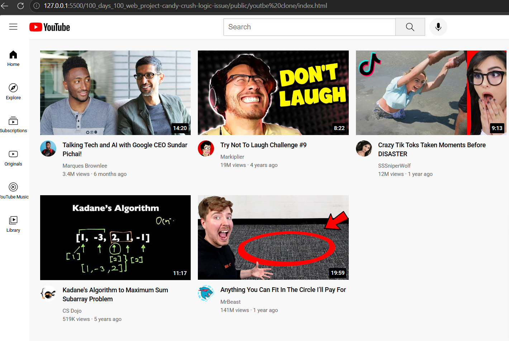
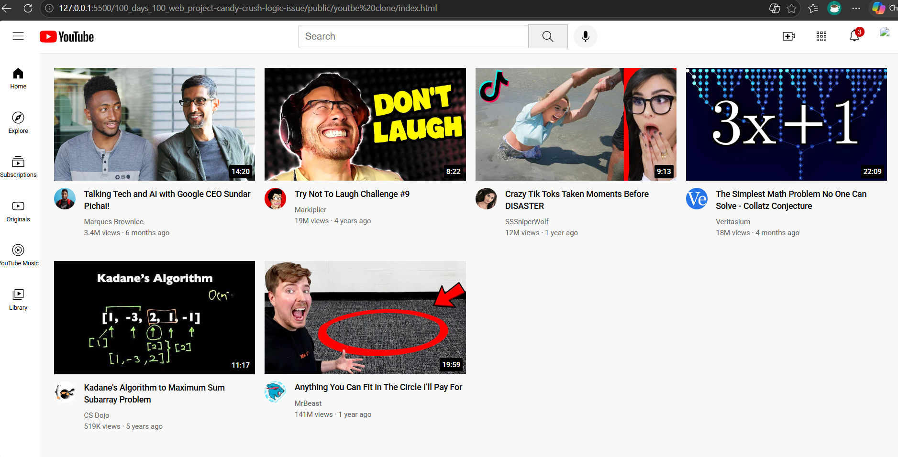

# YOUTUBE CLONE
It is you-tube static page clone made using HTML and CSS. This project demonstrates HTML5 and CSS3 skills by replicating YouTube's visual design.

## Features
- Layout & Design
- Visual components
- Responsive Design
- CSS Features

## Technologies Used
- HTML
- CSS

## How to run
1. Open index.html in a web browser
2. Enjoy the project!

## Screenshots

## Author Name
Manish Yadav