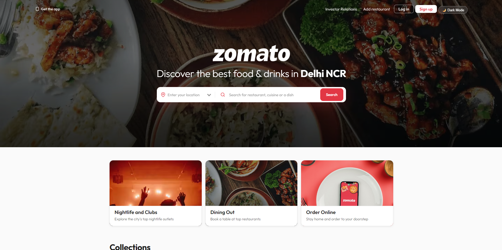
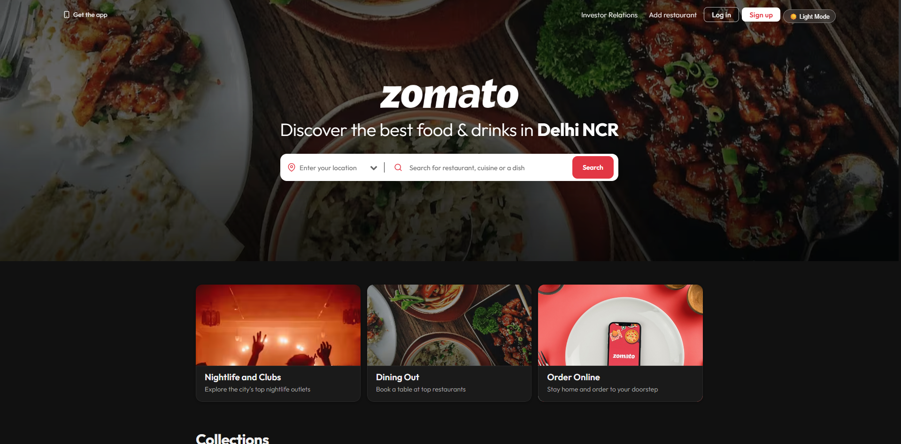
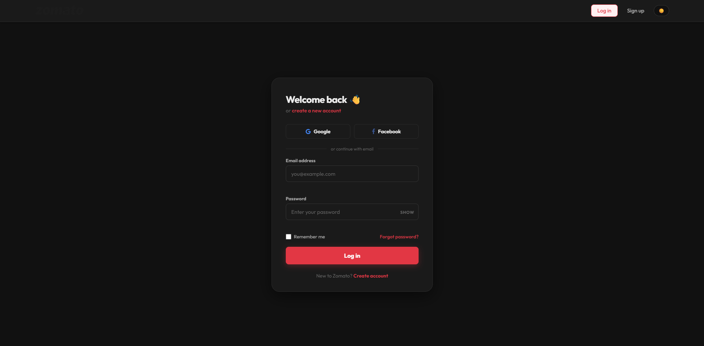
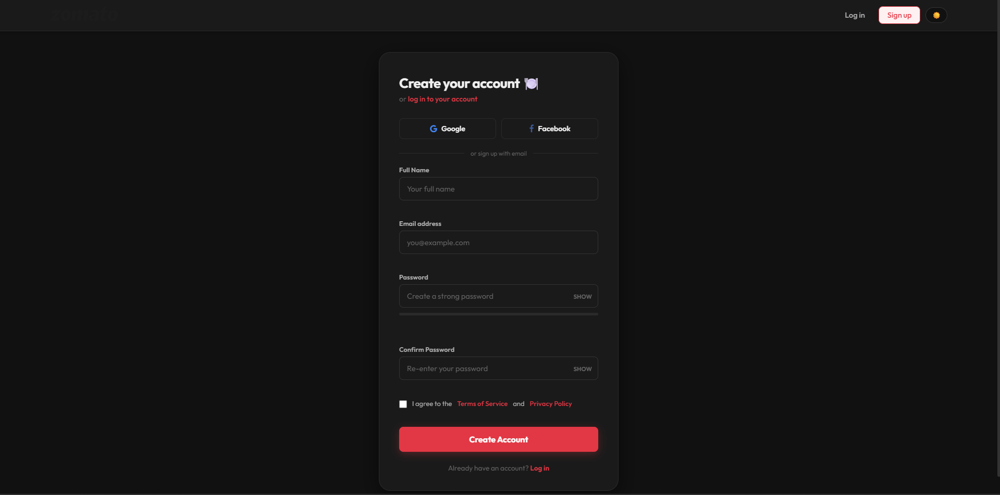
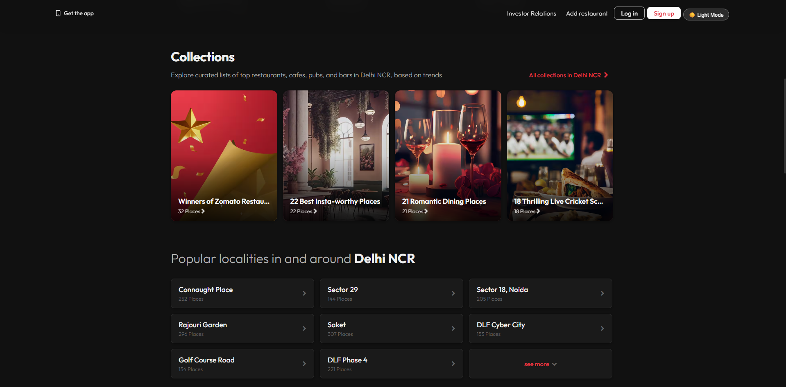
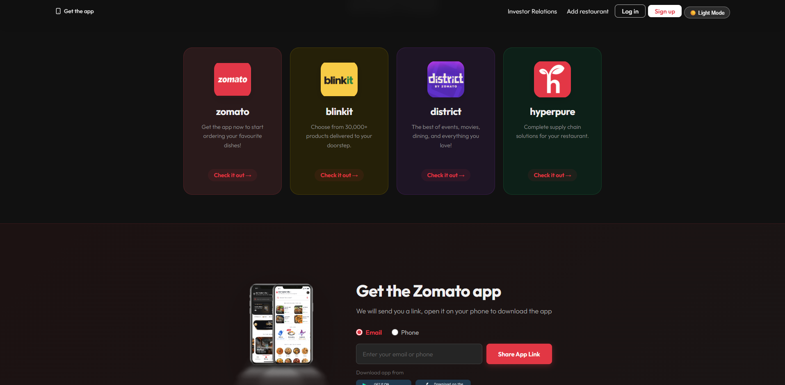

# 🍽️ Zomato Clone

A modern and responsive **Zomato Clone** web application built using **HTML, CSS, and JavaScript** that replicates the look and feel of the popular food delivery platform — complete with dark/light mode, login & signup pages, collections, popular localities, and partner app sections.

## 🚀 Live Features

### 🏠 Hero Section
- Full-screen landing with background food imagery
- Integrated search bar for location and restaurant discovery
- Quick-access category buttons — **Nightlife**, **Dining Out**, **Order Online**
- Clean navbar with "Get the app", "Investor Relations", "Add restaurant", Login, Signup, and Dark Mode toggle — all properly aligned

### 🌙 Dark / Light Mode
- One-click full-page theme toggle
- Seamlessly switches navbar, cards, locality grid, footer, and all sections
- Consistent Zomato brand colors maintained in both themes:
  - Primary Red: `#e23744`
  - Dark Background: `#1c1c1c`

### 🗂️ Collections Section
Curated restaurant category cards including:

- 🏆 Winners of Zomato Restaurant Awards
- 📸 Insta-worthy Places
- 🕯️ Romantic Dining
- 🏏 Live Cricket Screenings

### 🏙️ Popular Localities Grid
- 3-column responsive grid layout
- Arrow navigation for browsing localities
- Correctly renders in both light and dark themes without overflow

### 🔐 Login Page
- Centered card layout
- Email & password input fields
- Google & Facebook OAuth buttons
- "Remember me" checkbox
- "Forgot password?" link

### 📝 Signup / Create Account Page
- Full name, email, password, and confirm password fields
- Terms of Service checkbox
- Google & Facebook OAuth options

### 📦 Partner Apps Section
Showcasing Zomato's ecosystem with themed cards:

- 🍔 Zomato
- ⚡ Blinkit
- 🎟️ District by Zomato
- 🌿 Hyperpure

### 📲 Get the Zomato App Section
- Email / phone number input
- Share App Link button

### 📱 Responsive Design
Works seamlessly across:

- Desktop
- Laptop
- Tablet
- Mobile Devices

---

## 🛠️ Technologies Used

| Technology | Purpose |
|------------|---------|
| HTML5 | Structure & Semantic Markup |
| CSS3 | Styling, Layout & Dark/Light Theming |
| JavaScript (ES6) | Interactivity & Theme Toggle |

---

## 📂 Project Structure

```text
Zomato-Clone/
│
├── images/
├── accordion.js
├── app.css
├── brands.css
└── explore.css
├── footer.css
├── index.css
├── login.html
├── main.css
└── nav.css
└── signup.html
├── top.css
├── zomato.html
├── README.md

```

---

## ✨ Improvements Made

### Previous Version
- Overlapping layout in the hero section (navbar, search bar, and food image colliding)
- No dark mode support
- Missing Login and Signup pages
- Collections and locality grid were misaligned
- Incomplete navbar links

### Updated Version
✅ Fixed hero section overlap — navbar, search bar, and image no longer collide

✅ Full Dark / Light mode toggle across all sections

✅ Login page with OAuth + form fields

✅ Signup / Create Account page with validation fields

✅ Collections section renders correctly without overflow

✅ Popular Localities 3-column grid fixed in both themes

✅ Partner Apps (Zomato, Blinkit, District, Hyperpure) section added

✅ "Get the Zomato App" section added

✅ Navbar fully aligned with all links and theme toggle

✅ Consistent Zomato brand colors applied throughout

---

## 🎯 Future Enhancements

- Real restaurant data via Zomato / Swiggy API
- Functional search with live results
- User authentication (backend integration)
- Cart and order flow
- Restaurant detail pages
- Location-based filtering
- Ratings and reviews section
- PWA (Progressive Web App) support

---

## 📸 Preview

### Home — Light Mode
Clean hero section with search bar and category buttons in light theme.



### Home — Dark Mode
Full dark theme applied across navbar, cards, locality grid, and footer.



### Login Page
Centered login card with Google/Facebook OAuth and email/password form.



### Signup Page
Create Account card with full name, email, password, confirm password, and T&C checkbox.



### Collections & Popular Localities
Curated collection cards and 3-column locality grid in dark mode.



### Partner Apps Section
Zomato, Blinkit, District, and Hyperpure cards with dark-themed backgrounds.



---

## 🤝 Contributing

Contributions, issues, and feature requests are welcome.

1. Fork the repository
2. Create a new branch
3. Make your changes
4. Commit your changes
5. Open a Pull Request

---

## 👩‍💻 Author

**Sanyogita Singh**

- Developed the Zomato Clone web application
- Wrote and maintained the project documentation

---

## 🤝 Contributors

- Sanyogita Singh – Project Development & Documentation

---

## 📜 License

This project is open-source and available under the MIT License.

---